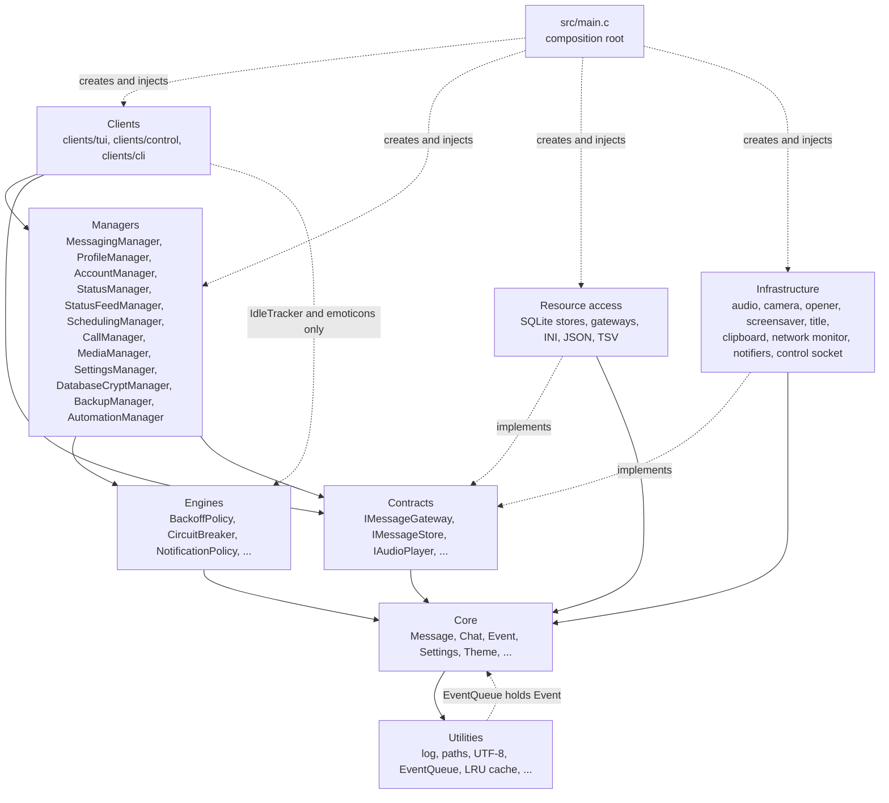
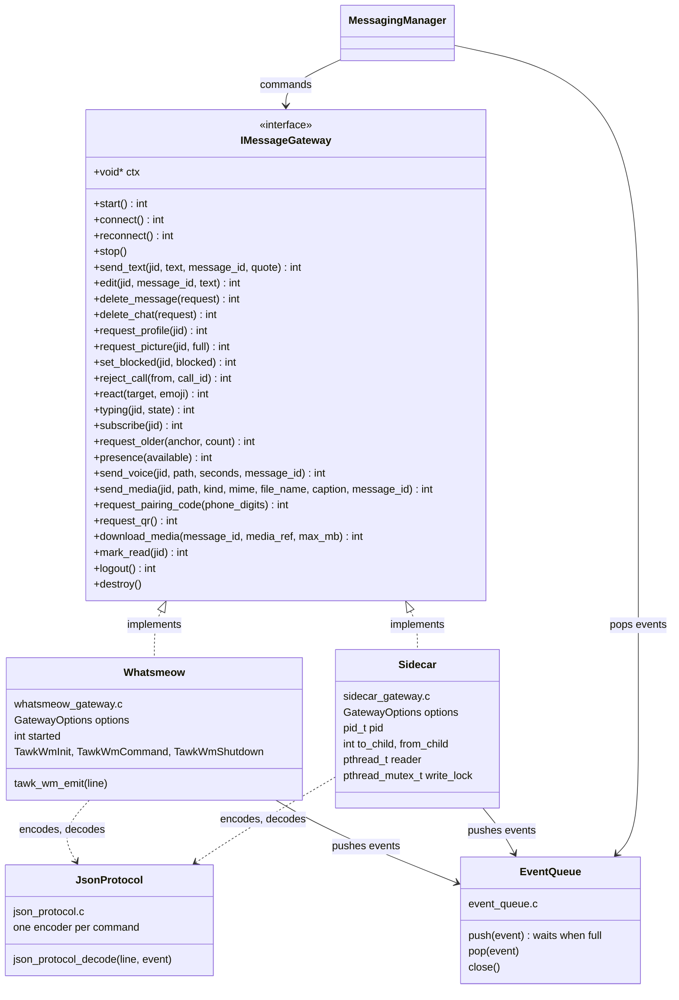
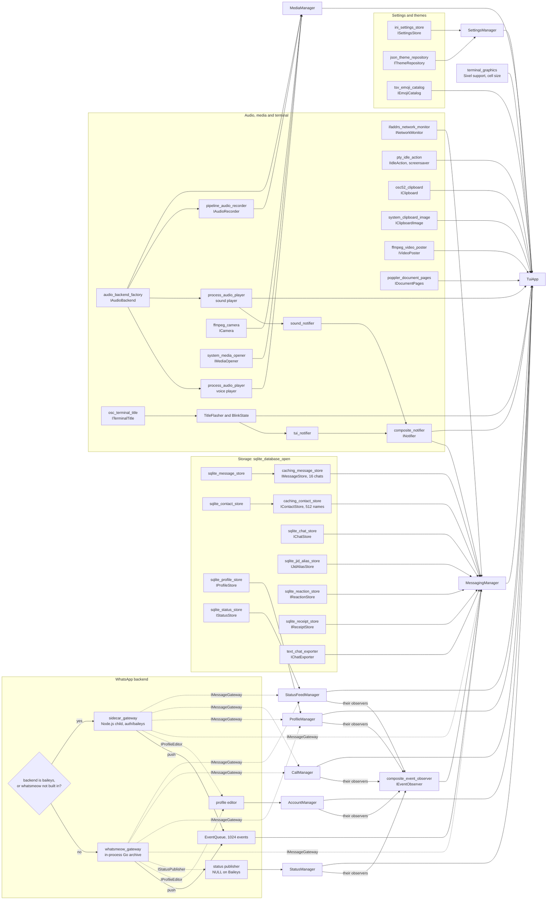
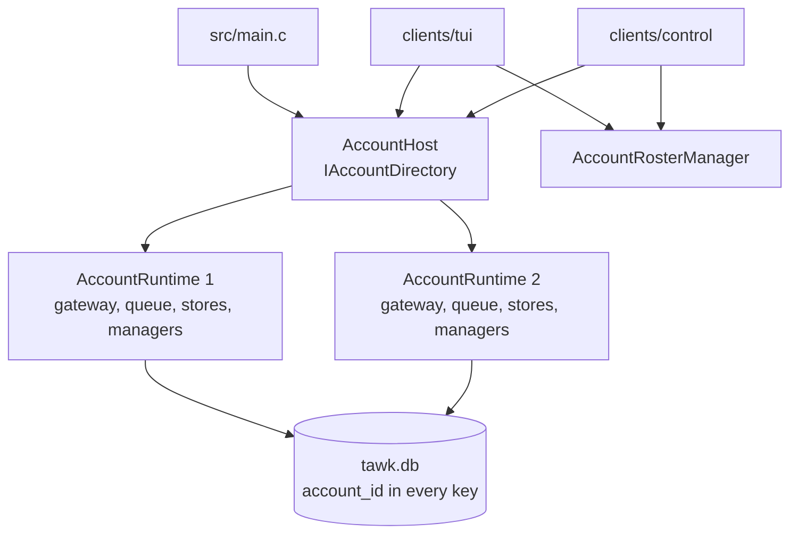
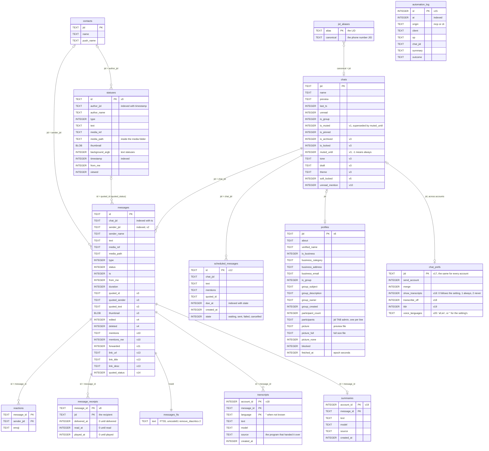

# Architecture

## Table of Contents

- [Overview](#overview)
- [Layers](#layers)
- [Component map](#component-map)
- [Contracts](#contracts)
- [Composition root](#composition-root)
- [Accounts](#accounts)
- [Threads](#threads)
- [Backends](#backends)
- [Storage](#storage)
- [Design principles](#design-principles)
- [Adding things](#adding-things)

## Overview

tawk is one C11 program arranged in [iDesign](https://www.idesign.net/) layers. Volatile concerns (the WhatsApp protocol, the audio system, the terminal, the database) sit behind small interfaces so they can change without touching the logic that uses them. Every interface is a struct of function pointers with a `ctx` pointer, and every concrete implementation is created in exactly one place, `src/main.c`.

## Layers

| Layer | Folder | Responsibility | May call |
|---|---|---|---|
| Composition | `composition` | Builds one account's components and owns the set of running accounts. Part of the composition root | Everything, as `main.c` does |
| Client | `clients/tui`, `clients/control`, `clients/cli` | `tui`: the ncurses UI (widgets, input, slash commands, layout, the settings panel, the Chats and Agentic tabs). `control`: the control socket client that serves tawk-mcp and the shell commands ([CONTROL.md](CONTROL.md)). `cli`: the `--doctor` setup check, the `--update` installer, `--encrypt`, `--decrypt` and `--change-passphrase`, `--backup` and `--restore`, the start-up passphrase prompt, and `tawk send`, `tail`, `unread` and `status-line` | Managers, and the contracts the composition root hands it |
| Managers | `managers` | Use cases: messaging and connection supervision, profiles and profile pictures, your own profile, posting statuses, the status feed, messages scheduled for later, incoming calls, media, settings, encrypting the database, encrypted backups, voice note transcripts and TL;DR summaries (keeping what is handed over, and each chat's choices about them), the rules and log for agents (automation), plus the composite event observer that hands backend events to the managers that listen for them | Engines, contracts |
| Engines | `engines` | Business rules with no I/O: backoff, circuit breaker, notification policy, chat visibility, idle tracking, message ids, media type detection, emoticon conversion, network fingerprints and change detection, profile field and status post validation, finding a URL in text, the status background palette, matching chats against a search, reading when a scheduled message should go, the backup manifest and which archive members a restore accepts, and for agents: the automation policy (who sees which chats, which writes are asked about, which settings stay out of reach, risk, and which of its own requests a client may answer with access admin), the hourly quota for those, resolving a chat named by an agent, the rate limiter and confirmation tokens; and for transcripts and TL;DR: what may be kept (`transcript_validator`, `summary_validator`), what shows and what is transcribed or summarised (`transcript_display_policy`, `transcription_policy`, `summary_policy`, `transcript_choice`), which agent writes summaries (`summariser_choice`) and the question about that (`agent_question`) | Core, utilities |
| Resource access | `resource_access` | SQLite stores (messages, chats, contacts, reactions, receipts, JID aliases, profiles, statuses, scheduled messages, the automation log, transcripts, summaries), database encryption with SQLCipher (`sqlite_database_crypt`, `sqlite_key`), the caching decorators, INI settings store, JSON theme repository, TSV emoji catalog, the text chat exporter, WhatsApp gateways, the JSON protocol codec | Core, utilities |
| Infrastructure | `infrastructure` | Operating-system integration: audio backends and players, recorder, media opener, screensaver, terminal title, OSC 52 clipboard, clipboard pictures, video frames (ffmpeg), the camera (ffmpeg), PDF pages (poppler), the network monitor (getifaddrs), the terminal passphrase prompt, tar archives and openssl file encryption for backups, the control socket's listening end and the shell commands' calling end (Unix domain sockets), notifiers, media cache janitor | Core, utilities |
| Contracts | `contracts` | Interfaces between layers | Core |
| Core | `core` | Domain types: Message, Chat, Contact, ContactProfile, IncomingCall, Receipt, StatusUpdate, StatusPost, Event, Settings, Theme, Emoji and their enums, plus small value types such as QuoteRef, ReactionTarget, HistoryAnchor, DeleteRequest and TypingState, and helpers such as `message_file_name` (a safe file name for saving a message's file) and the shared icons in `icon_glyphs.h` | Utilities |
| Utilities | `utilities` | Cross-cutting helpers: logging, paths, UTF-8, event queue, LRU cache, processes (`process_capture` runs a tool and collects its output), base64, JPEG and PNG decoding (vendored stb_image), directory listing, `file_copy` (a copy that never replaces anything), `outgoing_media` (copies a file to send into `media/outgoing/`), `file_settled` (a file another program has finished writing), `instance_lock` (one tawk per data folder), `process_quiet` (runs a tool silently, handing it a secret over a pipe) and `tree_copy` (copies or removes a folder without following links) | Nothing above |

Solid arrows are the calls each layer makes; dotted arrows are construction, implementation and the two narrow exceptions. Every layer may also use utilities (only the core arrow is drawn). The client uses the `IdleTracker` engine directly to time the screensaver and presence and `emoticon_converter` and `emoji_shortcode` to turn emoticons and `(word` shortcodes into emoji as you type, and `EventQueue` in utilities stores core `Event` values.

The two interactive clients never call each other either. The control client runs on the UI thread through an `IFrameHook` the terminal client calls once a frame without knowing what it is, and it asks for your approval through an `IApprovalPrompt` that the terminal client's `ApprovalQueue` implements; both are wired in `main.c`. What you decide in the Agentic tab goes back through the automation manager (the status it reports, the commands you give it) and the approval queue.

Calls only flow downwards. Managers never call each other; the client coordinates the messaging and media managers when a use case needs both (for example "download this photo, then open it"). Backend events reach the profile, call, account, status and status feed managers through the `IEventObserver` contract: the messaging manager drains the one event queue and hands profile, picture, block list, call, `profile_updated`, `status_posted`, `connected` and finished download events, and every message, edit and removal on `status@broadcast`, to the observer it was given, without knowing who is behind it. A few contracts reach the client directly because no use case sits behind them: the emoji catalog (for the picker), the clipboard (for Copy text), the clipboard picture reader (for pasting), the video poster and document pages (for pictures of videos and PDFs), the screensaver, and the sound player for the test button. The doctor client gets the settings, the emoji catalog and an audio backend in a `DoctorInputs` record and only reads them.

Each type has its own header (`include/<layer>/<type>.h`) with its implementation in `src/<layer>/<type>.c`.

Voice note transcripts follow the same split. `TranscriptManager` (one per account, in `AccountRuntime`) keeps what a transcriber hands over and answers what to show; it transcribes nothing. The rules are engines: `transcript_validator` (what may be kept, and making the text safe), `transcript_choice` (which language shows), `transcript_display_policy` (the setting and a chat's own choice) and `transcription_policy` (whether a chat is transcribed at all). The control client's `control_ops_transcripts.c` takes `set_transcript` and `get_transcript`, loading the message and its chat through the messaging manager and handing both to the transcript manager, since managers never call each other. Transcripts are removed with their message by triggers in the database, so the messaging manager needs to know nothing about them. The languages a voice note may be in are data too: `voice_language` in core lists the languages a transcriber can tell apart, `voice_language_list` keeps a chosen list clean, and the terminal client shows them with `chat_toggle_dialog`, the list of switches that also chooses the chats an agent answers in, once for every chat (it writes `transcribe_languages`) and once for one chat (`ChatPrefs.voice_languages`). tawk only passes the list on; choosing among them is the transcriber's work.

The owner's chat is rules first. `self_chat_rule` says whether a chat is an account's "message yourself" chat, `owner_message_rule` whether a message there is your words (typed text that tawk did not send), `owner_reply_rule` whether an agent's answer may go out unasked, `remote_approval_policy` which waiting requests may be put to you on WhatsApp and when, `approval_card_text` how one reads, and `approval_reply_parser` what your answer means. `OwnerChatManager` holds the one thing with state, the ids of what tawk sent there (`ISentIdLog`), and the hour's count of answers. The control client's `control_owner.c` does the sending and listening: it is the only part that knows about sessions, waiting requests and accounts. The contact card row writes one setting.

TL;DR is built the same way, one step further, because the words come from a model tawk does not have. `SummaryManager` (one per account) keeps which chats are in TL;DR mode, the summaries handed over, and a short list of long messages waiting for one. The rules are engines: `summary_policy` (which messages are summarised), `summary_validator` (what may be kept), `summariser_choice` (which connected agent writes them: the chosen one, else the only one, else ask) and `agent_question` (the numbered question, reading the number answered, and the part of an agent's label that stays the same when it reconnects). The control client does the rest in `control_summariser.c`: each tick it hands waiting messages to the agent `summariser_choice` names as a `summary_wanted` event, and when the verdict is to ask, it sends the question to your own chat through the messaging manager and reads your answer from the same stream of live messages it already follows. `control_ops_summaries.c` takes `set_summary` and `get_summary`. Choosing the default agent in the Agents list travels as an `AutomationCommand`, like pausing one.

## Component map

```mermaid
flowchart TD
    subgraph Client["Client (ncurses)"]
        TUI["TuiApp<br/>loop, input, render"]
        W["Widgets<br/>header, chat list, messages, composer,<br/>portraits, contact panel, call prompt,<br/>profile and status dialogs, camera, splash,<br/>login wizard, settings panel, popups"]
        CMD["Slash commands"]
        DOC["Doctor (tawk --doctor)<br/>Updater (tawk --update)"]
    end
    subgraph Managers
        MM["MessagingManager<br/>events, chats, sending, export, supervision"]
        OBS["composite_event_observer<br/>IEventObserver"]
        PM["ProfileManager<br/>details, pictures, block list"]
        AM["AccountManager<br/>your name, about, photo"]
        STM["StatusManager<br/>posting statuses"]
        SFM["StatusFeedManager<br/>statuses and their archive"]
        CM["CallManager<br/>the ringing call"]
        MD["MediaManager<br/>open, play, record, camera, save"]
        SM["SettingsManager<br/>live settings, themes"]
    end
    subgraph Engines
        E["BackoffPolicy · CircuitBreaker ·<br/>NotificationPolicy · chat_visibility · IdleTracker ·<br/>MessageIdGenerator · MediaTypeDetector ·<br/>emoticon_converter · emoji_shortcode ·<br/>network_fingerprint · NetworkChangeDetector ·<br/>profile_field_validator · status_post_validator ·<br/>url_finder · status_background_palette ·<br/>whatsapp_markup"]
        E["BackoffPolicy · CircuitBreaker ·<br/>NotificationPolicy · chat_visibility · IdleTracker ·<br/>MessageIdGenerator · MediaTypeDetector ·<br/>emoticon_converter · emoji_shortcode ·<br/>network_fingerprint · NetworkChangeDetector ·<br/>profile_field_validator · status_post_validator ·<br/>url_finder · status_background_palette ·<br/>chat_match · schedule_time_parser"]
    end
    subgraph ResourceAccess["Resource access"]
        GW["IMessageGateway · IProfileEditor ·<br/>IStatusPublisher (whatsmeow only)<br/>whatsmeow | sidecar"]
        ST["IMessageStore · IChatStore ·<br/>IContactStore · IReactionStore ·<br/>IReceiptStore · IJidAliasStore<br/>(SQLite + LRU)"]
        PS["IProfileStore (SQLite)"]
        SS["IStatusStore (SQLite)"]
        EX["IChatExporter (text)"]
        CFG["ISettingsStore (INI) ·<br/>IThemeRepository (JSON) ·<br/>IEmojiCatalog (TSV)"]
    end
    subgraph Infrastructure
        AU["IAudioBackend · IAudioPlayer ·<br/>IAudioRecorder · ICamera"]
        OS["IMediaOpener · IIdleAction · ITerminalTitle ·<br/>IClipboard · IClipboardImage · IVideoPoster ·<br/>IDocumentPages · INotifier · INetworkMonitor"]
    end
    TUI --> W & CMD
    TUI --> MM & PM & AM & STM & SFM & CM & MD & SM
    TUI -->|emoji, clipboard, screensaver,<br/>video frames, PDF pages| CFG & OS
    TUI -.->|emoticons as you type| E
    DOC -->|reads| CFG & AU
    MM --> E
    MM --> GW & ST & EX
    MM -->|profile, picture, block list, call,<br/>account, status and download events| OBS
    OBS --> PM & CM & AM & STM & SFM
    PM --> GW & PS
    AM -->|IProfileEditor| GW
    STM -->|IStatusPublisher| GW
    SFM -->|download_media| GW
    SFM --> SS
    CM -->|reject_call| GW
    MM -->|INotifier, INetworkMonitor| OS
    MD --> AU & OS
    SM --> CFG
    GW <-->|JSON lines| B["whatsmeow (Go, in-process)<br/>or Baileys (Node.js child)"]
```

## Contracts

| Contract | Implementations |
|---|---|
| `IMessageGateway` | `whatsmeow_gateway` (Go archive, in-process), `sidecar_gateway` (Node.js child over pipes) |
| `IProfileEditor` | Handed out by both gateways (`whatsmeow_gateway_profile_editor`, `sidecar_gateway_profile_editor`) and owned by them: `set_name`, `set_about`, `set_picture`, `remove_picture` |
| `IStatusPublisher` | Handed out by `whatsmeow_gateway_status_publisher` only (`post`); Baileys has none, so the status manager gets `NULL` |
| `IStatusLiker` | Handed out by `sidecar_gateway_status_liker` only (`like`, the private heart on someone's status); whatsmeow has none, so the messaging manager gets `NULL` and sends a like as a ❤️ reply to the status |
| `IMessageStore` | `sqlite_message_store`, decorated by `caching_message_store` |
| `IChatStore` | `sqlite_chat_store` |
| `IContactStore` | `sqlite_contact_store`, decorated by `caching_contact_store` |
| `IReactionStore` | `sqlite_reaction_store` (one reaction per sender per message, summarised as "👍 2  ❤ 1") |
| `IReceiptStore` | `sqlite_receipt_store` (who received, read and played each message you sent, and when, for Message info) |
| `IJidAliasStore` | `sqlite_jid_alias_store` (LID to phone number mappings, loaded into memory for fast lookups) |
| `IProfileStore` | `sqlite_profile_store` (contact and group details, profile picture paths and the block list, in the `profiles` table) |
| `IStatusStore` | `sqlite_status_store` (statuses received or posted, in the `statuses` table until they expire; authors and their updates are read for a time window, `since` to `until`, so the same calls serve the recent statuses and the archive) |
| `IScheduledMessageStore` | `sqlite_scheduled_message_store` (messages to send later, in the `scheduled_messages` table until they are sent or cancelled: waiting ones for a chat or all, the ones due by a given time, and moving a chat's to another JID) |
| `ITranscriptStore` | `sqlite_transcript_store` (the words of voice notes handed over by a transcriber, in the `transcripts` table: one per message and language, bound to an account; `save`, `find` and `remove`) |
| `IChatTranscriptPrefs` | Handed out by `sqlite_chat_prefs_store` (`sqlite_chat_prefs_store_transcripts`) and owned by it: `set_show` and `set_transcribe_off` for one chat. They are read with the rest of `ChatPrefs` through `IChatPrefsStore`, which is not widened for them |
| `ISummaryStore` | `sqlite_summary_store` (TL;DR summaries an agent hands over, in the `summaries` table: one per message, bound to an account; `save`, `find` and `remove`) |
| `IChatAgentPrefs` | Handed out by `sqlite_chat_prefs_store` (`sqlite_chat_prefs_store_agents`): sets and lists the rule for agents in a chat, which `AutomationManager` reads once and keeps in step |
| `ISentIdLog` | `sqlite_sent_id_log` (the ids of the messages tawk itself put into the owner's chat, in the `sent_ids` table, so that what is left there is known to be yours after a restart too) |
| `IChatSummaryPrefs` | Handed out by `sqlite_chat_prefs_store` (`sqlite_chat_prefs_store_summaries`) and owned by it: `set_tldr` for one chat |
| `IChatExporter` | `text_chat_exporter` (a chat in WhatsApp's own export format, optionally with copies of its media) |
| `IEventObserver` | `profile_manager_observer`, `call_manager_observer`, `account_manager_observer`, `status_manager_observer`, `status_feed_manager_observer`, and `composite_event_observer`, which hands each event to all of them |
| `IEmojiCatalog` | `tsv_emoji_catalog` (reads `emoji.tsv`: glyph, group, name and CLDR keywords per line) |
| `ISettingsStore` | `ini_settings_store` |
| `IThemeRepository` | `json_theme_repository` |
| `IAudioBackend` | `pulse`, `pipewire`, `alsa`, `coreaudio`, `dshow`, chosen by `audio_backend_factory` |
| `IAudioPlayer` | `process_audio_player` (uses an `IAudioBackend`; reports how long the current file has played, for the voice note progress bar) |
| `IAudioRecorder` | `pipeline_audio_recorder` (backend capture piped into ffmpeg) |
| `ICamera` | `ffmpeg_camera` (a live preview of raw frames from ffmpeg, a snapped JPEG, or an MP4 recorded with sound) |
| `IMediaOpener` | `system_media_opener` |
| `IIdleAction` | `pty_idle_action` (screensaver in a pseudo-terminal) |
| `ITerminalTitle` | `osc_terminal_title` |
| `IClipboard` | `osc52_clipboard` (writes the OSC 52 sequence to `/dev/tty`) |
| `IClipboardImage` | `system_clipboard_image` (reads a picture with wl-paste, xclip, pngpaste or PowerShell) |
| `IVideoPoster` | `ffmpeg_video_poster` (a still frame of a downloaded video, made in the background) |
| `IDocumentPages` | `poppler_document_pages` (pages of a downloaded PDF rendered in the background with `pdftoppm` and counted with `pdfinfo`) |
| `INotifier` | `composite_notifier` holding `sound_notifier` and `tui_notifier` |
| `IDatabaseCipher` | `sqlite_database_crypt` (whether `tawk.db` is encrypted, whether a passphrase opens it, rewriting it under another passphrase with a table-by-table check, and removing unencrypted copies kept before upgrades) |
| `IPassphrasePrompt` | `terminal_passphrase_prompt` (reads from `/dev/tty` with echo off; asks twice when confirming) |
| `IDatabaseSnapshot` | `sqlite_file_snapshot` (copies `tawk.db` and its `-wal` for a backup while the instance lock keeps tawk from running) |
| `IArchive` | `tar_archive` (gzipped tar with the system's tar; lists names and types before extracting) |
| `IFileCipher` | `openssl_file_cipher` (`openssl enc -aes-256-cbc -pbkdf2 -iter 600000 -salt`, passphrase on file descriptor 3) |
| `IControlTransport` | `unix_control_transport` (the control socket: 0600 in a 0700 folder, clients of the same user only, non-blocking, lines of at most 1 MiB, a socket left by a crashed tawk replaced) |
| `IControlClient` | `unix_control_client` (the calling end, for `tawk send`, `tail`, `unread` and `status-line`) |
| `IApprovalPrompt` | `approval_queue` in the terminal client (requests waiting in the Agentic tab; answers collected by polling) |
| `IAutomationLog` | `sqlite_automation_log` (what agents did, in the `automation_log` table, the newest 5000 kept) |
| `IAdminTokenStore` | `file_admin_token_store` (the admin token in `admin.token` beside the control socket, 0600, written beside itself and renamed) |
| `IFrameHook` | `control_server_frame_hook` (the control client's work, run by the terminal client once a frame) |
| `INetworkMonitor` | `ifaddrs_network_monitor` (samples the addresses of the interfaces that are up every 3 seconds and reports a change once it has held for 2 seconds) |

The gateway contract is the largest, and shows the pattern every contract follows: a struct of function pointers with a `ctx` pointer, filled in by the implementation's `*_create` function, which is the only way to build one.

Composition shows up in four places: the notifiers are combined by a composite, backend events reach the listening managers through a composite event observer, the message and contact stores gain caching through decorators (`caching_message_store`, `caching_contact_store`) that implement the same contract, and the player and recorder are built around an audio backend strategy. There is no inheritance anywhere.

### Client widgets

The TUI is split into widgets that each draw one part of the screen and turn keys and clicks into results, with `tui_app.c` holding the operations they share and `tui_input.c` routing input to the topmost popup first.

| Widget | Role |
|---|---|
| `header_bar` | Menu toggle, app name, DND, unread tally, the ⭕ status circle with how many people have unseen statuses, the + that posts a status, clock, connection emoji, your name (which opens your profile), gear |
| `chat_list_view` | Detailed or compact chat list with Archived and Locked folder entries, foldable Pinned and Chats groups, adjustable spacing, a name filter, an accent bar on the open chat, and portraits in the detailed style |
| `message_view` | Bubbles, meta lines, quotes, thumbnails, day separators, the `↓ newer` badge, and a title bar that grows to two rows with a portrait and a summary line; a soft-locked chat is drawn as shaded shapes through `text_veil` |
| `portrait_view` | A contact's or group's picture in any box: a round Sixel placement, half blocks when the box is at least four rows high, otherwise an initials badge with rounded corners in a colour picked from the JID. It gets pictures through a `PortraitSource` and never calls the profile manager itself |
| `contact_panel`, `contact_action` | Contact or group details over the right of the conversation pane (picture, number, about text, business details, group description, creator and members) above a list of actions |
| `incoming_call_view` | The ringing call: a pulsing box with the caller's portrait and name, Decline and Answer on phone |
| `composer_view` | Word-wrapping input up to five lines with emoji, attach and send buttons; `composer_view_convert_word` swaps the word before the caret for an emoji |
| `command_suggestions` | `/command` suggestions above the input |
| `emoji_suggestions` | The strip of emoji matching a `(word` shortcode above the input; scrolls sideways and takes clicks |
| `typing_indicator` | The "typing" or "recording audio" bubble with animated dots on the last row of the conversation |
| `transcript_view` | The transcript of one voice note as the conversation shows it: its words as plain text in grey italics, wrapped and shown whole. `message_view` gives it rows inside the voice note's own bubble, under the play line. It gets the transcript through a `TranscriptSource` (one function and a `ctx`, like `PortraitSource`) and never calls the transcript manager itself; `tui_transcripts.c` implements the source and carries out the contact card's two rows, Alt+T and `/transcripts` |
| `summary_view` | The TL;DR of one long message: the line that folds it (`▸ TL;DR` over the summary, `▾ TL;DR · original` over the full text) and the summary's rows. `message_view` keeps which messages are unfolded and swaps the text rows for the summary rows; it gets summaries through a `SummarySource`. `tui_summaries.c` implements the source, puts a long message with no summary on the waiting list as it is looked at, and carries out the contact card's TL;DR row and the fold |
| `chat_subtitle` | The dim line under the open chat's name: "online" or "last seen" for one person when known and switched on, else the about text or member count |
| `message_info_panel` | Who received, read and played a message you sent, and when, from the receipts handed in at each draw |
| `message_menu` | Right-click menu of `message_action` entries for a message; the same widget shows the delete choice and the save or open offer for unknown files |
| `scheduled_list_dialog` | `/scheduled`: every message waiting to be sent later, soonest first, with Send now, Change time (a `text_field` for the new time) and Cancel; `tui_scheduling.c` carries them out through `SchedulingManager` and, each pass of the loop, sends what is due through the messaging manager |
| `chat_picker` | Choosing up to five chats to forward a message to: a `text_field` search, the matching chats (through `chat_match`) with ticks, Space to tick, Enter to send; `tui_forward.c` hands the choice to `messaging_manager_forward` |
| `reaction_palette` | Quick reactions with "remove" and "more" |
| `emoji_picker` | Searchable, tabbed emoji grid over an `IEmojiCatalog` |
| `chat_options_menu` | Per-chat options (`chat_option` entries) |
| `theme_picker_overlay` | Per-chat theme chooser with live preview |
| `search_overlay` | Full-text search across chats |
| `file_picker` | Attachment and tone file chooser |
| `attach_menu`, `camera_view` | The composer's + menu (take a photo or choose a file), and the live camera picture with the photo or video taken to review; a `CameraPurpose` says whether the result is attached, becomes your profile photo or goes to the status composer |
| `confirm_dialog` | A yes-or-no question with Cancel selected first; a dangerous one flashes its border and warning |
| `profile_dialogs` | Your own profile as one popup, composed of `profile_view_dialog` (photo, name, about, number), `profile_text_dialog` (name or about editor with a character count) and `profile_photo_menu` (a file, the camera, the clipboard, full size, remove) |
| `status_composer_dialog` | Tabs for text, photo, video and link statuses, the words or caption, the file, the background colour, and Post |
| `status_feed_dialogs` | Looking at statuses as one popup: `status_list_dialog` (My status, then recent and viewed updates) and `status_viewer_dialog` over it (a bar per status, who and when, the words on their colour or the photo or video with its caption) |
| `styled_text_view` | Draws a stretch of formatted message text span by span (bold, italic or underline, dim, the accent colour for code and mentions); used by the conversation and the reader. The formatted text comes through `MessageFormatter`, which the app implements with `messaging_manager_format_message`, so widgets never apply the rules themselves |
| `text_field` | A box of editable text for dialogs that wraps and scrolls to keep the cursor in view; the status composer's allows line breaks |
| `splash_view` | The animated start-up screen shown while the backend connects: the logo's symbol over the name, in the middle of the screen; the symbol is left out when the terminal is too short. Any key skips it |
| `text_reader` | Scrollable reader for long messages and `/help` |
| `image_viewer` | Full-screen viewer for photos, videos and PDFs, turning the pages of a PDF; in portrait mode it shows one profile picture, square |
| `media_picture`, `thumbnail_cache` | The best picture for a photo, video or PDF (`MediaSources` supplies video frames and PDF pages), decoded into an LRU and drawn with half blocks through `color_pair_cache` |
| `chat_toggle_dialog`, `toggle_switch` | A list of chats with a switch each and one for all, saved as a setting (the chats an admin agent may answer in by itself); the switch is also how on and off values are drawn in the Settings panel and the Permissions view |
| `sixel_overlay`, `sixel_image_cache` | Real pixels written after curses updates the screen; portraits are cut to a circle with `sixel_encode_masked` |
| `text_veil` | Soft shaded bands in place of text or pictures, keeping the shape of a soft-locked conversation |
| `text_caret` | Where the field that takes typing wants the blinking bar cursor |
| `escape_sequence` | Reads bracketed-paste starts and modified keys such as Ctrl+Shift+L and Shift+Enter after an Esc; `tui_input.c` turns Shift+Enter and Alt+Enter into the new-line key `TUI_KEY_NEWLINE` |
| `mac_option_keys` | On macOS, the Alt shortcut a character typed with Option stands for (`¬` is Alt+L), on a US layout |
| `settings_panel`, `login_view`, `outage_overlay`, `footer_bar` | Settings menus, linking wizard, outage window, key hints |

`tui_account.c` drives the profile dialogs and the status composer, handing their requests to the account and status managers and turning their results into toasts, and `tui_statuses.c` drives the status feed dialogs over the status feed manager.

Slash commands live in `tui_commands.c` as a table of name, argument hint, help text and handler. Handlers only call the app's public operations, so a command, a key and a menu entry share one behaviour.

`tools/screenshots/scenes.c` links these widgets without `main.c` and draws the manual's pictures of newer screens (profile, statuses, camera, splash) with made-up data, writing each screen as cells; `tools/screenshots/render.py` paints the cells as PNG files in `docs/images`. `make screenshots` runs both. `tools/branding/make_logos.py` draws the logo files (`docs/images/logo-*.png`), each with a transparent background; `make logos` runs it.

## Composition root

`src/main.c` reads the settings, creates every concrete component in dependency order, injects them through their contracts, runs the client, and destroys everything in reverse. Nothing else knows which implementation is in use. Swapping the WhatsApp backend, the audio system or the storage engine is a change to this one file.

The profile, call, account, status and status feed managers are created before the messaging manager. Each exposes an `IEventObserver`; all five are added to one `composite_event_observer`, which goes into `MessagingManagerDeps` with the chat exporter, the receipt store and the network monitor, and the client receives the managers in `TuiAppDeps`. Adding another listener for backend events is one more `composite_event_observer_add` call. The account manager gets the gateway's `IProfileEditor` and the status manager its `IStatusPublisher`, which stays `NULL` on Baileys, so `status_manager_supported` is false there. The messaging manager gets the sidecar's `IStatusLiker` last in `MessagingManagerDeps`, which stays `NULL` on whatsmeow.

Switching to whatsmeow from the client (offered when posting a status on Baileys) saves the backend, sets `restart_requested` and stops the client. `main.c` then tears everything down as usual and `restart_self` runs tawk again with the same arguments minus any `--backend` option, so the saved backend takes effect. `--update` and `--reinstall` never build anything: `main.c` hands them to `updater_run` in the `cli` client before the settings are read.

Before the database opens, `main.c` takes the instance lock (`instance_lock`, an `flock` on `tawk.lock` in the data folder) and builds `DatabaseCryptManager` over `sqlite_database_cipher_create()` (`IDatabaseCipher`) together with `terminal_passphrase_prompt_create()` (`IPassphrasePrompt`). `--encrypt`, `--decrypt` and `--change-passphrase` go to `database_crypt_command_run` at this point and exit, and `--backup` and `--restore` go to `run_backup_or_restore`, which builds `BackupManager` over `sqlite_file_snapshot`, `tar_archive` and `openssl_file_cipher` for that one command; otherwise `database_unlock` asks for the passphrase of an encrypted database, which `sqlite_database_open(path, key)` receives and `main.c` wipes straight after. The lock is released last, after everything else is destroyed; restarting for a backend switch closes it with the rest of the process (the descriptor is close-on-exec).

With `--doctor`, `main.c` reads the settings through a read-only store (no folders or files are created), stops after the settings, themes and emoji catalog, creates an audio backend, and hands them to `doctor_run` in a `DoctorInputs` record; the database, gateway and client are never built. Teardown closes the event queue before destroying the gateway, so a backend waiting on back-pressure can return.

## Accounts

tawk holds several WhatsApp accounts in one process. The rule that keeps this simple is that an account is decided where a component is created, and never passed along with each call.

| Piece | Where | What it is |
|---|---|---|
| `AccountId`, `Account`, `AccountAgentAccess`, `ChatPrefs`, `ChatMergeChoice` | `core` | The account, what agents may do with it, and a contact's own choices across accounts |
| `SqliteAccountScope` | `resource_access` | Binds a store to one account when it is created. Every per-account table has `account_id` in its key, and the store's statements name it once, so no store method takes an account |
| `IAccountStore`, `IChatPrefsStore` | `contracts` | The roster of accounts, and what is kept per contact whichever account it is on |
| `AccountRosterManager` | `managers` | Adding, renaming, removing and ordering accounts, the primary account, agent access and self-approval chats |
| `AccountRuntime` | `composition` | Everything one account needs to run: its gateway, event queue, bound stores and its managers (messaging, account, profile, status, status feed, scheduling, call and transcript) |
| `IGatewayFactory`, `GatewayParts` | `contracts` | Makes one account's connection to WhatsApp. `BackendGatewayFactory` in `composition` is the real one and the only code that chooses between whatsmeow and the Node.js bridge; a test hands the runtime a factory whose gateways play WhatsApp |
| `AccountHost` | `composition` | Owns the runtimes and starts and stops them. It implements `IAccountDirectory` |
| `IAccountDirectory`, `AccountServices` | `clients` | What a client is given: the accounts that are running, and the managers of each |
| `AccountLabelValidator`, `ChatMergePolicy`, `ReplyAccountPolicy`, `AccountAgentPolicy` | `engines` | The rules: which labels are allowed, when two chats show as one, which number a message goes out from, and what agents may do with an account |

`src/composition/` is part of the composition root: it is the only other place that names concrete stores and gateways, and nothing outside `main.c` includes it. The managers are unchanged by accounts. A `MessagingManager` still knows one gateway and one set of stores; there are simply several of them.

The clients compose across accounts. The terminal client keeps one account in view and swaps the managers it talks to when you open a chat of another (`tui_accounts.c`), builds the one chat list from every account's chats (`UnifiedChatList`), and builds a merged conversation from the chats of one person (`MergedMessageWindow`). The control client serves each request from the account it names (`control_accounts.c`), and `AutomationManager` is told which account it is serving so the existing rules in `automation_policy` are applied with that account's level.

One `tawk.log` serves every account. The logger keeps a label per thread (`log_context_set`), set where an account is ticked or served, so a line written while an account is worked on starts with its label. `tawk --doctor` reads the accounts through `sqlite_account_roster_read`, which opens the database read-only and never upgrades it.

The whatsmeow bridge keeps a session per account, keyed by a handle the gateway passes with every call, so one linked library carries all of them.

## Threads

tawk is single-threaded except for the edges:

- The UI thread runs the event loop: it drains the event queue, applies changes, draws a frame when something changed (or at most four times a second while something animates) and waits up to 100 ms for input. Keys already queued are handled together before the next frame.
- The sidecar gateway has one reader thread that turns stdout lines from Node.js into events.
- The whatsmeow bridge runs its own goroutines and calls back into C with each event.
- While the camera is on, `ffmpeg_camera` has one reader thread that collects frames from ffmpeg; the UI thread takes the newest one.

The network monitor needs no thread of its own: the messaging manager polls it on each tick and it samples the interfaces with `getifaddrs` every 3 seconds.

Both backends hand events to a bounded `EventQueue`. When it is full, producers wait, so a large history sync slows down instead of dropping messages. On shutdown the queue is closed first so any waiting producer returns.

## Backends

Both backends speak the same JSON line protocol ([PROTOCOL.md](PROTOCOL.md)). `json_protocol.c` is the single decoder and encoder on the C side. The whatsmeow bridge is compiled with `go build -buildmode=c-archive` and linked into the binary; it registers the pure-Go SQLite driver so that only one copy of libsqlite3 is linked. The Baileys bridge is a small ES module program started with an argument list (no shell) and restarted by the messaging manager if it exits.

Neither backend retries anything. They report `connection` events with a reason, and `MessagingManager` decides what to do using `BackoffPolicy` and `CircuitBreaker` (see [HOW_IT_WORKS.md](HOW_IT_WORKS.md#reconnecting)). Profile edits and status posts travel over the same protocol, but through the smaller `IProfileEditor`, `IStatusPublisher` and `IStatusLiker` contracts that the gateways hand out, so the gateway contract does not grow with them.

## Storage

SQLite in WAL mode holds the tables `messages`, `chats`, `contacts`, `reactions`, `message_receipts`, `jid_aliases`, `profiles`, `statuses`, `scheduled_messages`, `automation_log`, `accounts`, `chat_prefs`, `transcripts` and `summaries`, plus the FTS5 index `messages_fts` over message text. All statements use bound parameters. Upserts merge rather than overwrite: an empty name never replaces a known one, older timestamps never replace newer ones, message status only moves forward, and local preferences (pinned, muted, tone, draft, chat theme, soft lock) are never touched by sync. A message deleted for everyone keeps its row with `deleted` set; a message deleted for me is removed with `DELETE`, and the FTS5 trigger drops it from the index. `caching_message_store` keeps the latest page of recently opened chats in an LRU and invalidates a chat whenever anything in it changes; `caching_contact_store` caches display-name lookups. `recent` grows its result as rows arrive instead of reserving room for the whole limit, so a chat export, which asks for every message, costs only what the chat holds.

The `profiles` table keeps what WhatsApp says about a contact or group. `save_details` writes the about text, business and group fields and `fetched_at`, but never the picture columns or `blocked`; `set_picture` records a downloaded file (or `picture_none`); `forget_picture` clears both picture paths when the picture changed; and `set_blocklist` clears every `blocked` flag and sets it again for each JID in the list, in one transaction. Group members are stored in `participants` as one `jid<TAB>admin` line per member.

`message_receipts` holds one row per message you sent and recipient, with the earliest time each was delivered, read and played (0 until it happens); a read implies delivery and a play implies both. `statuses` keeps each status once by id (a later copy only fills in what was missing), with its author, type, text, media reference, local file, preview, background colour, time, whether it is yours and whether you have viewed it. The status feed manager prunes rows older than `status_keep_days`, and deletes their files, every ten minutes; rows older than a day and younger than that form the Status archive.

The schema is versioned with `PRAGMA user_version`. `sqlite_database.c` creates the original tables and then applies each newer migration in order, each in its own transaction, so a database from any earlier release is upgraded in place when tawk starts:

| Version | Adds |
|---|---|
| 1 | `messages`, `chats` and `contacts` |
| 2 | `jid_aliases` (LID to phone number) and an index on message senders |
| 3 | Replies (`quoted_id`, `quoted_sender`, `quoted_text`) and inline previews (`thumbnail`) on messages; folders (`is_archived`, `is_locked`), timed mutes (`muted_until`, where -1 means always), `tone`, `draft` and `theme` on chats; the `reactions` table; the `messages_fts` index with triggers that keep it in step with `messages` |
| 4 | `edited` and `deleted` on messages |
| 5 | `soft_locked` on chats |
| 6 | The `profiles` table: `jid`, `about`, `verified_name`, `is_business`, `business_category`, `business_address`, `business_email`, `is_group`, `group_subject`, `group_description`, `group_owner`, `group_created`, `participant_count`, `participants`, `picture`, `picture_full`, `picture_none`, `blocked` and `fetched_at` |
| 7 | No new columns: stored chat previews switch to the new photo and sticker icons (📷, 🔖) |
| 8 | The `message_receipts` table: `message_id`, `jid`, `delivered_at`, `read_at` and `played_at`, keyed by message and recipient |
| 9 | The `statuses` table: `id`, `author_jid`, `author_name`, `type`, `text`, `media_ref`, `media_path`, `thumbnail`, `background_argb`, `timestamp`, `from_me` and `viewed`, with indexes on author and time and on time |
| 10 | Mentions: `mentions` (one `jid TAB user` per line) and `mentions_me` on messages, `unread_mention` on chats |
| 11 | `forwarded` on messages |
| 12 | The `scheduled_messages` table: `id`, `chat_jid`, `text`, `mentions`, `quoted_id`, `due_at`, `created_at` and `state`, with an index on state and due time |
| 13 | Link cards: `link_url`, `link_title` and `link_desc` on messages |
| 14 | `quoted_status` on messages: the reply answers a status, and `quoted_id` is the status's id |
| 15 | The `automation_log` table: `id`, `at`, `origin`, `client`, `op`, `chat_jid`, `summary` and `outcome`, with an index on `at` |
| 16 | No new columns: indexes on `reactions(sender_jid)` and `message_receipts(jid)`, used when a contact's address changes |
| 17 | Several accounts: the `accounts` table, `account_id` in the key of every per-account table, and `chat_prefs` (`jid`, `send_account`, `merge`) for what you chose per contact |
| 18 | The `transcripts` table: `account_id`, `message_id`, `language`, `text`, `model`, `source` and `created_at`, keyed by the first three, with the triggers `transcripts_message_removed` and `transcripts_message_deleted` on `messages` that remove a message's transcripts when its row is deleted or marked deleted for everyone; and `show_transcripts` and `transcribe_off` on `chat_prefs` |
| 19 | The `summaries` table: `account_id`, `message_id`, `text`, `model`, `source` and `created_at`, keyed by the first two, with the triggers `summaries_message_removed` and `summaries_message_changed` on `messages` that remove a message's summary when its row is deleted, when it is marked deleted for everyone, and when its text changes; and `tldr` on `chat_prefs` |
| 20 | `voice_languages` on `chat_prefs` (the languages a chat's voice notes are spoken in, as codes joined by commas). The transcripts written before it are deleted, since their language could be wrong; they are written again as their voice notes are looked at |
| 21 | No new columns: the transcripts written so far are deleted once more, since some came from a session running an older transcriber |
| 22 | The `sent_ids` table: `account_id`, `message_id`, `kind` (an agent's answer, a request's card, a line of tawk's own), `ref` (the request a card is for) and `at`; the ids of what tawk itself sent into the owner's chat |
| 23 | `agent_rule` on `chat_prefs` (what agents may do in one chat: as the account says, always ask, read only, hidden) |
| 24 | `alerts` on `chat_prefs` (which of a chat's messages alert you: all, or only a mention) |

Before the first migration of an upgrade runs, the database is copied to `tawk.db.pre-v<N>` (once, 0600), so a failed upgrade can be rolled back by hand. The schema after version 24 is below (the account column that version 17 put in every key is left out of the older tables for room). The tables declare no foreign keys; the relationships are by value (a message's `chat_jid` matches a chat's `jid`, a reaction's or receipt's `message_id` matches a message's `id`, a status's `author_jid` matches a contact's `jid`, a profile's `jid` matches a chat's or contact's `jid`, and an alias maps a LID to the phone number JID used everywhere else). `messages_fts` is an external-content FTS5 table over `messages.text`, keyed by the message `rowid` and kept in step by the triggers `messages_fts_ai`, `messages_fts_ad` and `messages_fts_au`.

Search turns what you type into a safe FTS5 query: every word becomes a quoted prefix term, so input can never use FTS operators.

## Design principles

| Principle | How it shows up |
|---|---|
| Single responsibility | One type per file; widgets draw, managers decide, stores persist |
| Open/closed | New backends, audio systems, notifiers or themes are new files, not edits |
| Liskov substitution | Every implementation of a contract is interchangeable at the composition root |
| Interface segregation | Separate message, chat, contact, reaction, receipt, alias, profile and status stores; separate player, recorder and backend; profile editing and status posting in their own contracts beside the gateway; a clipboard contract with a single copy operation |
| Dependency inversion | Managers depend on contracts; `main.c` supplies implementations |
| Composition over inheritance | Composite notifier, composite event observer, caching decorators, audio strategy |
| Separation of concerns | Policy in engines, orchestration in managers, I/O at the edges |

## Adding things

- **An audio system:** implement `IAudioBackend` in `src/infrastructure/audio/`, add it to the table in `audio_backend_factory.c`, and add its name to the `audio_backend` choices in `settings_schema.c`.
- **A setting:** add a field to `Settings`, a default in `settings.c`, a line in `settings_schema.c` (key, label, help, bounds), and a `FIELD(...)` entry in `settings_menu.c`. The INI file and the panel pick it up automatically.
- **A slash command:** add a handler and a row to the table in `tui_commands.c`. Suggestions and `/help` pick it up automatically.
- **A database change:** append a `Migration` with the next version number to `sqlite_database.c`. Never edit a migration that has shipped.
- **A setup check:** add it to `doctor.c`, marking it as a failure only when tawk cannot run without it.
- **A notifier:** implement `INotifier` and add it to the composite in `main.c`.
- **A listener for backend events:** give the new manager an `IEventObserver`, add it to the composite event observer in `main.c`, and add the event types it needs to the list `handle_event` forwards in `messaging_manager.c`.
- **A theme:** drop a JSON file in `themes/`.
- **A backend command:** add an encoder to `json_protocol.c`, a function to `IMessageGateway` (or to a smaller contract the gateways hand out, such as `IProfileEditor`) and the gateways that support it, handlers in the bridges, and a row in [PROTOCOL.md](PROTOCOL.md).
