# How It Works

## Table of Contents

- [Start-up](#start-up)
- [The event loop](#the-event-loop)
- [Linking a phone](#linking-a-phone)
- [Receiving a message](#receiving-a-message)
- [Sending a message or file](#sending-a-message-or-file)
- [Replies, reactions, edits and deletions](#replies-reactions-edits-and-deletions)
- [Scheduled messages](#scheduled-messages)
- [Typing and presence](#typing-and-presence)
- [Loading older messages](#loading-older-messages)
- [One chat per person](#one-chat-per-person)
- [Search](#search)
- [Soft lock](#soft-lock)
- [The chat list](#the-chat-list)
- [Profiles and portraits](#profiles-and-portraits)
- [Contact details](#contact-details)
- [Your profile](#your-profile)
- [Statuses](#statuses)
- [Incoming calls](#incoming-calls)
- [Photos, videos and PDFs](#photos-videos-and-pdfs)
- [Pasting a picture](#pasting-a-picture)
- [The camera](#the-camera)
- [Saving files](#saving-files)
- [Voice notes](#voice-notes)
- [Reconnecting](#reconnecting)
- [Screensaver](#screensaver)
- [Encrypted chats](#encrypted-chats)
- [Backups](#backups)
- [Several accounts](#several-accounts)
- [Agents and the control socket](#agents-and-the-control-socket)
- [The setup check](#the-setup-check)

## Start-up

1. `main.c` reads the command line, sets a private umask, installs signal handlers and checks it is attached to a terminal (except for `--doctor`).
2. The settings store loads `~/.config/tawk/config.ini` (writing defaults on first run), the theme repository loads bundled and personal themes, and the emoji catalog reads `emoji.tsv`. With `--doctor`, tawk runs the setup check at this point and exits (see [The setup check](#the-setup-check)).
3. The data, cache and state folders are created with owner-only permissions; old media is pruned to the cache limit.
4. tawk takes the instance lock (`flock` on `tawk.lock` in the data folder) and stops if another tawk holds it. `--encrypt`, `--decrypt` and `--change-passphrase` run here, under the lock, and exit. If `tawk.db` does not start with SQLite's plain header it is encrypted: the terminal passphrase prompt asks for its passphrase on `/dev/tty` with echo off (three tries), before curses starts. The passphrase is wiped as soon as the database is open.
5. SQLite (SQLCipher when built with it) opens with that passphrase, keeps a copy of the database before an upgrade (encrypted the same way), and applies any pending schema migrations, the message and contact stores are wrapped in caching decorators, the reaction, receipt, alias, profile and status stores and the chat exporter are created, and the event queue is created.
6. The WhatsApp gateway is chosen (whatsmeow unless configured otherwise) along with the profile editor it hands out and, on whatsmeow only, the status publisher. Then come the audio backend, players, recorder, camera, media opener, screensaver, terminal title, clipboard, video poster, PDF page renderer, clipboard picture reader and notifiers.
7. The managers are created with those dependencies (the profile, call, account, status and status feed managers first, with their observers joined in a composite event observer that the messaging manager receives along with the network monitor; the camera goes to the media manager), then the client, which starts curses, asks the messaging manager to start the backend and connect, and shows the splash while it does (unless `splash` is off). The splash lasts about two seconds and any key skips it. Starting curses also turns on mouse reporting (when `mouse` is on), bracketed paste, modified key reporting (`CSI > 4;1 m`) and a blinking bar cursor (`CSI 5 q`); on exit tawk turns them off again and restores the terminal's own cursor style (`CSI 0 q`).

## The event loop

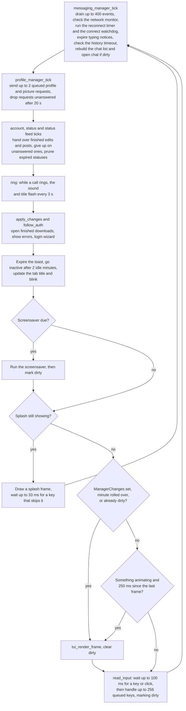
```mermaid
flowchart TD
    TICK["messaging_manager_tick<br/>drain up to 400 events, check the network monitor,<br/>run the reconnect timer and the connect watchdog,<br/>expire typing notices, check the history timeout,<br/>rebuild the chat list and open chat if dirty"]
    PROF["profile_manager_tick<br/>send up to 2 queued profile and picture requests,<br/>drop requests unanswered after 20 s"]
    ACC["account, status and status feed ticks<br/>hand over finished edits and posts, give up on<br/>unanswered ones, prune expired statuses"]
    RING["ring: while a call rings, the sound<br/>and title flash every 3 s"]
    APPLY["apply_changes and follow_auth<br/>open finished downloads, show errors, login wizard"]
    TAB["Expire the toast, go inactive after 2 idle minutes,<br/>update the tab title and blink"]
    SAVER{"Screensaver due?"}
    RUN["Run the screensaver, then mark dirty"]
    SPLASH{"Splash still showing?"}
    SPLASHF["Draw a splash frame,<br/>wait up to 33 ms for a key that skips it"]
    CHANGED{"ManagerChanges set, minute rolled over,<br/>or already dirty?"}
    ANIM{"Something animating and<br/>250 ms since the last frame?"}
    DRAW["tui_render_frame, clear dirty"]
    INPUT["read_input: wait up to 100 ms for a key or click,<br/>then handle up to 256 queued keys, marking dirty"]

    TICK --> PROF --> ACC --> RING --> APPLY --> TAB --> SAVER
    SAVER -- yes --> RUN --> SPLASH
    SAVER -- no --> SPLASH
    SPLASH -- yes --> SPLASHF --> TICK
    SPLASH -- no --> CHANGED
    CHANGED -- yes --> DRAW
    CHANGED -- no --> ANIM
    ANIM -- yes --> DRAW
    ANIM -- no --> INPUT
    DRAW --> INPUT
    INPUT --> TICK
```

Everything the UI needs from a tick arrives in a `ManagerChanges` record (chats changed, a download finished, an error to show), so widgets redraw from manager state rather than reacting to raw events. A frame is drawn only when something changed, the minute rolled over, or an animation (blink, recording counter, title flash, outage countdown, a toast, waiting for older history, a video frame or PDF page being made, the flashing warning of a dangerous confirmation, a ringing call) is running, and then at most four times a second. Keys that are already queued behind the first one are handled before the next frame, so fast typing or a paste costs one redraw.

At the end of each frame the terminal cursor, a blinking bar, is moved to the field that takes typing: the topmost popup's field (search, the emoji picker's search, a setting being edited), else the phone number in the linking wizard, else the chat list filter, else the message input. Each of these widgets records where its caret belongs in a `TextCaret`. When no field takes typing (the viewer, a menu or a picker is open) the cursor is hidden, and tawk only changes the cursor state when it differs from the last frame, so it never flickers.

An Esc from curses is passed to `escape_sequence_read`, which reads what follows without waiting: the start of a bracketed paste, or a modified key in the form `CSI 27;<mods>;<key>~` or `CSI <key>;<mods> u`. That is how Ctrl+Shift+L is told apart from Ctrl+L. Other modified keys carry on as the key curses would have reported, and anything else is pushed back, so a bare Esc stays an Esc and Esc followed by a key is still Alt+key. Enter with Shift or Alt becomes one new-line key, `TUI_KEY_NEWLINE` (`tui_key_newline.h`): the message input and the status composer's `text_field`, which allows line breaks, insert a line break, and one-line fields ignore it. On macOS, `mac_option_letter` turns the characters Option types on a US layout (`¬` for Option+L, for example) into the Alt shortcut they stand for; letters such as `å` and `ø` count only where no text is being typed, so they still type in a message.

## Linking a phone

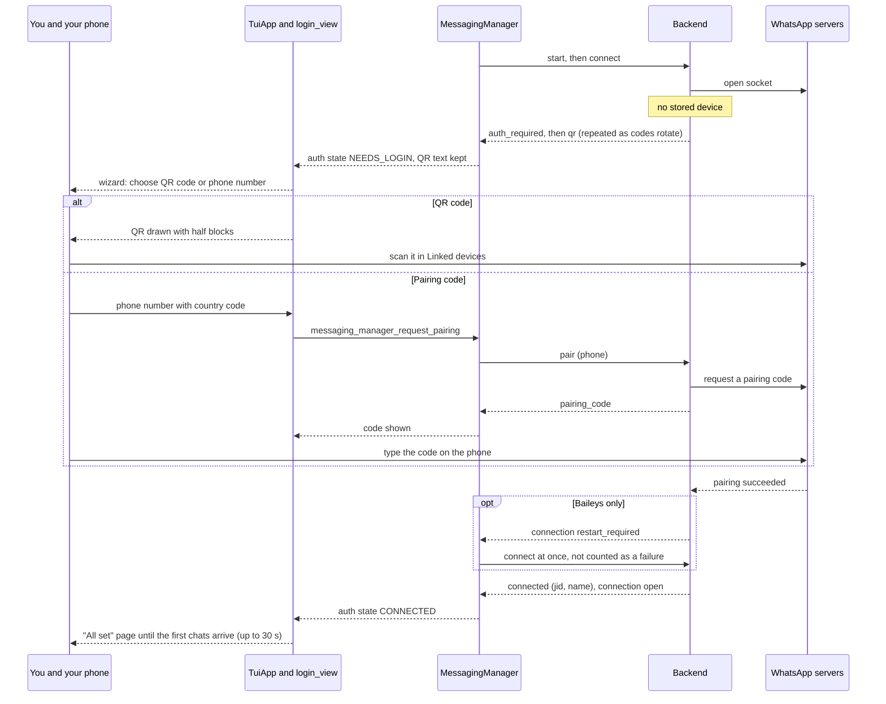
```mermaid
sequenceDiagram
    participant U as You and your phone
    participant T as TuiApp and login_view
    participant M as MessagingManager
    participant B as Backend
    participant W as WhatsApp servers
    M->>B: start, then connect
    B->>W: open socket
    Note over B: no stored device
    B-->>M: auth_required, then qr (repeated as codes rotate)
    M-->>T: auth state NEEDS_LOGIN, QR text kept
    T-->>U: wizard: choose QR code or phone number
    alt QR code
        T-->>U: QR drawn with half blocks
        U->>W: scan it in Linked devices
    else Pairing code
        U->>T: phone number with country code
        T->>M: messaging_manager_request_pairing
        M->>B: pair (phone)
        B->>W: request a pairing code
        B-->>M: pairing_code
        M-->>T: code shown
        U->>W: type the code on the phone
    end
    W-->>B: pairing succeeded
    opt Baileys only
        B-->>M: connection restart_required
        M->>B: connect at once, not counted as a failure
    end
    B-->>M: connected (jid, name), connection open
    M-->>T: auth state CONNECTED
    T-->>U: "All set" page until the first chats arrive (up to 30 s)
```

A QR code that is never scanned ends with `connection` `qr_timeout`, which leaves tawk waiting for a login. Asking for a new QR code sends `qr`, which drops the connection and starts again.

The QR code is rendered by the backend with half-block characters, two QR rows per text row, so it fits a normal terminal. Pairing codes are requested only after the socket is ready, which is why the phone step waits for the first QR from WhatsApp.

## Receiving a message

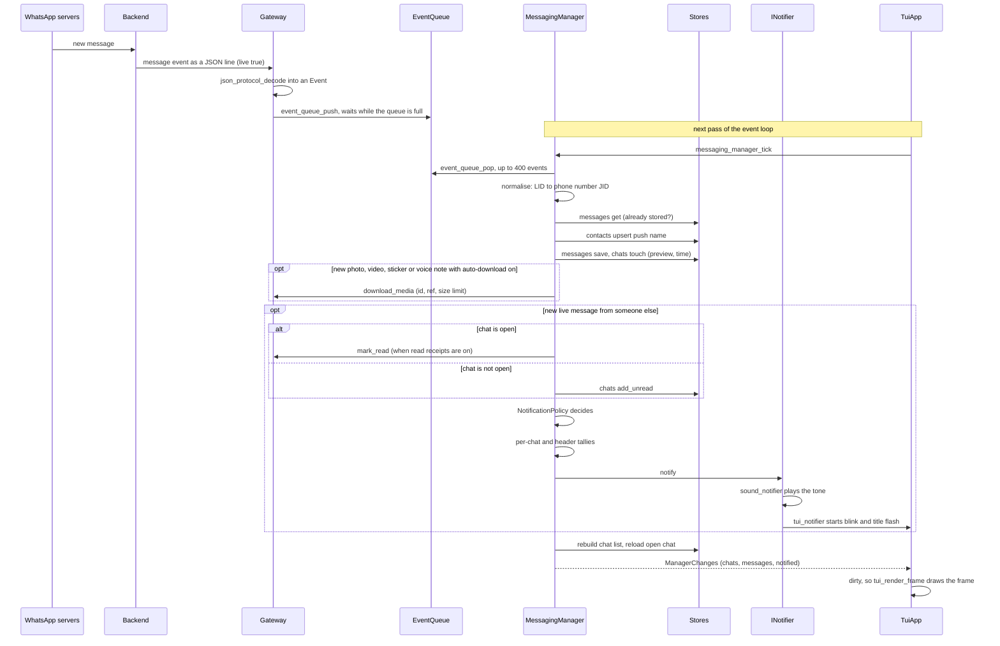
```mermaid
sequenceDiagram
    participant W as WhatsApp servers
    participant B as Backend
    participant G as Gateway
    participant Q as EventQueue
    participant M as MessagingManager
    participant S as Stores
    participant N as INotifier
    participant T as TuiApp
    W->>B: new message
    B->>G: message event as a JSON line (live true)
    G->>G: json_protocol_decode into an Event
    G->>Q: event_queue_push, waits while the queue is full
    Note over T,M: next pass of the event loop
    T->>M: messaging_manager_tick
    M->>Q: event_queue_pop, up to 400 events
    M->>M: normalise: LID to phone number JID
    M->>S: messages get (already stored?)
    M->>S: contacts upsert push name
    M->>S: messages save, chats touch (preview, time)
    opt new photo, video, sticker or voice note with auto-download on
        M->>G: download_media (id, ref, size limit)
    end
    opt new live message from someone else
        alt chat is open
            M->>G: mark_read (when read receipts are on)
        else chat is not open
            M->>S: chats add_unread
        end
        M->>M: NotificationPolicy decides
        M->>M: per-chat and header tallies
        M->>N: notify
        N->>N: sound_notifier plays the tone
        N->>T: tui_notifier starts blink and title flash
    end
    M->>S: rebuild chat list, reload open chat
    M-->>T: ManagerChanges (chats, messages, notified)
    T->>T: dirty, so tui_render_frame draws the frame
```

The gateway step runs on the sidecar's reader thread or on a whatsmeow goroutine through `tawk_wm_emit`; everything from `messaging_manager_tick` onwards runs on the UI thread.

1. The backend emits `message` with `live: true`. History arrives the same way with `live: false`. A reply carries a `quote`, and a photo or video usually carries a small JPEG `thumb`.
2. `MessagingManager` rewrites any LID in the event to its phone number. A message, edit or removal on `status@broadcast` goes to the status feed through the observer (see [Statuses](#statuses)), and anything else from a chat ending in `@broadcast` is dropped (`chat_visibility`), so neither becomes a chat, a notification or an unread count. For any other message it checks whether the message is already stored, records the sender's push name as a contact, saves the message (with its quote and preview) and updates the chat's preview and time. The FTS5 index is updated by a database trigger.
3. For a new live message in a chat that is not open, it adds one to the chat's unread count. A typing notice from the same sender is cleared.
4. `NotificationPolicy` decides whether to alert (notifications on, not do-not-disturb, chat not muted (a timed mute ends by itself), group rule, chat not open). If so, it adds one to the per-type tally shown in the header and tab title, the composite notifier plays the chat's tone (or the default sound, or nothing when the tone is "none") and the TUI notifier starts the blink, the title flash and optional bell or screen flash.
5. Photos, videos, stickers and voice notes below the size limit are downloaded immediately; the backend writes the file into the media folder, named only from the message id, and reports its path. tawk refuses any path outside the media folder.

### Formatting and mentions on screen

Stored text keeps the marks as they arrived. When the conversation is drawn, `messaging_manager_format_message` runs the `whatsapp_markup` engine over each message: it takes out the marks WhatsApp would take (`*`, `_`, `~` and `` ` `` at word edges on one line, ```` ``` ```` blocks, `> ` quotes and `- `/`* ` lists), turns `@<digits>` of a mentioned person into `@Name` (named from contacts, your own from the linked name) and returns the text as shown with runs of styles. The view wraps that text, so widths are right, and `styled_text_view` draws each run. Chat previews, notifications and search results use `messaging_manager_message_preview`, the same text flattened to one line. With `format_text` off the raw text is shown and wrapped as before.

### Mentions

A message that mentions people carries their JIDs beside the text, which holds `@<number>` for each. The bridges read them (`contextInfoOf` and `mentionsOf` in whatsmeow, `mentionsOf` in the sidecar), report each as `{jid, user}` and flag `mentions_me` by comparing with the account's phone JID and LID. The messaging manager maps LIDs to phone numbers, stores the list and, for an unread message that mentions you, marks the chat (`unread_mention`, cleared with its unread count). `notification_policy` lets such a message through a mute and the group switch. Typing `@` in a group runs `tui_app_refresh_mention`: members come from the group's details in the profile manager, named through the messaging manager, ranked by `mention_matcher`. Picking one inserts `@Name` and remembers who it was; on send, `messaging_manager_send_text_mentioning` runs `mention_encoder` to turn each `@Name` into `@<number>` and lists the JIDs, and the bridges convert both to LIDs for groups that use them.

### Who saw your status

Viewers come from data tawk already keeps. Each viewer's phone sends a read receipt for your status, which the messaging manager stores in `message_receipts` like any other receipt. A like is a reaction sent to `status@broadcast` with the status's id: the messaging manager passes it to the status feed with the other status events, and the feed keeps it in the reactions table when the status is yours and queues it as a new like. `status_feed_manager_viewers` merges the two (a view is a read or played time; a like without a view still counts), newest first; the viewer draws `Seen by n · ❤️ m` under your own statuses and the `status_viewers_dialog` lists them. New likes appear in the footer through `status_feed_manager_take_like`.

## Sending a message or file

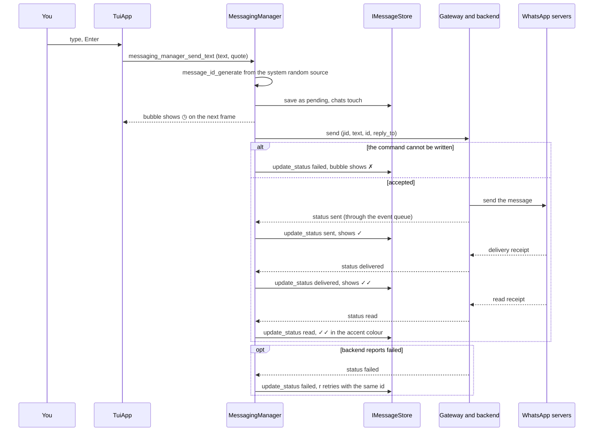
```mermaid
sequenceDiagram
    participant U as You
    participant T as TuiApp
    participant M as MessagingManager
    participant S as IMessageStore
    participant G as Gateway and backend
    participant W as WhatsApp servers
    U->>T: type, Enter
    T->>M: messaging_manager_send_text (text, quote)
    M->>M: message_id_generate from the system random source
    M->>S: save as pending, chats touch
    M-->>T: bubble shows ◷ on the next frame
    M->>G: send (jid, text, id, reply_to)
    alt the command cannot be written
        M->>S: update_status failed, bubble shows ✗
    else accepted
        G->>W: send the message
        G-->>M: status sent (through the event queue)
        M->>S: update_status sent, shows ✓
        W-->>G: delivery receipt
        G-->>M: status delivered
        M->>S: update_status delivered, shows ✓✓
        W-->>G: read receipt
        G-->>M: status read
        M->>S: update_status read, ✓✓ in the accent colour
    end
    opt backend reports failed
        G-->>M: status failed
        M->>S: update_status failed, r retries with the same id
    end
```

Status only moves forward through pending, sent, delivered and read (`MAX(status, ?)` in `sqlite_message_store`), so a late `sent` never hides a `read`. Only `failed` is written unconditionally.

Alongside `status`, both backends send a `receipt` event for each recipient of a message you sent: who, whether it was delivered, read or played, and when. `IReceiptStore` keeps the earliest time of each kind per recipient in `message_receipts`, and Message info in the message menu opens `message_info_panel`, which lists them and updates while it is open.

- **Text:** tawk generates a WhatsApp-style id from the system random source, stores the message as pending, shows it at once, and asks the backend to send with that id (with `reply_to` when you are replying). The backend reports `sent`, and later WhatsApp's receipts move it to delivered and read. A failure marks it failed and `r` retries it.
- **Emoticons:** with `convert_emoticons` on, a space or Enter first passes the word before the caret to `composer_view_convert_word`, which asks the `emoticon_converter` engine for an emoji. Only a whole word of 2 to 12 characters that matches the table exactly (`:)`, `<3`, `:D`, `;)`, `:P`, `(y)`, `:fire:`, `:tada:` and so on) is replaced, so `:/` inside a link is left alone. Ctrl+S and the send button send the last word as it is.
- **Shortcodes:** after every edit, `composer_view_shortcode` looks for `(word` (two letters or more, at the start of a word) or `(word)` just before the caret. The `emoji_shortcode` engine scores every emoji in the catalog against its name and its keywords: each typed word must start a word of either, a whole word of the name scores above a whole keyword, which scores above a prefix, the exact name scores highest, and ties keep the catalog order (smileys first). Skin tone variants, joined sequences and emoji the system's character tables cannot measure are left out, and at most 64 are kept. A closed shortcode with one match is replaced at once; otherwise `emoji_suggestions` shows the matches in a strip above the input that follows the typing. Esc remembers where that shortcode starts so the strip stays closed while it is typed on.
- **A slash command:** text that starts with a single `/` is looked up in the command table and run instead of being sent; `//` sends a literal slash.
- **A photo or video from the camera:** ➕ and Take a photo, or `/camera`, open the viewfinder; what you take is attached like a picked file (see [The camera](#the-camera)).
- **A dropped file:** the terminal pastes the path inside bracketed-paste markers. tawk resolves the path (quotes, `file://`, Windows drive paths under WSL), shows it as an attachment, and on Enter `outgoing_media_copy` copies the file into `media/outgoing/`, named after the message id (only a regular file of at most 100 MB, and the copy is created with `O_EXCL` and `O_NOFOLLOW` so it never writes through a link), before asking the backend to upload it. The backend re-checks that the path is inside the media folder.

- **Forwarding:** ↪ Forward… in the message menu opens `chat_picker` (a `text_field` search, filtered with the `chat_match` engine, which also leaves Locked chats out; Space ticks up to five). `messaging_manager_forward` then sends one copy per chat, each with its own id, stored as yours with `forwarded` set. Text goes through `messaging_manager_send_text_to` with `OutgoingText.forwarded`. A downloaded file is copied again with `outgoing_media_copy` and uploaded through `send_media`; media that was never downloaded goes through `forward_media`, where whatsmeow decodes the stored `ref` (the full media message) and sends it with `ContextInfo.IsForwarded` and `ForwardingScore`, and Baileys calls `sendMessage` with `forward`. The score is 1, or 2 for a message that was already forwarded. Received messages carry `forwarded`, and the bubble gets a `↪ Forwarded` row.

## Replies, reactions, edits and deletions

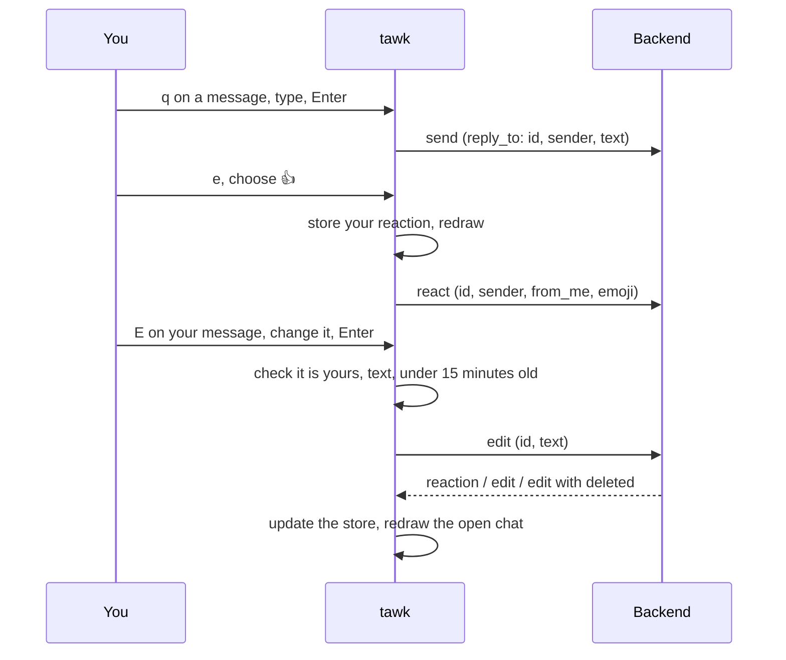
```mermaid
sequenceDiagram
    participant U as You
    participant T as tawk
    participant B as Backend
    U->>T: q on a message, type, Enter
    T->>B: send (reply_to: id, sender, text)
    U->>T: e, choose 👍
    T->>T: store your reaction, redraw
    T->>B: react (id, sender, from_me, emoji)
    U->>T: E on your message, change it, Enter
    T->>T: check it is yours, text, under 15 minutes old
    T->>B: edit (id, text)
    B-->>T: reaction / edit / edit with deleted
    T->>T: update the store, redraw the open chat
```

Your own reaction is stored at once so the bubble updates without waiting for the network; an empty emoji removes it. Reactions are kept one per sender per message, and each bubble shows a short summary on its meta line, on the side facing the middle of the conversation: on the left under your messages and on the right under everyone else's, with the time and ticks at the other end. An incoming `edit` replaces the text and marks the message edited; an `edit` with `deleted` true clears the text and marks the message deleted, so it shows as "This message was deleted".

Deleting a message starts from the Delete key on a selected message or Delete… in the message menu:

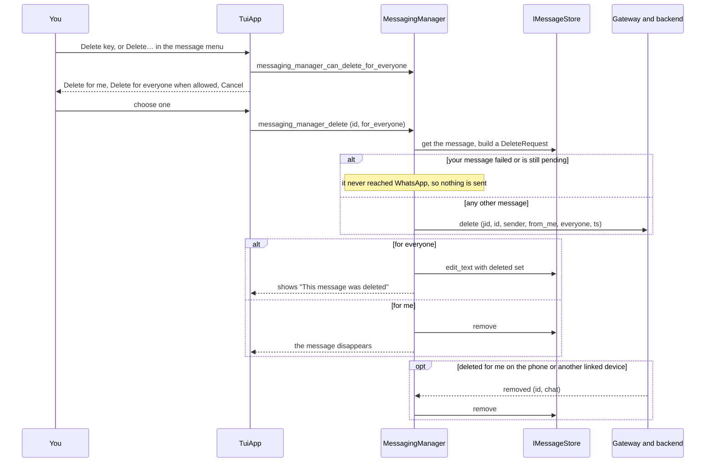
```mermaid
sequenceDiagram
    participant U as You
    participant T as TuiApp
    participant M as MessagingManager
    participant S as IMessageStore
    participant B as Gateway and backend
    U->>T: Delete key, or Delete… in the message menu
    T->>M: messaging_manager_can_delete_for_everyone
    T-->>U: Delete for me, Delete for everyone when allowed, Cancel
    U->>T: choose one
    T->>M: messaging_manager_delete (id, for_everyone)
    M->>S: get the message, build a DeleteRequest
    alt your message failed or is still pending
        Note over M: it never reached WhatsApp, so nothing is sent
    else any other message
        M->>B: delete (jid, id, sender, from_me, everyone, ts)
    end
    alt for everyone
        M->>S: edit_text with deleted set
        M-->>T: shows "This message was deleted"
    else for me
        M->>S: remove
        M-->>T: the message disappears
    end
    opt deleted for me on the phone or another linked device
        B-->>M: removed (id, chat)
        M->>S: remove
    end
```

Delete for me is always offered. Delete for everyone is offered only for your own messages that were sent, are not already deleted and are less than about 60 hours old, WhatsApp's limit. Deleting for me on your phone reaches tawk as a `removed` event, so the message goes here too. Whatever the backend does, the local copy is updated at once; if the command could not be sent tawk says the phone was not reachable.

## Scheduled messages

`/later <when> <text>` in a chat hands the line to `SchedulingManager`, which reads the time from its start with the `schedule_time_parser` engine (`18:00` today or tomorrow once past, `6:30pm`, `+30m` or `+1h30m`, `today 18:00`, `tomorrow 9:00`, or a weekday such as `fri 17:30`, the next one) and keeps the rest in `IScheduledMessageStore` (the `scheduled_messages` table, migration 12). Nothing leaves the computer until the message is due.

The scheduling manager never sends anything itself. Each pass of the loop, while connected, `tui_scheduling.c` asks it for the messages that are due, hands each to `messaging_manager_send_text_to` for its chat (so it goes out as an ordinary message with its own id, pending until WhatsApp takes it) and marks it sent, which removes it, or failed. Messages that fell due while tawk was closed or offline go as soon as it is connected again, with a note that they were late. The open chat shows its waiting messages after the others as dimmed bubbles with `🕓` and the time; they cannot be selected. `/scheduled` opens `scheduled_list_dialog`: every waiting message across chats, with Send now (which makes it due at once), Change time (read by the same parser) and Cancel. A chat whose hidden id (LID) turns out to be a phone number keeps its scheduled messages, through the `alias` event the messaging manager now also hands to its observer.

## Typing and presence

While you type in a chat, tawk sends `typing` with `composing` (repeated at most every 7 seconds while you keep typing) and `paused` once you stop for a while, send, switch chats or go idle. Recording a voice note sends `recording`. Nothing is sent when "Share typing" is off.

Incoming `typing` events are kept per chat and sender and expire after 8 seconds unless refreshed, so a lost `paused` never leaves a chat stuck on "typing…". The chat list preview shows the notice, and in the open chat `typing_indicator` draws it as a small bubble on the last row of the conversation, just above the input, with three dots lit one after another (a step every 300 ms, which keeps the event loop redrawing while someone types). A soft-locked chat shows neither.

WhatsApp delivers typing notices only to devices that are online and subscribed to the contact. tawk sends `presence` available after connecting while "Appear online" is on and you are active, and unavailable after two minutes without input, while the screensaver runs and on exit. It sends `subscribe` for a one-to-one chat when you open it and again after each reconnect.

The same subscription carries who is online. Both backends pass a contact's `presence` (online or offline, with a last-seen time when shared) to the messaging manager, which keeps it in a `presence_tracker`: one entry per contact, 64 at most. Each time the chats are rebuilt the tracker fills `Chat.presence` and `Chat.last_seen` for one-to-one chats, and `chat_subtitle` turns them into the dim line under the open chat's name through `presence_text` ("online", "last seen today at 14:32"), falling back to the about text when nothing is known or "Show online status" is off. The tracker is emptied whenever tawk is not both connected and shown as online, because WhatsApp sends no presence then and an old "online" would be wrong. Only a change of state is passed on to those who follow along: it goes into the live ring as `LIVE_KIND_PRESENCE`, and the control server sends it to agents as a `presence` event when "Push online status" is on.

## Loading older messages

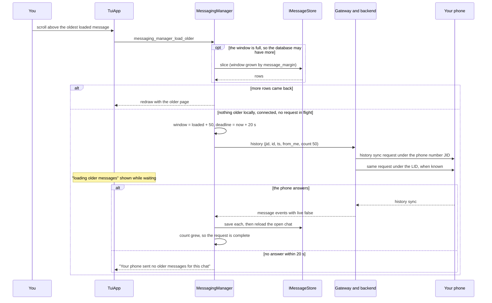
```mermaid
sequenceDiagram
    participant U as You
    participant T as TuiApp
    participant M as MessagingManager
    participant S as IMessageStore
    participant B as Gateway and backend
    participant P as Your phone
    U->>T: scroll above the oldest loaded message
    T->>M: messaging_manager_load_older
    opt the window is full, so the database may have more
        M->>S: slice (window grown by message_margin)
        S-->>M: rows
    end
    alt more rows came back
        M-->>T: redraw with the older page
    else nothing older locally, connected, no request in flight
        M->>M: window = loaded + 50, deadline = now + 20 s
        M->>B: history (jid, id, ts, from_me, count 50)
        B->>P: history sync request under the phone number JID
        B->>P: same request under the LID, when known
        Note over T: "loading older messages" shown while waiting
        alt the phone answers
            P-->>B: history sync
            B-->>M: message events with live false
            M->>S: save each, then reload the open chat
            M->>M: count grew, so the request is complete
        else no answer within 20 s
            M-->>T: "Your phone sent no older messages for this chat"
        end
    end
```

The open chat keeps a window of messages in memory: what is on screen and `message_margin` messages either side (50 by default). `IMessageStore.slice` reads the window by how many of the newest messages to skip, so the cost of opening or scrolling a chat does not depend on how long the chat is. After each frame `TuiApp` tells `MessagingManager` which messages are on screen (`messaging_manager_focus_window`); when fewer than half a margin is left above or below, the window slides, and `MessageView` holds the message at the top of the screen in place across the reload so nothing jumps. A message that arrives while the window is away from the end moves the skip count along rather than the view, and the `↓ newer` badge or End returns to the newest messages. Scrolling up with the wheel, PgUp or ↑ on the oldest message grows the window by one margin and reloads from the database. When the database has nothing older, tawk sends a `history` command anchored on the oldest message it has, and only one such request is in flight at a time. The phone files a one-to-one chat under either the phone number or the LID and only answers for the form it uses, so both backends send the request under both when they know the other form. Opening a search result uses the same path to load pages until the message is in view.

Pictures are decoded once per width: layout and drawing ask the thumbnail cache for the same size, and the cache holds more pictures than a full window can contain. A delivery tick or a read receipt reloads the conversation only when its message is among those loaded.

## One chat per person

WhatsApp may address the same person by phone number or by a hidden LID. Both backends translate LIDs to phone numbers when they can and report every mapping they learn as an `alias` event. `MessagingManager` stores the alias through `IJidAliasStore`, rewrites the JIDs of every later event to the phone number, and merges what it already had under the LID: messages move to the phone number chat, chat details and preferences are combined, contact names are merged, reactions are reassigned and unread tallies are added together. If the LID chat was open, the phone number chat opens in its place.

## Search

Message text is indexed by an SQLite FTS5 table that database triggers keep in step with every insert, edit and delete. A query is split into words, each word is quoted and made a prefix term, and the matches are returned newest first. `messaging_manager_search` then drops every result from a soft-locked chat. Choosing a result opens the chat and selects the message.

## Soft lock

A soft lock keeps a chat's conversation off the screen, for example while someone can see your terminal. Ctrl+Shift+L (where the terminal reports it, see [CONFIGURATION.md](CONFIGURATION.md#ctrlshiftl-in-windows-terminal)) and Alt+L toggle it for the chat selected in the list when the list has focus, and for the open chat otherwise; `/softlock` toggles the open chat and the chat options their own chat. `messaging_manager_toggle_soft_lock` stores the new state through `IChatStore.set_soft_locked` in the `soft_locked` column (database version 5), so it survives restarts. It is local to tawk and never sent to WhatsApp.

While a chat is soft-locked:

- The conversation is drawn by `text_veil` as soft shaded bands of `░` and `▒` in place of names, text, meta lines and pictures, keeping the shape of each bubble. Pictures become bands too and no Sixel images are placed. The title bar shows 🙈 before the chat name.
- The chat list shows 🙈 before the name and "Soft-locked" instead of the last message, the typing notice or a draft, and a `?` badge instead of the portrait.
- The title bar shows 🙈 before the name, and neither the profile picture nor the summary line.
- The contact panel shows a badge instead of the picture, and the full size picture cannot be opened.
- Search leaves out its messages.
- Locking the open chat clears the message selection and closes the viewer.

Notifications, unread counts and sending work as usual.

## The chat list

When some chats are pinned, the Chats folder is split into two groups: Pinned, then Chats (everything else). Each group has a header with a fold arrow, its name, the number of chats and how many have unread messages, and a rule that sets it apart. Enter or a click on a header folds or unfolds the group, ← folds it and → unfolds it. The state is written to `pinned_folded` and `chats_folded` in `config.ini`, so it is the same after a restart. Without pinned chats, and while the name filter is in use, the list is not grouped.

`chat_spacing` sets the blank lines between chats (0, 1 or 2) in both the detailed and the compact style. Group headers take the same height as a chat, with a blank line above the header when the height allows.

A bar on the left edge marks a chat: the accent colour for the open chat, the badge colour for chats with unread messages. In the detailed style, with `portraits` on, each chat starts with its portrait, four columns wide and two rows high (see [Profiles and portraits](#profiles-and-portraits)). Up to 24 of them are drawn as Sixel images at once.

## Profiles and portraits

`ProfileManager` keeps what WhatsApp says about contacts and groups: the about text, business details, group subject, description, creator, creation date and members, the profile pictures and the block list. It keeps up to 256 profiles in memory, reading each from `IProfileStore` the first time it is needed and replacing the least recently used one when full, and it asks the backend for whatever is missing or stale:

| Asked for | When |
|---|---|
| Preview picture and details | The first time a profile is needed in a run, so changes made while tawk was closed are picked up |
| Preview picture | When there is no picture file (and WhatsApp did not say there is none), or the last request is a day old; at most once a minute per contact |
| Details | When they are older than an hour, when none are stored, and always when the contact panel opens |
| Full picture | When the full size view opens and no full picture file is stored |

Requests wait in a queue of 64, where asking twice for the same thing counts once. Each pass of the event loop `profile_manager_tick` sends at most two, so opening a long chat list never floods WhatsApp. A request with no answer after 20 seconds is dropped, so it can be asked again later.

The answers come back as events. The messaging manager drains the one event queue as usual, and hands `profile`, `picture`, `picture_changed`, `blocklist`, `call`, `profile_updated` and `status_posted` events to the `IEventObserver` it was given, a `composite_event_observer` holding the observers of the profile, call, account, status and status feed managers. `connected` and `media` events go to the observer too, after the messaging manager has handled them itself. It marks `ManagerChanges.profiles` when an observer says the event changed what is shown, so the screen redraws.

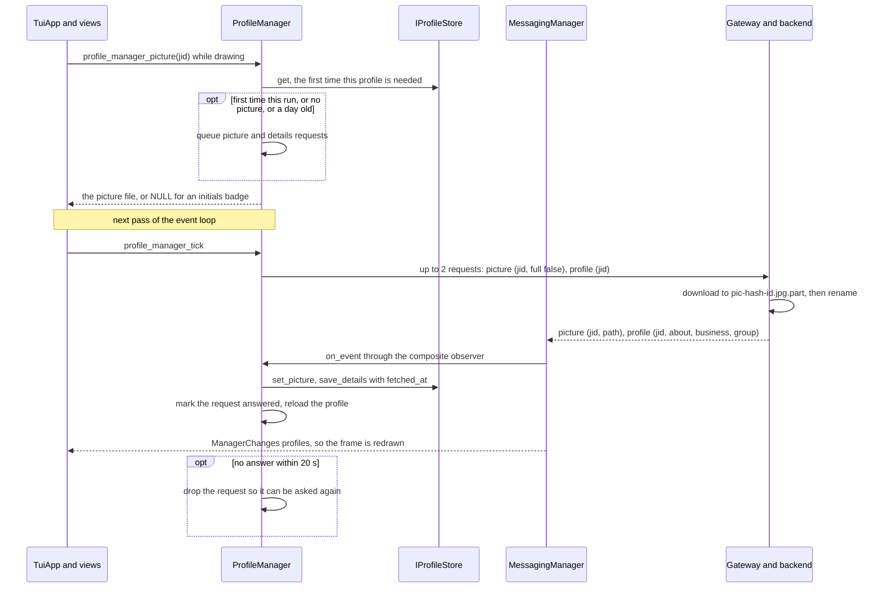
```mermaid
sequenceDiagram
    participant T as TuiApp and views
    participant P as ProfileManager
    participant S as IProfileStore
    participant M as MessagingManager
    participant B as Gateway and backend
    T->>P: profile_manager_picture(jid) while drawing
    P->>S: get, the first time this profile is needed
    opt first time this run, or no picture, or a day old
        P->>P: queue picture and details requests
    end
    P-->>T: the picture file, or NULL for an initials badge
    Note over T,P: next pass of the event loop
    T->>P: profile_manager_tick
    P->>B: up to 2 requests: picture (jid, full false), profile (jid)
    B->>B: download to pic-hash-id.jpg.part, then rename
    B-->>M: picture (jid, path), profile (jid, about, business, group)
    M->>P: on_event through the composite observer
    P->>S: set_picture, save_details with fetched_at
    P->>P: mark the request answered, reload the profile
    M-->>T: ManagerChanges profiles, so the frame is redrawn
    opt no answer within 20 s
        P->>P: drop the request so it can be asked again
    end
```

`picture_changed` makes the store forget both picture files, so they are fetched again, and `blocklist` replaces the `blocked` flags of every profile. Blocking or unblocking shows at once and sends `block`; the `blocklist` that follows confirms it.

Views never call the profile manager. They get pictures through a `PortraitSource` (a context and a `picture(jid)` function) that the client fills in, and `portrait_draw` in `portrait_view.c` draws one into any box:

- **Sixel in use and a picture:** the cells are left blank and an `ImagePlacement` with its `round` flag set goes to the Sixel overlay. `sixel_image_cache_get_path` crops the picture to its centred square, scales it to the largest square that fits the box, and encodes it with `sixel_encode_masked` and a circular mask, so the pixels outside the circle are never drawn and the background shows through.
- **Half blocks and a picture, in a box at least four rows high:** the picture is drawn with coloured half blocks, big enough to recognise a face.
- **Otherwise, or with no picture:** a badge with up to two initials from the first two words of the name, in one of 14 colours picked from a hash of the JID, so a contact keeps its colour. When the badge is at least three columns wide and two rows high its corners are rounded with quarter blocks (`▗ ▖ ▝ ▘`) in the badge colour over the background behind it.

| Where | Size |
|---|---|
| Chat list (detailed style) | 4 columns by 2 rows before each chat |
| Chat title bar | 4 columns by 2 rows, when the conversation pane is at least 6 rows high |
| Contact panel | 4 rows, or 6 when the panel is at least 30 rows high, twice as many columns |
| Incoming call prompt | 12 columns by 6 rows |
| Full size view | As large as the window allows, square |

With `portraits` on, the chat title bar takes two rows: the portrait, the name, and under it a summary line from `profile_manager_summary`. The summary is "Blocked" for a blocked contact, "N members" for a group, otherwise the about text, otherwise a business account's category. A "loading older messages" note takes its place while history is fetched; typing notices sit above the input instead. A click on the title bar portrait opens the full size view, and a click on the name opens the contact details.

The full size view is the image viewer in portrait mode. It shows the preview at once, asks for the full picture, and switches to it when it arrives; with neither, tawk says there is no profile picture instead of opening it. The picture is shown square and whole, not round. Esc, q, Enter or a click closes it.

## Contact details

Clicking the name in the title bar, Alt+I (the chat selected in the list when the list has focus, otherwise the open chat), `/info` and Contact info… in the chat options open `contact_panel` over the right of the conversation pane. Opening it asks WhatsApp for the details again. The panel shows the picture, the name, the phone number or the group's member count, notes such as blocked, under a soft lock, muted, pinned and the chat theme, then the about text and business details (verified name, category, address, email) or the group description, who created it and when, and the members with admins marked. Until the first answer arrives it says it is asking WhatsApp. The details scroll with the wheel, PgUp and PgDn; the actions stay at the bottom, chosen with ↑ ↓ and Enter or a click. Esc, q or a click outside closes it, and a click on the picture opens the full size view.

| Action | What happens |
|---|---|
| View profile picture | The full size view |
| Search messages | Closes the panel and opens search |
| Chat options | Closes the panel and opens the chat options |
| Soft-lock chat, or Show chat | Toggles the soft lock |
| Export chat, Export chat with media | Writes the chat to the downloads folder, see below |
| Block, or Unblock | Chats with one person only, not groups. Block asks first in a `ConfirmDialog`; Unblock acts at once |
| Clear chat… | Asks first in a flashing `ConfirmDialog`, then `messaging_manager_clear_chat` |
| Delete chat… | Asks first in a flashing `ConfirmDialog`, then deletes the chat everywhere, as the chat options do |

Clearing is local: `messaging_manager_clear_chat` removes the chat's messages and their reactions from the database, empties its preview and unread count, and keeps the chat in the list. Nothing is sent to WhatsApp, so your phone keeps its copy, and downloaded files stay in the media cache until it is pruned.

Exporting goes through `messaging_manager_export_chat`, which reads every stored message of the chat (oldest first) and hands them to `IChatExporter`. `text_chat_exporter` writes WhatsApp's own export format, one line per message:

```
[29/09/2026, 14:05] Mom: Did you eat?
[29/09/2026, 14:06] You: <attached: 3EB0F00DBEEF12345678.jpg>
[29/09/2026, 14:07] Mom: <photo omitted>
[29/09/2026, 14:08] Mom: This message was deleted
```

Your messages are signed "You". A photo, video, voice note, document or sticker is written as `<attached: file>` when its file was copied, otherwise as `<photo omitted>` (or video, voice note, document, sticker), with any caption on the next line (a document's text is its file name, so it is not repeated). Without media the result is `tawk chat with NAME.txt` in the downloads folder (`download_dir`, else your downloads folder); with media it is a folder `tawk chat with NAME` holding the text file and copies of every downloaded file, named as Save to Downloads names them. Nothing is ever overwritten: names that are taken get ` (1)`, ` (2)` and so on, the text file is created with `O_EXCL` and `O_NOFOLLOW`, and the files are copied with `file_copy`. Only what tawk has stored is exported; older history still on the phone is not fetched first.

## Your profile

Clicking your name in the header (right of the connection emoji) or `/profile` opens `profile_dialogs`: your photo, name, about text and number. Name and About open an editor with a character count and WhatsApp's limits (25 and 139 characters, checked by the `profile_field_validator` engine). Photo offers choosing a file, taking a photo with the camera, pasting a picture, viewing it full size and removing it.

`AccountManager` checks the change, copies a new photo into `media/outgoing/` with `outgoing_media_copy`, and sends it through the gateway's `IProfileEditor`. Only one change per field is in flight at a time. The backend answers with `profile_updated`, which reaches the account manager through the composite observer; with no answer after 30 seconds it reports that WhatsApp did not answer. `tui_account.c` takes each finished change and shows it as a toast. A new about text is followed by a `profile` event for your own JID and a new or removed photo by `picture_changed`, so the profile manager shows the new details like any contact's.

## Statuses

**Posting.** The + in the header (left of the clock) and `/status` open `status_composer_dialog`, with tabs for text, photo, video and link statuses, a background colour from `status_background_palette` for text and link statuses, and a file or the camera for photos and videos. `StatusManager` checks the post with `status_post_validator` (words for text, an address found by `url_finder` for a link, an existing file of the right type up to 100 MB for a photo or video), copies the file with `outgoing_media_copy`, and sends it through `IStatusPublisher`. One post is in flight at a time, and the answer is `status_posted`; with none after two minutes the post counts as failed. Only whatsmeow hands out a status publisher. On Baileys the + offers to switch: tawk saves the backend, shuts down cleanly and `main.c` starts it again without any `--backend` option, ready to link again.

**Viewing.** Messages on `status@broadcast` never become a chat. The messaging manager hands them, with their edits and removals, to `StatusFeedManager` through the observer before the hidden chat check, and the feed keeps them in `IStatusStore` for `status_keep_days` (the last day as current, the rest as the archive), filing your own under your JID (learned from `connected`). whatsmeow also sends the statuses in history sync (`statusV3Messages`). The ⭕ in the header shows how many people have statuses you have not seen and opens the Status list (also `/statuses`): My status, then recent and viewed updates. Choosing someone opens the viewer with a bar per status, who and when, and the status itself. ← and → step through them, Enter opens a photo full size (in the built-in viewer when `image_viewer` is `builtin`) or plays a video, and past the last one the viewer returns to the list.

A status's photo or video is downloaded when it is looked at, with no size limit, or, while the archive is kept and auto-download is on, as it arrives (up to `auto_download_max_mb`); the feed accepts the file only inside the media folder. A request that brings no file within two minutes may be asked again. Viewing marks a status seen locally and sends no read receipt. Every ten minutes the feed prunes statuses older than `status_keep_days` and deletes their files. Tab in the Status list switches between recent statuses and the archive.

**Answering.** Under someone else's status the viewer offers eight quick emoji, a like and a reply. `tui_statuses.c` builds a `StatusReplyTarget` (the status id, its author and a short preview) and hands it to the messaging manager, since the feed manager never sends messages. `messaging_manager_reply_to_status` sends an emoji or the words to the author's chat as a reply whose `QuoteRef` has `is_status` set; the backends then quote the message on `status@broadcast`, which is how the phone knows it answers a status. `messaging_manager_like_status` uses the gateway's `IStatusLiker` where there is one (Baileys sends a reaction to the status with `statusJidList` naming only the author) and otherwise sends ❤️ as a status reply, and returns which it did so the toast can say so.

**Status replies in chats.** A reply to a status, sent or received, is stored with `quoted_status` (migration 14). While laying out a chat, `message_view` looks each such status up through the `StatusSource` in its context, which `tui_app.c` answers from `status_feed_manager_get`, and keeps the result as a `QuotedStatus` per message for the frame. The bubble then shows whose status it was, the status's picture (a stand-in message gives the thumbnail cache the status's file or preview) and caption, or a text status's words on its own colour through `status_colour_attr`, the same helper the composer's preview uses. A status tawk no longer keeps falls back to the quoted words.

**Pasting into the composer.** A path pasted or dropped while the composer is open, or Alt+V with a picture on the clipboard, is given to `status_manager_kind_for_file`, which asks the `media_type_detector` engine whether it is a photo or a video; the dialog then switches to that tab. Anything else is refused in the dialog.

## Incoming calls

Both backends report calls as `call` events. `CallManager` takes an `offer` for a voice call as the ringing call and forgets it when an event for the same call says `accepted` (answered on another device) or `ended`, or after 60 seconds, about when WhatsApp stops ringing. Video calls are ignored.

While a call rings, and you are not in the linking wizard, `incoming_call_view` draws a box above everything else, confirmations included: the caller's portrait and name, how long it has been ringing, and two buttons. Its border pulses twice a second. Every 3 seconds tawk plays the notification sound (when `sound` is on) and flashes the terminal title, unless do not disturb is on. The prompt takes every key and click: d (or n) or the Decline button declines the call through `reject_call`, and Enter, Esc, Space or Answer on phone only closes the prompt, leaving the call ringing on your phone.

tawk cannot answer a call or carry its audio. Neither whatsmeow nor Baileys implements WhatsApp's call media, only the signalling that reports and declines calls, so answering is left to the phone.

## Photos, videos and PDFs

Photos, videos and PDFs are drawn inside the conversation. `media_picture_for` (`src/clients/tui/media_picture.c`) picks the best picture tawk has for a message, using the `MediaSources` record (an `IVideoPoster` for video frames and an `IDocumentPages` for PDF pages), and `media_picture_decode` turns it into pixels, drawing a play button on videos and a red document badge in the bottom left corner of PDFs. A document counts as a PDF when its downloaded file, or the file name at the start of its text, ends in `.pdf`. The picture is then drawn either with coloured half blocks, which work in any colour terminal, or as a real Sixel image in terminals that support it.

| Source | Used for | When |
|---|---|---|
| `MEDIA_PICTURE_FILE` | Photos | The photo is downloaded |
| `MEDIA_PICTURE_POSTER` | Videos | The video is downloaded and `IVideoPoster` has a frame for it |
| `MEDIA_PICTURE_PAGE` | PDFs | The PDF is downloaded and `IDocumentPages` has rendered the page |
| `MEDIA_PICTURE_THUMB` | All three | The small JPEG preview WhatsApp sent with the message (for a PDF, only for its first page) |
| `MEDIA_PICTURE_PLACEHOLDER` | Videos and PDFs | Nothing else: a dark 16:9 picture for a video, a blank A4 page with grey lines for a PDF |

When a source cannot be decoded, `media_picture_fallback` steps down to the next one, so a corrupt file still shows its preview. The cache key includes the source, the page and whether the badge is drawn, so a sharper picture replaces a blurry one as soon as it exists.

Video frames come from `ffmpeg_video_poster.c`: the first time a downloaded video is drawn it starts `ffmpeg -ss 0.5 ... -frames:v 1` in the background, writing `<video>.poster.jpg` beside the video, and reports the frame as pending. While any frame is pending the main loop keeps redrawing four times a second, so the frame appears as soon as ffmpeg finishes. Without ffmpeg, videos keep their preview or placeholder.

PDF pages come from `poppler_document_pages.c` in the same way. The first time a page of a downloaded PDF is drawn it starts `pdftoppm -f N -l N -png -singlefile -scale-to 1600` in the background, writing `<pdf>.p<N>.png` beside the PDF, and reports the page as pending for up to 20 seconds. The number of pages comes from `pdfinfo` and is remembered per file. Without poppler, PDFs keep their preview or placeholder, and the viewer says the page needs `pdftoppm`.

A frame or page is used only once `file_settled` finds it non-empty and unchanged for 300 ms, so a picture is never decoded while the tool is still writing it.

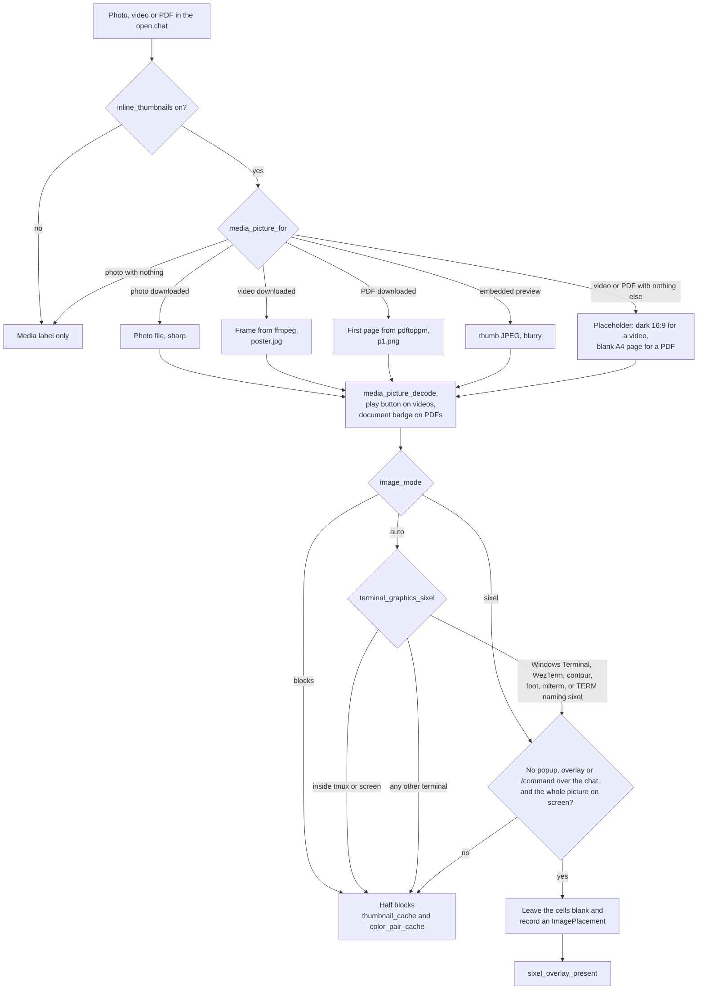
```mermaid
flowchart TD
    MSG["Photo, video or PDF in the open chat"] --> THUMBS{"inline_thumbnails on?"}
    THUMBS -->|no| LABEL["Media label only"]
    THUMBS -->|yes| PIC{"media_picture_for"}
    PIC -->|photo downloaded| SHARP["Photo file, sharp"]
    PIC -->|video downloaded| POSTER["Frame from ffmpeg,<br/>poster.jpg"]
    PIC -->|PDF downloaded| PAGE["First page from pdftoppm,<br/>p1.png"]
    PIC -->|embedded preview| BLUR["thumb JPEG, blurry"]
    PIC -->|"video or PDF with nothing else"| HOLD["Placeholder: dark 16:9 for a video,<br/>blank A4 page for a PDF"]
    PIC -->|"photo with nothing"| LABEL
    SHARP --> DECODE["media_picture_decode,<br/>play button on videos,<br/>document badge on PDFs"]
    POSTER --> DECODE
    PAGE --> DECODE
    BLUR --> DECODE
    HOLD --> DECODE
    DECODE --> MODE{"image_mode"}
    MODE -->|blocks| BLOCKS["Half blocks<br/>thumbnail_cache and color_pair_cache"]
    MODE -->|sixel| FREE
    MODE -->|auto| DETECT{"terminal_graphics_sixel"}
    DETECT -->|inside tmux or screen| BLOCKS
    DETECT -->|"Windows Terminal, WezTerm, contour,<br/>foot, mlterm, or TERM naming sixel"| FREE
    DETECT -->|any other terminal| BLOCKS
    FREE{"No popup, overlay or /command over the chat,<br/>and the whole picture on screen?"}
    FREE -->|no| BLOCKS
    FREE -->|yes| PLACE["Leave the cells blank and<br/>record an ImagePlacement"]
    PLACE --> OVERLAY["sixel_overlay_present"]
```

curses knows nothing about Sixel pixels, so `sixel_overlay.c` writes them straight to the terminal after curses has updated the screen, and only when something about them changed. Rewriting every image on every frame would flicker; never rewriting them would leave old pixels behind.

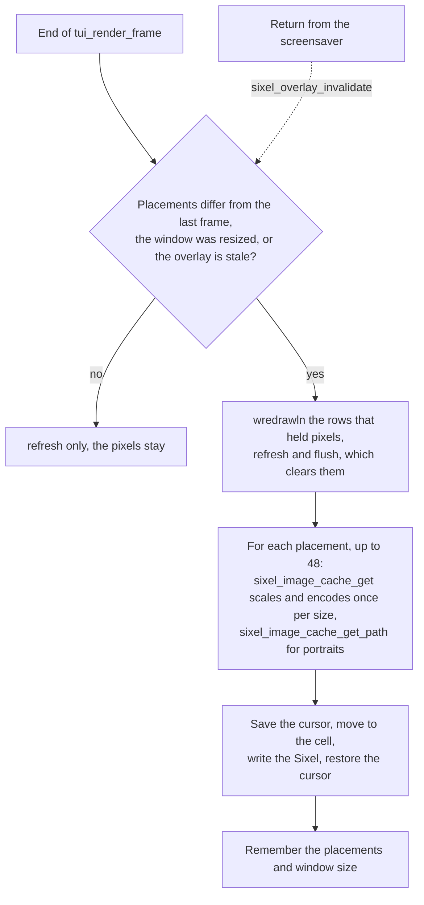
```mermaid
flowchart TD
    FRAME["End of tui_render_frame"] --> CHANGED{"Placements differ from the last frame,<br/>the window was resized, or the overlay is stale?"}
    CHANGED -->|no| KEEP["refresh only, the pixels stay"]
    CHANGED -->|yes| CLEAR["wredrawln the rows that held pixels,<br/>refresh and flush, which clears them"]
    CLEAR --> CACHE["For each placement, up to 48:<br/>sixel_image_cache_get scales and encodes once per size,<br/>sixel_image_cache_get_path for portraits"]
    CACHE --> WRITE["Save the cursor, move to the cell,<br/>write the Sixel, restore the cursor"]
    WRITE --> REMEMBER["Remember the placements and window size"]
    SAVER["Return from the screensaver"] -.->|sixel_overlay_invalidate| CHANGED
```

The conversation's pictures, the title bar portrait and the chat list's portraits share one list of placements. A popup that covers them (the contact panel, the viewer, a ringing call) presents its own placements instead. A placement differs when its position, size, background, message, picture source, PDF page or round flag changes, so a photo that finishes downloading is redrawn sharp and turning a page redraws it. Pictures that are only partly on screen stay as half blocks, and inline images give way while any other popup is open, because curses cannot draw text over pixels.

Opening a photo, video or PDF (Enter or a click) shows it in the built-in viewer unless `image_viewer` names another program:

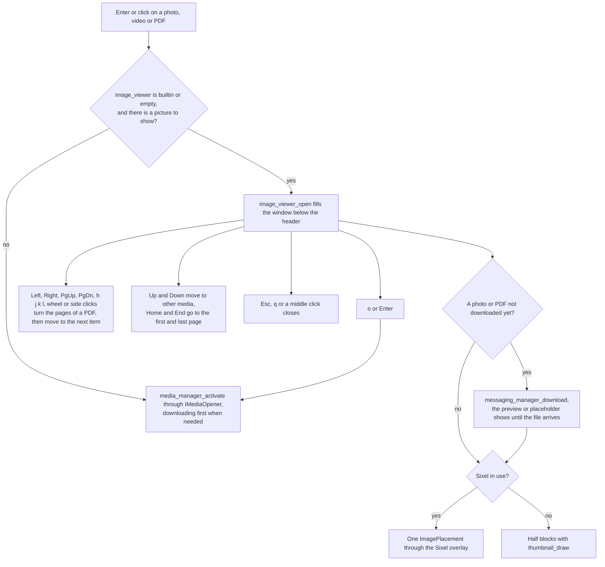
```mermaid
flowchart TD
    OPEN["Enter or click on a photo, video or PDF"] --> BUILTIN{"image_viewer is builtin or empty,<br/>and there is a picture to show?"}
    BUILTIN -->|no| OUTSIDE
    BUILTIN -->|yes| VIEWER["image_viewer_open fills the window below the header"]
    VIEWER --> FILE{"A photo or PDF not downloaded yet?"}
    FILE -->|yes| FETCH["messaging_manager_download,<br/>the preview or placeholder shows until the file arrives"]
    FILE -->|no| PIXELS
    FETCH --> PIXELS{"Sixel in use?"}
    PIXELS -->|yes| ONE["One ImagePlacement through the Sixel overlay"]
    PIXELS -->|no| HALF["Half blocks with thumbnail_draw"]
    VIEWER --> KEYS["Left, Right, PgUp, PgDn, h j k l, wheel or side clicks<br/>turn the pages of a PDF, then move to the next item"]
    VIEWER --> UPDOWN["Up and Down move to other media,<br/>Home and End go to the first and last page"]
    VIEWER --> CLOSE["Esc, q or a middle click closes"]
    VIEWER --> KEYO["o or Enter"]
    KEYO --> OUTSIDE["media_manager_activate through IMediaOpener,<br/>downloading first when needed"]
```

In the viewer a PDF is drawn without the document badge, and the header shows "page 2 of 7" next to the position in the chat's media. ← and → (and PgUp, PgDn, the wheel and clicks on the side thirds) turn the pages; past the first or last page they move on to the previous or next photo, video or PDF. ↑ and ↓ always move between items, and every item opens on its first page. A PDF that has not been downloaded is fetched when it is opened, and its pages appear once the file arrives and `pdftoppm` has rendered them.

Outside tawk, the opener runs the `image_viewer` or `video_player` command when the config file is trusted. Otherwise videos go to the first of mpv, vlc, celluloid, totem and ffplay found (unless the system can hand them to macOS or Windows), and everything else to the system default viewer.

## Pasting a picture

A terminal paste carries text only, so a picture on the clipboard never reaches tawk through the terminal. Alt+V, `/paste`, a Ctrl+V the terminal passes through, or an empty bracketed paste ask `IClipboardImage` for it instead:

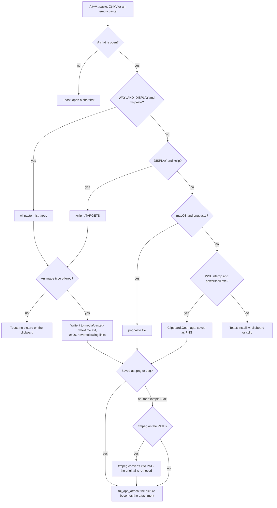
```mermaid
flowchart TD
    KEY["Alt+V, /paste, Ctrl+V or an empty paste"] --> CHAT{"A chat is open?"}
    CHAT -->|no| NOCHAT["Toast: open a chat first"]
    CHAT -->|yes| WL{"WAYLAND_DISPLAY and wl-paste?"}
    WL -->|yes| LIST1["wl-paste --list-types"]
    WL -->|no| X11{"DISPLAY and xclip?"}
    X11 -->|yes| LIST2["xclip -t TARGETS"]
    X11 -->|no| MAC{"macOS and pngpaste?"}
    MAC -->|yes| PNGPASTE["pngpaste file"]
    MAC -->|no| PS{"WSL interop and powershell.exe?"}
    PS -->|yes| WIN["Clipboard.GetImage, saved as PNG"]
    PS -->|no| NOTOOL["Toast: install wl-clipboard or xclip"]
    LIST1 --> TYPE{"An image type offered?"}
    LIST2 --> TYPE
    TYPE -->|no| EMPTY["Toast: no picture on the clipboard"]
    TYPE -->|yes| SAVE["Write it to media/pasted-date-time.ext,<br/>0600, never following links"]
    PNGPASTE --> KIND
    WIN --> KIND
    SAVE --> KIND{"Saved as .png or .jpg?"}
    KIND -->|yes| ATTACH["tui_app_attach: the picture becomes the attachment"]
    KIND -->|no, for example BMP| FF{"ffmpeg on the PATH?"}
    FF -->|yes| CONVERT["ffmpeg converts it to PNG,<br/>the original is removed"]
    FF -->|no| ATTACH
    CONVERT --> ATTACH
```

Each tool runs without a shell, with a four second limit, and the file lands in the media folder like any download. WhatsApp sends only JPEG and PNG as photos, and the Windows clipboard often reaches WSL as BMP, so any other picture is converted to PNG with ffmpeg (without a shell, its output discarded). Without ffmpeg, or when the conversion fails, the original file is attached and goes out as a document.

## The camera

➕ in the input opens `attach_menu` with Take a photo and Choose a file; Take a photo and `/camera` open `camera_view` over the conversation. The same viewfinder serves the profile photo menu and the status composer, and a `CameraPurpose` recorded when it opens says where the result goes: the open chat's attachment, `AccountManager` as a new profile photo, or the status composer as its photo or video. The menu says "(no camera)" when `media_manager_camera_available` is false, which on Linux means there is no ffmpeg or no readable `/dev/video0` (usual under WSL).

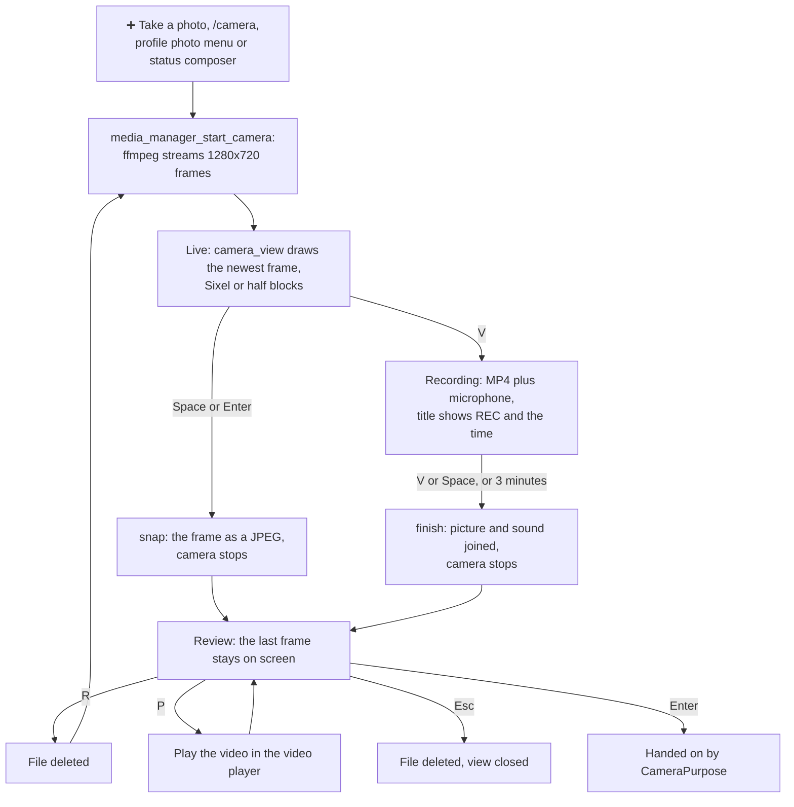
```mermaid
flowchart TD
    OPEN["➕ Take a photo, /camera,<br/>profile photo menu or status composer"] --> START["media_manager_start_camera:<br/>ffmpeg streams 1280x720 frames"]
    START --> LIVE["Live: camera_view draws the newest frame,<br/>Sixel or half blocks"]
    LIVE -->|Space or Enter| SNAP["snap: the frame as a JPEG,<br/>camera stops"]
    LIVE -->|V| REC["Recording: MP4 plus microphone,<br/>title shows REC and the time"]
    REC -->|V or Space, or 3 minutes| JOIN["finish: picture and sound joined,<br/>camera stops"]
    SNAP --> REVIEW["Review: the last frame stays on screen"]
    JOIN --> REVIEW
    REVIEW -->|R| DEL["File deleted"] --> START
    REVIEW -->|P| PLAY["Play the video in the video player"] --> REVIEW
    REVIEW -->|Esc| GONE["File deleted, view closed"]
    REVIEW -->|Enter| USE["Handed on by CameraPurpose"]
```

`ffmpeg_camera` implements `ICamera`. It runs ffmpeg on the camera (`avfoundation` on macOS, `v4l2` on `/dev/video0` elsewhere) with raw RGB frames on a pipe, which a reader thread collects, keeping only the newest so the picture never lags; the UI thread takes it on each tick. Without a first frame within 8 seconds tawk closes the viewfinder and says the camera was most likely refused (on a Mac, the terminal needs camera access in Privacy & Security). A photo is the newest frame written out and turned into a JPEG by ffmpeg. For a video, `MediaManager` asks the audio backend for its capture command, and the same ffmpeg also encodes the picture to H.264 while the capture records the sound; when recording stops the two are joined into an MP4 with AAC sound, trimmed so they stay in sync. The client stops a recording once `media_manager_video_limit_reached` reports 3 minutes. Photos and videos are named after a new message id in `media/outgoing/`, every tool runs without a shell, and a file you retake or cancel is deleted.

## Saving files

Save to Downloads in the message menu copies the file of any photo, video, voice note or document to your downloads folder: `download_dir` when it is set, otherwise `XDG_DOWNLOAD_DIR` or `~/Downloads`. When the file has not been downloaded yet, tawk downloads it first and saves it when it arrives instead of opening it.

A document whose type tawk does not recognise (`media_type_known` finds no known extension in its name, and it is not a PDF) is not handed to a viewer straight away. Activating it opens an offer instead:

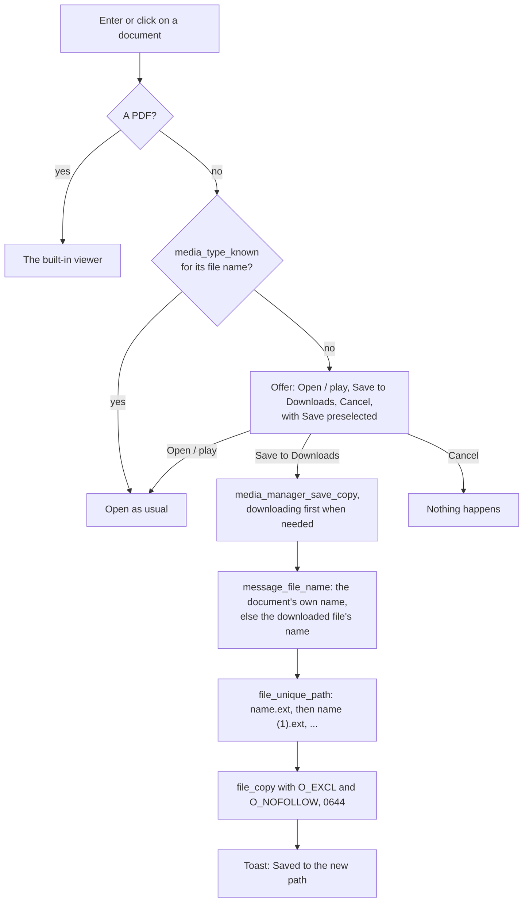
```mermaid
flowchart TD
    ACT["Enter or click on a document"] --> PDF{"A PDF?"}
    PDF -->|yes| VIEW["The built-in viewer"]
    PDF -->|no| KNOWN{"media_type_known<br/>for its file name?"}
    KNOWN -->|yes| OPEN["Open as usual"]
    KNOWN -->|no| OFFER["Offer: Open / play, Save to Downloads, Cancel,<br/>with Save preselected"]
    OFFER -->|Save to Downloads| SAVE["media_manager_save_copy,<br/>downloading first when needed"]
    OFFER -->|Open / play| OPEN
    OFFER -->|Cancel| NOTHING["Nothing happens"]
    SAVE --> NAME["message_file_name: the document's own name,<br/>else the downloaded file's name"]
    NAME --> UNIQUE["file_unique_path: name.ext, then name (1).ext, ..."]
    UNIQUE --> COPY["file_copy with O_EXCL and O_NOFOLLOW, 0644"]
    COPY --> TOAST["Toast: Saved to the new path"]
```

`message_file_name` takes the document's name from the start of its text (up to its extension), falling back to the downloaded file's name and then the message id. Slashes, backslashes and control characters become `_`, and a leading dot becomes `_`, so a saved file can never be hidden or land outside the folder. `file_copy` creates the new file exclusively and never follows a link, so it can never replace or write through anything already there, and a partial copy is removed.

## Voice notes

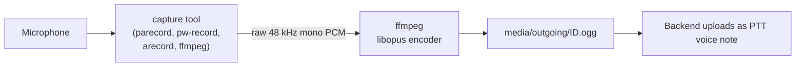
```mermaid
flowchart LR
    M[Microphone] --> C["capture tool<br/>(parecord, pw-record,<br/>arecord, ffmpeg)"]
    C -- raw 48 kHz mono PCM --> E["ffmpeg<br/>libopus encoder"]
    E --> F["media/outgoing/ID.ogg"]
    F --> B[Backend uploads as PTT voice note]
```

The audio backend only describes commands. The recorder connects the capture command to ffmpeg with a pipe; stopping sends an interrupt to the capture side, ffmpeg sees the end of input and finishes the Ogg file cleanly. Playback asks the same backend how to play a file and runs it in the background, tracked so a second click stops it.

## Reconnecting

`MessagingManager` supervises the connection. Backends only report what happened; the manager keeps one pending action (`PENDING_CONNECT`; `PENDING_RECONNECT`, which drops a connection that may still look open before dialling again; or `PENDING_RESTART` when the backend runtime itself has to be restarted) with the time it is due, and `run_supervisor` carries it out on the first tick after that time if the circuit breaker allows it. The first connect, started by `messaging_manager_start`, and each connect or reconnect it carries out set a 45 second watchdog: if the backend has reported nothing but `connecting` by then (and tawk is not waiting for a QR scan), the attempt counts as a failure and a reconnect is scheduled.

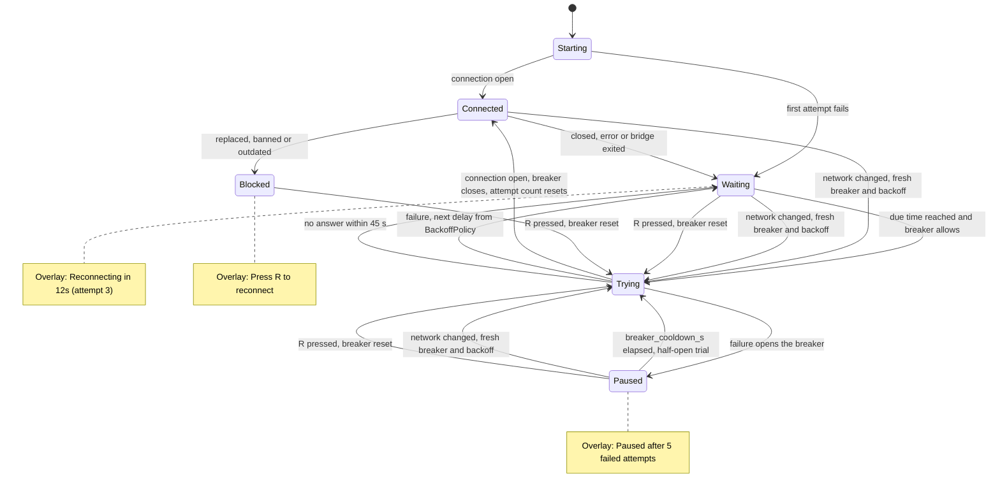
```mermaid
stateDiagram-v2
    [*] --> Starting
    Starting --> Connected: connection open
    Starting --> Waiting: first attempt fails
    Connected --> Waiting: closed, error or bridge exited
    Waiting --> Trying: due time reached and breaker allows
    Trying --> Connected: connection open, breaker closes, attempt count resets
    Trying --> Waiting: failure, next delay from BackoffPolicy
    Trying --> Waiting: no answer within 45 s
    Trying --> Paused: failure opens the breaker
    Paused --> Trying: breaker_cooldown_s elapsed, half-open trial
    Connected --> Blocked: replaced, banned or outdated
    Connected --> Trying: network changed, fresh breaker and backoff
    Waiting --> Trying: network changed, fresh breaker and backoff
    Paused --> Trying: network changed, fresh breaker and backoff
    Waiting --> Trying: R pressed, breaker reset
    Paused --> Trying: R pressed, breaker reset
    Blocked --> Trying: R pressed, breaker reset

    note right of Waiting
        Overlay: Reconnecting in 12s (attempt 3)
    end note
    note right of Paused
        Overlay: Paused after 5 failed attempts
    end note
    note right of Blocked
        Overlay: Press R to reconnect
    end note
```

The circuit breaker is a small state machine in `engines/circuit_breaker.c`:

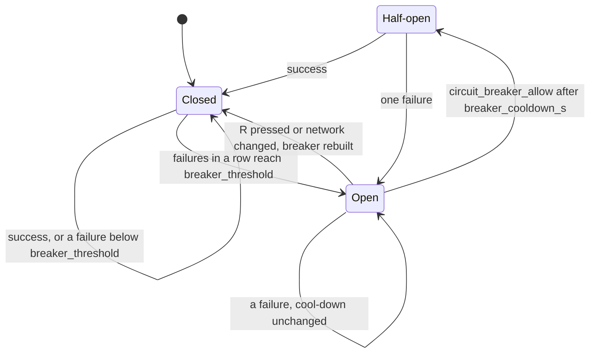
```mermaid
stateDiagram-v2
    state "Half-open" as HalfOpen
    [*] --> Closed
    Closed --> Closed: success, or a failure below breaker_threshold
    Closed --> Open: failures in a row reach breaker_threshold
    Open --> Open: a failure, cool-down unchanged
    Open --> HalfOpen: circuit_breaker_allow after breaker_cooldown_s
    HalfOpen --> Closed: success
    HalfOpen --> Open: one failure
    Open --> Closed: R pressed or network changed, breaker rebuilt
```

Only the move into Open starts the cool-down. A failure reported while the breaker is already open (a backend repeating the same outage) leaves the cool-down where it was, so a steady trickle of failures cannot keep the circuit open forever.

Delays start at `backoff_initial_ms`, double after each failure up to `backoff_max_ms`, and are randomised between half and all of that value. When the breaker is open the next attempt waits for whichever is longer, the backoff delay or the rest of the cool-down. A backend process that exits is restarted on the same schedule (`PENDING_RESTART` stops and starts the gateway, then connects). The overlay reads the same state through `messaging_manager_health`, so what it shows is exactly what will happen next: it appears when tawk is not connected and not waiting for a login, and at least one attempt has failed, a retry is blocked or the breaker is not closed. The expected restart right after pairing is not counted as a failure.

Pressing R (`messaging_manager_retry_now`) rebuilds the breaker, clears a blocked retry and turns a pending connect (or no pending action) into a reconnect due at once, because a connection that still looks open may be why you pressed it.

A connection opened on one network adapter usually hangs without any error once traffic moves to another (Wi-Fi to Ethernet, or to a phone hotspot). `ifaddrs_network_monitor` samples the addresses of the interfaces that are up and running (loopback left out) every 3 seconds, and `network_fingerprint` turns them into one number. `NetworkChangeDetector` reports a change once a new fingerprint has held for 2 seconds, so an adapter that drops and comes back while switching counts once. On a change, unless a login is needed or a retry is blocked, the messaging manager rebuilds the breaker, resets the attempt count, shows "Network changed" and schedules an immediate reconnect.

The bridges help from their side. whatsmeow runs with its own reconnecting turned off; it gives each dial and handshake 30 seconds, and after 3 keep-alive pings in a row go unanswered it disconnects and reports `closed`, since the socket would otherwise stay open forever. When keep-alives are answered again before that, it reports `open`. The Baileys sidecar shares one socket between two quick `connect` calls and ignores a close from a socket it has already replaced.

## Screensaver

After `idle_minutes` without input, or at once when you press Ctrl+L or type `/screensaver` or `/lock`, tawk leaves curses mode and starts the screensaver command in a new pseudo-terminal the size of the window. It copies the command's output to the screen and never forwards your keystrokes to it: the first key or mouse event ends the command (while it runs tawk asks the terminal to report clicks, so a click counts too), and tawk restores curses and redraws. While it runs, tawk keeps processing WhatsApp events, updates the tab title, forwards window resizes to the command, and stops it when a message arrives if `wake_on_message` is on.

## Encrypted chats

When tawk is built with SQLCipher (the Makefile uses it whenever `pkg-config` finds it), `tawk.db` can be encrypted. The client `database_crypt_command.c` handles `--encrypt`, `--decrypt` and `--change-passphrase` and asks for passphrases through `IPassphrasePrompt` (`terminal_passphrase_prompt.c`: `/dev/tty`, echo off, the terminal restored even on Ctrl+C). `DatabaseCryptManager` holds the use cases and works through `IDatabaseCipher`, which `sqlite_database_crypt.c` implements:

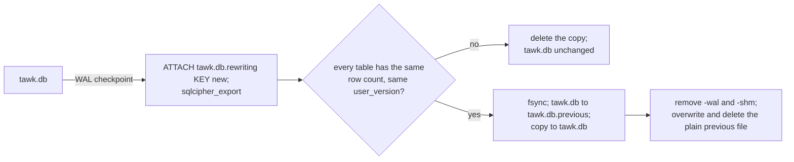
```mermaid
flowchart LR
    A["tawk.db"] -->|"WAL checkpoint"| B["ATTACH tawk.db.rewriting KEY new;<br/>sqlcipher_export"]
    B --> C{"every table has the same<br/>row count, same user_version?"}
    C -->|no| D["delete the copy;<br/>tawk.db unchanged"]
    C -->|yes| E["fsync; tawk.db to tawk.db.previous;<br/>copy to tawk.db"]
    E --> F["remove -wal and -shm;<br/>overwrite and delete the plain previous file"]
```

Decrypting and changing the passphrase use the same rewrite with the old key on the source and the new key (or none) on the copy. At start-up `database_unlock` asks for the passphrase when the file lacks SQLite's plain header, checks it with `IDatabaseCipher.unlocks`, and `sqlite_database_open` keys the connection with `sqlite3_key` before reading anything; a wrong key fails the schema read, and tawk asks again. SQLCipher's own log is turned off, so a wrong passphrase prints only tawk's message. The `Passphrase` type is wiped with `explicit_bzero` once the database is open.

## Backups

`--backup` and `--restore` run under the instance lock, before the database is opened. The client (`backup_command.c`) asks for the passphrase through `IPassphrasePrompt`; `BackupManager` does the work through three contracts: `IDatabaseSnapshot` (`sqlite_file_snapshot`: a copy of `tawk.db` and its `-wal`, consistent because nothing has it open, and still encrypted when it was), `IArchive` (`tar_archive`: the system `tar`, run with argument lists) and `IFileCipher` (`openssl_file_cipher`: `openssl enc` with the passphrase on file descriptor 3). The engines `backup_manifest_codec` and `archive_path_policy` write the manifest and decide which members a restore accepts.

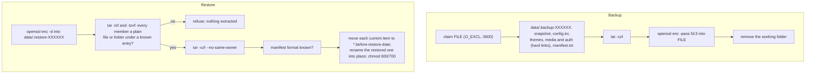
```mermaid
flowchart TD
    subgraph Backup
        B1["claim FILE (O_EXCL, 0600)"] --> B2["data/.backup-XXXXXX: snapshot, config.ini,<br/>themes, media and auth (hard links), manifest.txt"]
        B2 --> B3["tar -czf"] --> B4["openssl enc -pass fd:3 into FILE"] --> B5["remove the working folder"]
    end
    subgraph Restore
        R1["openssl enc -d into data/.restore-XXXXXX"] --> R2["tar -tzf and -tzvf: every member a plain<br/>file or folder under a known entry?"]
        R2 -->|no| R3["refuse; nothing extracted"]
        R2 -->|yes| R4["tar -xzf --no-same-owner"] --> R5["manifest format known?"]
        R5 --> R6["move each current item to *.before-restore-date;<br/>rename the restored one into place; chmod 600/700"]
    end
```

The media and login folders are copied into the working folder with hard links where the filesystem allows, so a large media folder costs no extra space while it is packed.

## Several accounts

**Start-up.** `main.c` opens the database, reads the roster of accounts and asks the `AccountHost` to start each one. Starting an account creates its gateway, its event queue, its stores bound to its id, and its managers. The first account logs in from `auth/`, every other from `accounts/<id>/auth/`. All of them connect at once.

**The upgrade.** A database from before accounts is at schema 16 or lower. Migration 17 copies the file aside, then, in one transaction, rebuilds each per-account table with `account_id` in its key and moves every row across as account 1, creates the `accounts` table with the row `main`, and creates `chat_prefs`. The search index is rebuilt to match. If any step fails the transaction is rolled back and the database is as it was.

**One loop.** The event loop drains every account's queue on each pass. A message event is handled by the managers of the account it arrived on and stored under that account's id, so two accounts never see each other's rows.

**The chat list.** `UnifiedChatList` takes each account's chats and produces one list. With merging on, chats of different accounts that are with the same person become one row that remembers which accounts it stands for. `ChatMergePolicy` decides this from the `merge_accounts` setting and the contact's own choice. A group that two of your numbers are both in is one chat on WhatsApp, and merges the same way.

**A merged conversation.** Opening such a row loads the conversation from each account and `MergedMessageWindow` interleaves them by time, dropping a message that is the same in both. Each row remembers its account, which is how a reply, a reaction or a delete reaches the right one. Scrolling up loads older messages from whichever account has them.

**Sending.** `ReplyAccountPolicy` picks the account: the one chosen for this contact, else the one the last message arrived on, else the primary. Alt+A overrides it for one message. The message is then sent by that account's `MessagingManager`, as it would be with one account.

**Agents.** The control client resolves the account of each request before the operation runs, swaps in that account's managers, and tells the `AutomationManager` which level and which self-approval chats apply. A request that waits for your answer keeps its account and is carried out by it.

## Agents and the control socket

With Settings, Automation, Agent access on, the control client (`src/clients/control`) listens on `$XDG_RUNTIME_DIR/tawk/control.sock` through `IControlTransport`. It runs on the UI thread: the terminal client calls its `IFrameHook` once a frame, so it uses the same managers as the terminal without locks. It starts listening when the setting turns on, stops when it turns off (saying goodbye to connected clients), and listens again if the socket file is removed. Each line is one request from [CONTROL.md](CONTROL.md), handled by one of the `control_ops_*.c` files. Reads are answered at once and logged as reads; nothing is marked read and the chat open on screen does not change, because `messaging_manager_history` reads any chat straight from the store.

A write passes through `control_writes.c`. The automation manager's policy says whether the access allows it, whether the chat may be used and whether you must be asked; the rate limiter counts it; destructive writes are held behind a one-time token first. What needs you goes to the `ApprovalQueue`, which the Agentic tab shows and answers; the client polls the answers each frame and carries the write out through the managers, or reports it declined or expired. Every outcome goes to the automation log.

```mermaid
sequenceDiagram
    participant A as tawk-mcp (or tawk send)
    participant C as Control client
    participant AM as AutomationManager
    participant Q as ApprovalQueue
    participant T as Agentic tab
    participant M as MessagingManager
    A->>C: send_message {chat, text}
    C->>AM: check_write(origin, SEND)
    AM-->>C: ASK (a model always asks)
    C->>Q: ask(request, risk MED)
    C-->>A: evt approval waiting
    Note over T: the tab's count goes up; a line appears once you stop typing
    T->>Q: a, or e and your edit, or d
    C->>Q: take_answer (next frame)
    alt allowed
        C->>M: send_text_to(chat, text)
        C-->>A: ok {id, edited?}
    else declined or expired
        C-->>A: error declined or timed_out
    end
    C->>AM: record(outcome)
```

A client that subscribed hears about new messages as they arrive. `control_ops_live.c` asks the automation manager for each listener, and `automation_policy_pushes` answers from the two push settings:

```mermaid
flowchart TD
    NEW["A new message in a chat"] --> VIS{"May agents use this chat?"}
    VIS -- no --> DROP["Nobody is told"]
    VIS -- yes --> EACH["For each client that subscribed to it"]
    EACH --> ORIGIN{"Acting for a model?"}
    ORIGIN -- "no, your own shell (tawk tail)" --> SEND["Send the message event"]
    ORIGIN -- yes --> MINE{"Did you send it?"}
    MINE -- yes --> PS{"Push messages you send on?"}
    MINE -- no --> PR{"Push received messages on?"}
    PS -- yes --> SEND
    PR -- yes --> SEND
    PS -- no --> SKIP["Not told; it sees the message when it reads the chat"]
    PR -- no --> SKIP
```

The other kinds take the same road. `MessagingManager` puts each in the live ring with its `LiveKind`: a read receipt for one of your messages, a reaction to one, an edit or delete by someone else, and (told by the terminal client when it sends a due message) a scheduled send. `automation_policy_pushes_event` lets each through only to programs acting for a model, and only with that kind's switch on; `control_ops_live.c` then writes one event per kind.

Just before a write is carried out, `control_writes.c` asks `automation_policy_disclaimer` whether this origin and operation get the AI disclaimer, and the `ai_disclaimer` engine adds the line under the text once (never twice). It happens after your approval and any edit, so the approval shows the words alone.

With access admin a client can give that answer itself. `AutomationManager` keeps an admin token while the access setting says admin: it writes a fresh one through `IAdminTokenStore` when the control client's tick finds access at admin with none issued, and removes it when access is anything else and when tawk quits. The `approve` operation finds the caller's own waiting request, and the manager decides: `automation_policy_self_approval` checks the access, the kind of operation and that the chat is one agents may use and one you switched on in the self-approval chats (kept in `self_approval_chats`, with `*` for all, and empty for none), the token is compared without stopping at the first difference, and the `hourly_quota` engine counts it against `self_approvals_per_hour`. When the answer is yes the request is withdrawn from the queue and carried out as if you had allowed it, logged as approved by the agent, and the manager hands the screen a line to show. When it is no the request stays in the queue for you.

The chats are chosen in `ChatToggleDialog`, a list with a `toggle_switch` per chat and one for all, opened from the Automation settings by `tui_self_chats.c`. The dialog knows nothing about what the chats are for: the terminal client reads the setting into it, and writes what is switched on back through the settings manager when you save.

```mermaid
sequenceDiagram
    participant A as tawk-mcp, holding the admin token
    participant C as Control client
    participant AM as AutomationManager
    participant Q as ApprovalQueue
    participant T as Screen
    participant M as MessagingManager
    A->>C: send_message {chat, text}
    C->>Q: ask(request)
    C-->>A: evt approval waiting
    A->>C: approve {id, admin_token}
    C->>AM: self_approve(op, chat, token)
    AM->>AM: access admin? own kind? chat switched on for this? token? hourly quota?
    alt allowed
        AM-->>C: ALLOW
        C->>Q: withdraw(request)
        C->>M: send_text_to(chat, text)
        C-->>A: ok {id} for the send
        C-->>A: ok {approved} for approve
        C->>AM: record(approved by the agent), notice
        AM-->>T: a line saying what it did
    else refused
        AM-->>C: OFF, BAD_TOKEN, NOT_THIS_KIND, CHAT_NOT_LISTED or RATE_LIMITED
        C-->>A: error not_allowed, bad_token or rate_limited
        Note over Q: the request still waits for you
    end
```

A destructive request (deleting, clearing, blocking, removing your photo, cancelling a message for later) first answers `needs_confirmation` with a token and does nothing. tawk-mcp keeps the token from the model and asks you in your MCP client; only then does it send `confirm`, which puts the request in the queue as HIGH, where Shift+A and Y allow it. Allowances "for this session" are kept per connection and never cover destructive requests.

New messages reach subscribers through a ring of the last 256 messages the messaging manager saw arrive or sent (`live_message_ring`); each frame the control client sends those after the last one it passed on to every client following that chat, and every half second it compares the unread counts it last told each client. Messages in locked or hidden chats are never passed on.

The shell commands (`tawk send`, `tail`, `unread`, `status-line`) are small clients of the same socket, run before tawk would take its lock or open the database, since another tawk is already doing both.

## The setup check

`tawk --doctor` loads the settings, themes and emoji catalog exactly as a normal start does, then hands them with an audio backend to `doctor.c` in the `cli` client instead of opening the database, starting a backend or drawing the UI. Each check prints ✓, `!` or ✗ with a hint that names the package to install for the detected package manager (apt, dnf, pacman, zypper or Homebrew). The "PDF pages" line checks for `pdftoppm` and `pdfinfo` and warns (without failing) when they are missing. Only problems that stop tawk from running count as failures and set exit status 1: no usable terminal type, a data folder that cannot be written, or a backend that cannot run (whatsmeow not built in and the Baileys sidecar or Node.js missing). `install.sh` runs the check after installing.
