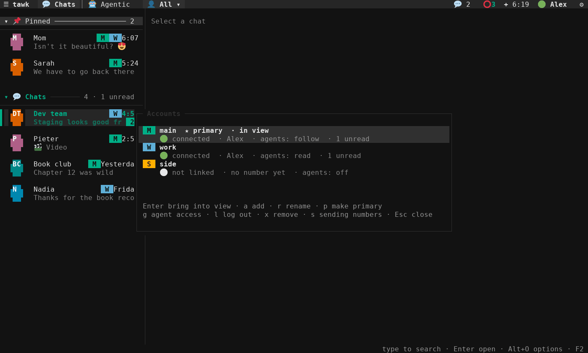
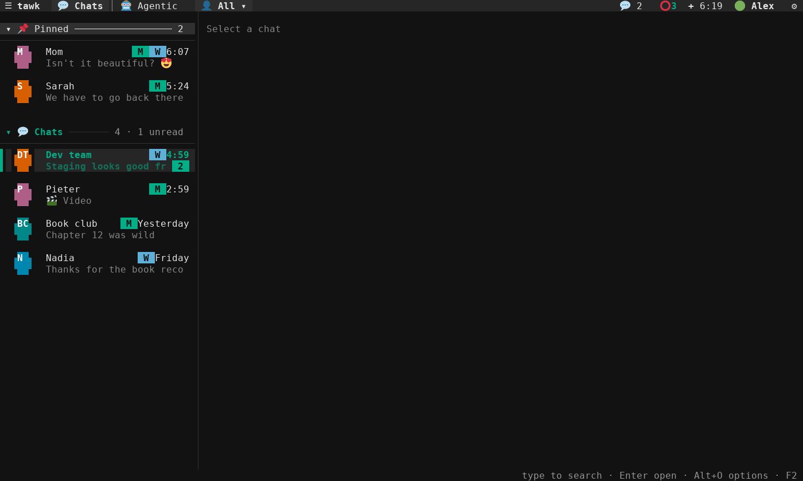
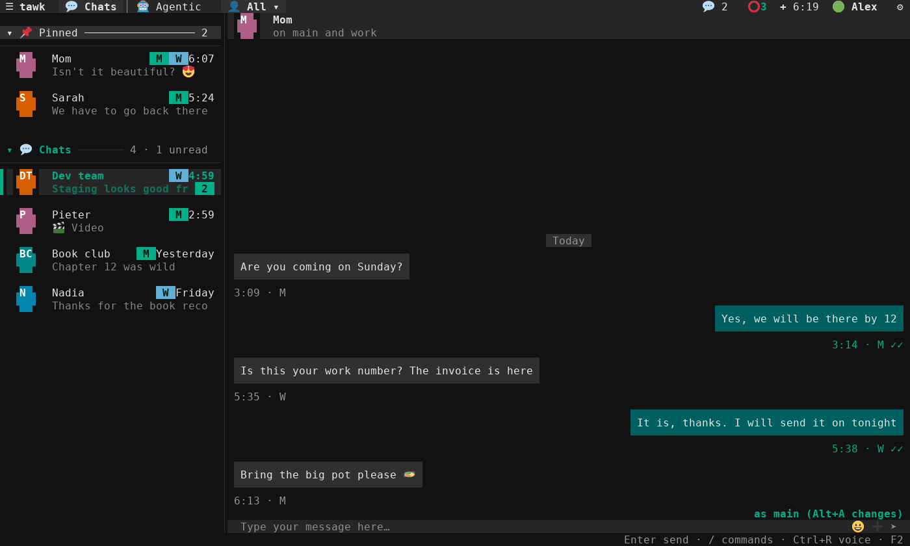

# Manual

The screenshots in this manual were taken from tawk running on a demo account with made-up chats. Chat names and message text are blurred; everything else is exactly what tawk draws. They were taken inside tmux, so photos appear in block mode; in Windows Terminal and other Sixel terminals they are drawn in full resolution. The pictures of your profile, statuses, the camera, the formatted conversation and the start-up splash are drawn by tawk's own code with made-up data (`make screenshots` draws them again; it needs Python with Pillow and the DejaVu fonts, whose folder `TAWK_SHOT_FONTS` names when it is not `/usr/share/fonts/truetype/dejavu`).

## Table of Contents

- [Screen layout](#screen-layout)
- [Keyboard](#keyboard)
- [Slash commands](#slash-commands)
- [Mouse](#mouse)
- [Chats](#chats)
- [Chat options](#chat-options)
- [Soft lock](#soft-lock)
- [Contact details](#contact-details)
- [Deleting chats and messages](#deleting-chats-and-messages)
- [Messages and media](#messages-and-media)
- [Replies, reactions and edits](#replies-reactions-and-edits)
- [Forwarding](#forwarding)
- [Scheduled messages](#scheduled-messages)
- [Emoji](#emoji)
- [Search](#search)
- [Voice notes](#voice-notes)
- [Sending files](#sending-files)
- [The photo viewer](#the-photo-viewer)
- [Notifications](#notifications)
- [Incoming calls](#incoming-calls)
- [Your profile](#your-profile)
- [Statuses](#statuses)
  - [Viewing statuses](#viewing-statuses)
  - [Answering a status](#answering-a-status)
  - [Who saw your status](#who-saw-your-status)
  - [The status archive](#the-status-archive)
  - [Posting a status](#posting-a-status)
- [Settings panel](#settings-panel)
- [Themes](#themes)
- [Screensaver](#screensaver)
- [When WhatsApp is unavailable](#when-whatsapp-is-unavailable)
- [Linking and unlinking](#linking-and-unlinking)
- [Several accounts](#several-accounts)
  - [Adding and managing accounts](#adding-and-managing-accounts)
  - [One chat list](#one-chat-list)
  - [The same person on two numbers](#the-same-person-on-two-numbers)
  - [Which number a message is sent from](#which-number-a-message-is-sent-from)
  - [Agents and accounts](#agents-and-accounts)
  - [What happens when you update](#what-happens-when-you-update)
- [Encrypting your chats](#encrypting-your-chats)
- [Backups](#backups)
- [Automation and MCP](#automation-and-mcp)
  - [Turning it on](#turning-it-on)
  - [Agent events](#agent-events)
  - [The Agentic tab](#the-agentic-tab)
  - [Letting an agent answer for itself](#letting-an-agent-answer-for-itself)
  - [Destructive requests](#destructive-requests)
  - [Drafts from agents](#drafts-from-agents)
  - [Writing to someone new](#writing-to-someone-new)
  - [Shell commands](#shell-commands)
  - [tawk-mcp](#tawk-mcp)
- [Command line](#command-line)
- [Checking your setup](#checking-your-setup)
- [Troubleshooting](#troubleshooting)

## Screen layout


| Area | What it shows |
|---|---|
| Header | On the left: ☰ (show or hide the chat list), the app name and `🔕 DND` while do not disturb is on. On the right, from left to right: unread counts per type (they blink when something new arrives), ⭕ with the number of people whose statuses you have not seen (click it for the [status list](#viewing-statuses)), + (click it to [post a status](#posting-a-status)), the time, the connection state as an emoji, your name (click it for [your profile](#your-profile)) and ⚙ (settings). The ⭕ and + are hidden while tawk is being linked. |
| Chat list | Folder entries for Archived and Locked chats at the top, then chats sorted pinned first, then by latest message, each with its profile picture. The open chat is marked with a bar on the left edge and a highlighted row; unread chats have an accent bar and a bold name. |
| Conversation | The open chat. A two-row title bar shows the chat's profile picture, its name and, under the name, the about text or the member count. When someone is typing or recording, a small bubble with three moving dots says so on the last row, just above the input. Click the picture to enlarge it and the name for the [contact details](#contact-details). Your messages sit on the right, everyone else's on the left, with day separators between days. |
| Input | Where you type, with 😀 emoji, ➕ attach and ➤ send buttons on the right, and ✕ to clear what you typed while there is something there. The line above it shows recording state, an attachment, the message you are replying to, or the message you are editing. |
| Footer | Keys for the part of the screen that has focus, or a short message after an action. |

The connection emoji in the header is 🟢 online, 🟡 connecting or reconnecting, 🔴 offline and ⚪ not linked.

The layout follows the window: resize it and everything reflows. When the conversation would be narrower than 30 columns the chat list hides itself; widen the window or press Ctrl+B to bring it back.

When tawk starts it shows a short splash while it connects: the tawk logo draws itself in WhatsApp greens with what the name stands for, Terminal Access to WhatsApp Konnector, underneath, the tagline types itself out and the connection state shows underneath. It fades after about two seconds, and any key skips it straight away. Turn it off with Settings, Appearance, Layout, Startup splash (`splash`).


## Keyboard

Global:

| Key | Action |
|---|---|
| Tab / Shift+Tab | Move focus: chat list, conversation, input |
| Ctrl+K | Search messages in every chat |
| Ctrl+F | Search the chat list by name or number (typing in the chat list does the same) |
| Ctrl+N | Open the next chat with unread messages |
| Ctrl+B | Collapse or expand the chat list |
| Ctrl+E | Open the emoji picker |
| Ctrl+O | Attach a file with the file picker |
| Alt+V | Attach the picture on the clipboard (Ctrl+V too, when the terminal passes it to tawk) |
| Ctrl+R | Start recording a voice note, or finish and send it |
| Ctrl+D | Toggle do not disturb |
| Alt+I | [Contact details](#contact-details) of the selected chat in the list, otherwise of the open chat |
| Ctrl+L | Start the screensaver |
| Ctrl+Shift+L or Alt+L | Soft-lock the open or selected chat (blur it), or show it again; see [Soft lock](#soft-lock) |
| PgUp / PgDn | Scroll the conversation (PgUp loads older messages at the top) |
| F2 | Settings |
| F3 | Switch between the Chats and [Agentic](#the-agentic-tab) tabs: requests from agents, who is connected, the log and permissions |
| Ctrl+Q or Ctrl+C | Quit |

Chat list:

| Key | Action |
|---|---|
| Any letter | Search the list by name: a search bar appears and the list narrows as you type; it goes away when you delete the text |
| ↑ ↓ | Move the selection (also while searching) |
| Home / End | First or last entry |
| Enter or → | Open the chat, or open the Archived or Locked folder |
| Esc or ← | Clear the search, or leave a folder and return to the chats |
| / | Open an empty search bar |
| Enter, ← or → on a group header | Fold or unfold the Pinned or Chats group |
| Alt+O | Chat options (mute, pin, archive, theme, tone, soft lock, delete, draft) |
| Alt+M | Mute or unmute the chat |
| Alt+P | Pin or unpin the chat |
| Alt+A | Archive the chat, or move it back to the chats |

Conversation:

| Key | Action |
|---|---|
| Any letter | Start typing in the input |
| ↑ ↓ | Select a message; ↑ on the oldest loaded message loads older ones |
| Enter | Open the selected photo or video in the viewer, open a document, play the voice note, or read a long message in full |
| Alt+Q | Reply to the selected message |
| Alt+E | React to the selected message |
| Alt+Shift+E | Edit the selected message (your own text, within 15 minutes) |
| Alt+M | Open the message menu (also right-click) |
| Alt+O | Chat options for the open chat |
| Alt+R | Retry a message that failed to send |
| Delete | Delete the selected message, for you or for everyone |
| End or Ctrl+End | Jump back to the newest message |
| Esc | Back to the input |

Input:

| Key | Action |
|---|---|
| Enter | Send (or new line when "Enter is send" is off) |
| Shift+Enter or Alt+Enter | New line (see [New lines](#new-lines-with-shiftenter) if Shift+Enter sends) |
| Ctrl+S | Send (useful when Enter adds new lines) |
| Ctrl+End | Go to the end of the text; press it again to scroll the chat to the newest message |
| ← → Home End | Move the cursor (Ctrl+A also moves to the start) |
| ↑ ↓ | Move between lines; ↑ on the first line selects the newest message |
| ↑ in an empty input | Edit your last message, when it is the newest in the chat and still editable |
| Ctrl+W | Delete the previous word |
| Ctrl+U | Clear the input |
| Tab | Complete a `/command` while suggestions are shown, or move through the emoji offered for a `(word` |
| Esc | Cancel an edit, remove an attachment or cancel a reply, in that order; otherwise go back to the chat list |

### New lines with Shift+Enter

Shift+Enter starts a new line in the input and in the status composer; Enter alone sends or posts. tawk asks the terminal to report modified keys ("modifyOtherKeys"), which xterm, WezTerm, foot, Ghostty and iTerm2 do, so Shift+Enter works there without setup. Alt+Enter does the same in every terminal. Windows Terminal and some others send Shift+Enter exactly like Enter; to make it a new line there, add this action to Windows Terminal's settings.json (Settings, Open JSON file), or the same input as a key binding in your terminal:

```json
{ "command": { "action": "sendInput", "input": "\u001b[13;2u" }, "keys": "shift+enter" }
```

### Alt shortcuts on a Mac

On a Mac the Option key types characters (Option+L types `¬`) unless the terminal sends it as Alt. tawk reads the characters Option types for its shortcuts on a US keyboard layout as the Alt shortcut itself: `¬` is Alt+L, `√` Alt+V, `®` Alt+R and `´` (Shift+Option+E) Alt+Shift+E everywhere, and `ø` (Alt+O), `µ` (Alt+M), `π` (Alt+P), `å` (Alt+A) and `œ` (Alt+Q) when you are not typing text, so those letters still type as themselves in a message. Option+E and Option+I are accent keys that wait for the next letter, so Alt+E (react) and Alt+I (contact details) need `/react` and `/info`, or a terminal that sends Option as Alt:

| Terminal | Setting |
|---|---|
| iTerm2 | Settings, Profiles, Keys, General: Left Option key "Esc+" |
| Terminal | Settings, Profiles, Keyboard: "Use Option as Meta key" |
| Ghostty | `macos-option-as-alt = true` in its config |
| WezTerm | `send_composed_key_when_left_alt_is_pressed = false` (the default) |

With that set, every Alt shortcut in this manual works with Option.

Popups (message menu, chat options, reaction palette, emoji picker, search, file picker, theme picker, reader, profile, status dialogs and settings) take the keys while they are open. Arrow keys move, Enter chooses and Esc closes each of them.

## Slash commands


Type a command at the start of the input. Suggestions appear above the input as you type: ↑ ↓ choose, Tab completes and Enter runs the highlighted command. To send a message that starts with a slash, begin it with two (`//text` sends `/text`). `/help` lists every command and the main keys.

| Command | Arguments | Action |
|---|---|---|
| `/help` | | Commands and keyboard shortcuts |
| `/search` | `<text>` | Search messages in every chat |
| `/reply` | | Reply to the last message you received in this chat |
| `/react` | `[emoji]` | React to the last message you received; without an emoji the palette opens |
| `/attach` | `[path]` | Send a photo, video or file; without a path the file picker opens |
| `/paste` | | Attach the picture on the clipboard (the same as Alt+V) |
| `/camera` or `/photo` | | Take a photo or record a video with the camera (the same as ➕, Take a photo) |
| `/emoji` | `[search]` | Insert an emoji; the picker opens with the search filled in |
| `/info` | | Contact or group details for this chat |
| `/profile` | | Your name, about text and photo (see [Your profile](#your-profile)) |
| `/status` | | Post a status (the same as + in the header) |
| `/statuses` | | See your own and your contacts' statuses (the same as ⭕ in the header) |
| `/later` | `<when> <text>` | Send a message to this chat later, for example `/later 18:00 Dinner at ours` (see [Scheduled messages](#scheduled-messages)) |
| `/scheduled` | | Messages waiting to be sent later, to send now, move or cancel |
| `/agents` | | The [Agentic tab](#the-agentic-tab) (the same as F3 or clicking 🤖 Agentic in the header) |
| `/voice` | | Record a voice note (the same as Ctrl+R) |
| `/mute` | `[8h\|1w\|always]` | Mute this chat for 8 hours, a week, or until you unmute it (the default) |
| `/unmute` | | Unmute this chat |
| `/pin` | | Pin this chat |
| `/unpin` | | Unpin this chat |
| `/archive` | | Move this chat to Archived |
| `/unarchive` | | Move this chat back to the chats |
| `/theme` | `[id\|default]` | Theme for this chat; without an argument the theme picker opens, `default` returns to the app theme |
| `/tone` | `[file\|none\|default]` | Notification sound for this chat; without an argument the file picker opens |
| `/dnd` | | Toggle do not disturb |
| `/screensaver` | | Start the screensaver now |
| `/lock` | | Start the screensaver now |
| `/softlock` | | Blur this chat, or show it again |
| `/clear` | | Clear the input, the attachment, the reply and this chat's draft |
| `/settings` | | Open settings |
| `/quit` | | Quit tawk |
| `/exit` | | Quit tawk (same as `/quit`) |

Commands that act on "this chat" need an open chat.

`/help` opens a scrollable page with every command and the main keys:


## Mouse

- Click a chat to open it; scroll the list with the wheel. Click a folder entry to open it.
- Right-click a chat for its options. On a Mac, Ctrl+click works as a right-click too.
- Drag a chat onto the 📌 Pinned group to pin it, or onto the 💬 Chats group to unpin it. The group it would land in lights up while you drag; with nothing pinned yet, an empty Pinned group appears for the drop.
- Click a photo or video to open it in the [photo viewer](#the-photo-viewer); click a document or voice note to open or play it.
- Right-click a message for the message menu. Clicks count only on the bubble itself: clicking beside a photo, document or download does nothing.
- Click a quote at the top of a reply to jump to the message it quotes.
- Click the picture in the conversation title bar to see it full size, and the name to open the [contact details](#contact-details).
- Scroll the conversation with the wheel. Scrolling past the oldest message loads older ones.
- Click the `↓ newer` badge at the bottom right of the conversation to jump to the newest message. It appears whenever you have scrolled up.
- Click the input to type, and use the wheel to scroll a long message in it.
- Click 😀 to insert an emoji, ➕ to attach a file and ➤ to send.
- Click ✕, which appears beside them once you have typed something, to clear the input. tawk asks "Clear what you typed?" first, with Cancel selected, so a stray click loses nothing.


- Drag the line between the chat list and the conversation to resize the list. The width is saved.
- Click ☰ to hide or show the chat list and ⚙ to open settings.
- Click your name in the header to open [your profile](#your-profile), + to [post a status](#posting-a-status) and ⭕ to [see statuses](#viewing-statuses).
- In popups, click an item to choose it, use the wheel to scroll, and click outside a menu to close it.

Mouse support can be turned off in Settings, Appearance, Layout.

## Chats

The list shows each chat's name (address-book name, otherwise the name the person chose, otherwise the number) with markers in front of it: 🔕 muted, and 📌 pinned in search results and folders (in the main list pinned chats have their own Pinned group). Unread chats have an accent bar on the left edge and a bold name until you open them. Muted chats still count unread messages but never alert you, and their count badge is dimmed.

There are two styles, set in Settings, Appearance, Layout, Chat list (`chat_list_style`):

- **Detailed** (the default): two lines per chat and a small left margin. The first line has the name and the time of the last message (the time today, "Yesterday", the weekday within a week, otherwise the date). The second line has a preview of the last message and the unread count. While someone is typing the preview shows that instead, and a chat with an unsent draft shows its preview in the warning colour.
- **Compact**: one line per chat with the name and a short time: `14:05` today, `y` for yesterday, `mo` `tu` `we` `th` `fr` `sa` `su` within the last week, `dd/mm` earlier this year and `dd/mm/yy` before that.

Settings, Appearance, Layout, Space between chats (`chat_spacing`) puts 0, 1 (the default) or 2 blank lines between chats in either style. A terminal cannot draw less than a whole line, so 0 is the tightest.

**Profile pictures.** In the detailed style each chat starts with the contact's or group's profile picture, drawn as a circle like on the phone. Without a picture, or where the terminal can only draw blocks, a coloured badge with the name's initials takes its place; a contact always keeps the same colour. Pictures are fetched from WhatsApp in the background, and when tawk starts it asks again for the chats you look at, so a picture or about text changed while tawk was closed is picked up. Turn them off with Settings, Appearance, Layout, Profile pictures (`portraits`).

**Pinned and other chats.** When any chat is pinned, the list is split into two groups, each with a header and a line across the list: 📌 Pinned, then 💬 Chats. The header shows how many chats the group holds and how many have unread messages. Enter or a click on a header folds the group away (▸) or unfolds it (▾); ← folds and → unfolds. Folding is remembered when tawk restarts.


<table><tr><td width="50%">


</td><td width="50%">


</td></tr><tr><td>Typing in the chat list searches it</td><td>The compact style</td></tr></table>

**Searching the list.** With the chat list focused, just start typing: a 🔍 bar appears at the top and the list narrows to chats whose name or number matches. ↑ ↓ move through the matches, Enter opens one, and deleting the text (or Esc) removes the bar again. Ctrl+F and `/` open an empty bar. The single-letter shortcuts of earlier versions moved to Alt (Alt+O options, Alt+M mute, Alt+P pin, Alt+A archive) so they never get in the way of a name.

Archived and locked chats live in their own folders and never appear among the regular chats. When there are any, an entry for each folder (`🗄 Archived` and `🔒 Locked chats`, with the number of chats and a badge for unread ones) sits at the top of the list. Enter opens the folder; the first entry inside it, or Esc, returns to the chats. The list search searches every folder except Locked chats, so an archived chat can still be found by name. Chats you archive on your phone arrive in Archived too. A chat is placed in Locked chats when the backend reports it as locked; neither bundled backend reports locked chats at present, so the folder only appears if one does.

Opening a chat marks it read on your phone as well, unless read receipts are turned off.

When tawk starts it opens the chat you had open when it last quit, so you can carry on where you left off. A chat deleted since, or one in Locked chats, is skipped. Turn this off with Settings, Chats, Reopen last chat (`reopen_last_chat`).

Each chat keeps its own draft. Whatever you have typed stays with the chat when you switch to another one or quit, and comes back when you return. `/clear` or the chat options remove it.

### Typing and online status

While you type in a chat, tawk tells the other person you are typing, and while you record a voice note it shows you as recording audio. When someone types to you, their chat's preview shows "typing…" (or "Name is typing…" in a group, or "recording audio…"), and in the open chat a small bubble on the last row, just above the input, says the same with three dots that light up in turn, as on the phone. Both directions can be turned off: "Share typing" (`share_typing`) stops tawk sending your state, and "Appear online" (`appear_online`) stops tawk showing you as online. WhatsApp only delivers other people's typing notices while you appear online. tawk shows you offline after two minutes without input, while the screensaver runs, and when it quits.

Under the name of an open one-to-one chat, tawk says "online" when the other person is on WhatsApp, and otherwise when they were last seen: "last seen today at 14:32", "last seen yesterday at 9:10", a weekday within the week, or a date. The line appears a moment after you open the chat and follows them as they come and go. It needs "Appear online" on, since WhatsApp only tells you about others while you show as online yourself, and it shows only what the person shares: someone who hides their last seen shows "online" or nothing, and then their about text stays in that place as before. Groups have no online status, and a soft-locked chat shows none. "Show online status" (`show_online`) turns the line off.

Agents are not told who is online unless you switch on "Push online status" under Settings, Automation, Agent events. With it on, an agent that listens hears when the person in a chat you opened comes online or leaves, for the chats it may use. It cannot ask about anyone else.

## Chat options

Press Alt+O on a chat in the list or in the conversation, or right-click a chat. The menu shows what applies to that chat:


| Option | Effect |
|---|---|
| Mute for 8 hours, Mute for 1 week, Mute always | Silence the chat; a timed mute ends by itself |
| Unmute | Shown instead of the mute options for a muted chat |
| Pin chat / Unpin chat | Keep the chat at the top of the list |
| Archive chat / Unarchive chat | Move the chat to or from the Archived folder |
| Chat theme… | Give this chat's conversation its own colours (see [Themes](#themes)) |
| Notification tone: choose file… | Pick a sound file for this chat with the file picker |
| Notification tone: none | No sound for this chat (other alerts still apply) |
| Notification tone: default | Go back to the sound in Settings, Notifications |
| Clear draft | Shown when the chat has an unsent draft |
| Soft-lock chat / Show chat | Blur the conversation (see [Soft lock](#soft-lock)) |
| Contact info… | Open the [contact details](#contact-details) |
| Delete chat… | Delete the whole chat everywhere, after a confirmation (see below) |

Mutes, pins, archiving from tawk, tones and chat themes are kept on this computer and are not sent to your phone.

## Soft lock

A soft lock hides a chat from people looking over your shoulder. Press **Ctrl+Shift+L** (or **Alt+L**, which works in every terminal, and Option+L on a Mac; see [Alt shortcuts on a Mac](#alt-shortcuts-on-a-mac)), type `/softlock`, or choose "Soft-lock chat" in the chat options. In the chat list it acts on the selected chat, elsewhere on the open one.


While a chat is soft-locked:

- its conversation is drawn as shaded shapes where the text, names, times and pictures were;
- the chat list shows 🙈 in front of its name and "Soft-locked" instead of the last message or typing;
- search leaves its messages out, and the tab title shows 🙈 instead of its name.

The lock is saved, so the chat is still hidden after tawk restarts. It is not a password: anyone at the keyboard can show the chat again with the same key. Notifications and unread counts still work.

Windows Terminal sends Ctrl+Shift+L the same way as Ctrl+L, so tawk cannot tell them apart there. Alt+L always works; to use Ctrl+Shift+L, add this action to Windows Terminal's settings.json (Settings, Open JSON file):

```json
{ "command": { "action": "sendInput", "input": "\u001b[27;6;76~" }, "keys": "ctrl+shift+l" }
```

xterm, and terminals that support its "modifyOtherKeys" mode, send Ctrl+Shift+L distinctly without any setup.

## Contact details

Press **Alt+I**, type `/info`, click the chat's name in the title bar, or choose "Contact info…" in the chat options. A panel opens over the right of the conversation with everything WhatsApp shares about the chat; tawk asks WhatsApp again each time it opens, so it is up to date.

<table><tr><td width="50%">


</td><td width="50%">


</td></tr><tr><td>A person</td><td>A group</td></tr></table>

For a person it shows the picture, name, phone number and about text, and for a business account its verified name, category, address and email. For a group it shows the description, who created it and when, and every member, with admins marked. Notes such as blocked, muted, pinned, soft-locked or a chat theme appear under the name. The details scroll with the wheel, PgUp and PgDn; the actions stay at the bottom, chosen with ↑ ↓ and Enter or a click. Esc, q or a click outside closes the panel.

| Action | Effect |
|---|---|
| View profile picture | Opens the picture full size and square (click the picture in the panel or the title bar for the same); Esc closes it |
| Search messages | Opens search |
| Chat options | Opens the chat options for this chat |
| Soft-lock chat / Show chat | See [Soft lock](#soft-lock) |
| Export chat | Writes the chat as `tawk chat with NAME.txt` to your Downloads folder, in the same format as WhatsApp's own export |
| Export chat with media | The same, in a folder `tawk chat with NAME` together with every downloaded photo, video, voice note and file |
| Block / Unblock | People only. Blocking asks first; a blocked contact can no longer call you or send you messages, on any of your devices |
| Clear chat… | Asks first, with a flashing warning, then removes every message of the chat from this computer. The chat stays in the list, downloaded files stay in the media folder, and your phone keeps its copy |
| Delete chat… | Asks first, with a flashing warning, then deletes the chat everywhere (see [Deleting chats and messages](#deleting-chats-and-messages)) |

Every action that removes or blocks something shows a confirmation with Cancel selected first. An export never replaces an existing file; a second export becomes `tawk chat with NAME (1).txt`. Only the messages stored on this computer are exported.

## Deleting chats and messages

**A message.** Select it and press Delete, or choose "Delete…" from the message menu. Choose:

- **Delete for me** removes it from this computer and, through WhatsApp, from your phone and other linked devices. The other people keep it.
- **Delete for everyone** replaces it with "🚫 This message was deleted" for everyone in the chat. It is offered for your own messages for about two and a half days after sending, like on the phone.

A message that never reached WhatsApp (still waiting or failed) is simply removed here.


**A whole chat.** Right-click the chat in the list (or press Alt+O) and choose "Delete chat…". A confirmation flashes and warns that this is permanent: every message, photo and file in the chat is deleted from this computer, your phone and your other linked devices, and it cannot be undone. Cancel is selected first; choose "Delete permanently", press Y, or click it to go ahead. A chat deleted on your phone disappears from tawk too.


## Messages and media

Each message is a solid bubble. Under it sits a meta line with the time (with `edited` in front when the text was changed). Reactions sit on the bubble's bottom edge, in the bubble's own colours, on the side facing the middle of the conversation: the left of your bubbles and the right of everyone else's. Your own messages also show ticks: ◷ waiting, ✓ sent, ✓✓ delivered, ✓✓ in the accent colour when read, ✗ failed. A failed message can be retried with Alt+R.

Messages from the same person less than a minute apart share one time: only the last of the run shows the time under it, which keeps a quick exchange tidy. Your own messages in such a run still show their own ticks, at the end of their last line inside the bubble, so you can see each one arrive and be read. A message with an edit, a picture or a failed send keeps its own line. Messages from the same person within five minutes of each other form a group. In group chats the sender's name is shown once, at the top of the group. A reply shows the quoted message as a `▎Name: "text"` strip at the top of the bubble; click it (or choose "Go to quoted message" in the message menu) to scroll to that message, loading older history when it is not on screen. A message deleted for everyone shows as "🚫 This message was deleted", and its text is removed from the local database.

Photos and videos show as the picture itself, with no label; click one (or press Enter on it) to open it in the [photo viewer](#the-photo-viewer). A video carries a ▶ play button on its picture and adds `▶ 0:42` in front of the time. Its picture is, from best to worst: a frame taken from the downloaded video (with ffmpeg, in the background, saved beside the video as `<video>.poster.jpg`), the small preview WhatsApp sends with the message, or a dark placeholder when there is neither.


PDFs show their first page, with a small red document badge, and open in the viewer where you can turn the pages (see [The photo viewer](#the-photo-viewer)). Pages are drawn with `pdftoppm` from poppler, which the installer adds; until a PDF has downloaded, WhatsApp's small preview of its first page is shown.


Files tawk does not know how to show (anything other than photos, videos, audio, PDFs and a few common document types) open a small offer instead: 💾 Save to Downloads (selected first), ↗ Open with the system's application, or Cancel.


Any photo, video, voice note or file can also be saved with "💾 Save to Downloads" in its right-click menu. It is copied (downloading it first when needed) into your Downloads folder, or the folder set in Settings, Media, Photos and videos, Save folder (`download_dir`), under its original name; an existing file is never replaced, so a second copy becomes `name (1).ext`.

Other media shows as a short labelled line: `📄 Document ↗`, `🔖 Sticker ↗`, or `⤓` instead of `↗` when the file has not been downloaded yet. Photos, videos, stickers and voice notes download automatically up to the size set in Settings, Media, Photos and videos. Selecting a file that is not downloaded downloads it and then opens it. Videos play in the first player found of mpv, vlc, celluloid, totem and ffplay (installed with ffmpeg), because a desktop's default for video is sometimes an image viewer. Other files open in your system's default application: `xdg-open` on Linux, `open` on macOS, and `wslview` or Windows Explorer under WSL when Windows interop is enabled. You can name a specific player in Settings, Media, Photos and videos, Video player.

tawk draws the picture in one of two ways, chosen by `image_mode` in the `[appearance]` section of the config file (it is not in the settings panel; see [CONFIGURATION.md](CONFIGURATION.md#appearance)):

- **sixel** draws real pixels. Windows Terminal (1.22 or later), WezTerm, foot, mlterm and contour support it. A picture is encoded once with a palette of 256 colours taken from the photo, and is redrawn only when it moves or something covered it. While a menu or other window is open over the conversation, pictures fall back to blocks so the window stays readable.
- **blocks** draws the picture with coloured half-block characters, two picture pixels per character cell. It works in any terminal with 256 colours, including inside tmux and screen.
- **auto** (the default) uses sixel where the terminal is known to support it and not running inside tmux or screen, and blocks everywhere else.

tawk uses the small picture WhatsApp sends with the message and switches to a sharper one once the photo (or a frame of the video) is on disk. A picture only partly on screen is drawn with blocks until it is fully visible. Turn pictures off with Settings, Appearance, Layout, Photo previews (`inline_thumbnails`).

A long text message (more than about eight lines) opens in a scrollable reader when you press Enter on it or choose "Read in full" from the message menu.

The conversation keeps only the messages around what is on screen in memory: 50 either side by default (Settings, Chats, Messages kept around the screen, or `message_margin`). A chat opens with its newest messages, so a busy group opens as fast as a quiet one. Scroll up, with the wheel, PgUp or ↑, and the window slides with you: older messages are read from the local database ahead of where you are, and the newest ones are let go once they are more than the margin below the screen. Scroll back down and they return the same way. When the database has nothing older, tawk asks your phone for the next 50 messages; the title bar shows "⟳ loading older messages…" while it waits, and a note appears if the phone sends nothing within 20 seconds. Whenever you have scrolled up, a `↓ newer` badge at the bottom right takes you back to the newest message.


Downloaded media is kept in `~/.cache/tawk/media`. The oldest files are removed once the folder passes the cache limit (1 GB by default).

### The message menu

Right-click a message, or select it and press Alt+M. The menu lists the actions that apply:


| Action | Available for |
|---|---|
| ↩ Reply | Any message that was not deleted |
| 😀 React | Any message that was not deleted |
| ✏ Edit | Your own text messages that were sent in the last 15 minutes |
| 📋 Copy text | Any message with text |
| ↪ Forward… | Text, photos, videos, voice notes, documents and stickers that were not deleted |
| ↗ Open / play | Photos and videos (in the viewer), documents, stickers and voice notes |
| 📖 Read in full | Long text messages |
| ↻ Retry sending | Your messages that failed to send |
| 💾 Save to Downloads | Photos, videos, voice notes, PDFs and other files |
| ↥ Go to quoted message | Replies |
| ℹ Message info | Your own messages: who received and read it, and when |
| 🗑 Delete… | Any message: for me, or for everyone when still allowed |

Message info shows when your message was delivered, read and (for voice notes) played. In a group it lists who has read it and who it has only been delivered to, each with the time, and it updates while open. tawk records receipts from the version that added this panel onwards, so older messages show none; people who turned off read receipts only ever show as delivered.

Copy text puts the message on your system clipboard with the OSC 52 terminal sequence, so it works over SSH as well. Windows Terminal, iTerm2, kitty, WezTerm, Alacritty and foot support it; some terminals (and tmux, unless `set-clipboard` is on) need it enabled first. Up to 64 KB is copied.

### Formatting

Messages are drawn with WhatsApp's formatting, as on the phone:

| Typed | Shown |
|---|---|
| `*bold*` | **bold** |
| `_italic_` | italic (underlined where the terminal has no italics) |
| `~strikethrough~` | dimmed |
| `` `code` `` | in the accent colour |
| ```` ```block``` ```` | a block in the accent colour, kept exactly as typed |
| `> quote` at the start of a line | `▎ quote`, dimmed |
| `- item` or `* item` at the start of a line | `• item` |
| `@27821234567` of someone mentioned | `@Name` in bold, in the accent colour |

The marks count only where WhatsApp takes them: at the start and end of a word, on one line, around at least one character. `2*3*4`, `snake_case` and a lone `*` stay as typed. Chat previews, notifications and search results show the text without the marks, and a long message opened in the reader keeps its formatting. Turn it off with Settings, Chats, Text formatting (`format_text`) to see every mark as typed.


### Link previews

A message with a link can carry a card, as on the phone: the page's picture, its title in bold, a line or two of its description and the site's name above the text. Cards on messages you receive come from WhatsApp and always show.

Cards for links you send are off by default, because making one means fetching the page, and the site then sees your IP address. Turn them on with Settings, Chats, Link previews for links you send (`link_previews`). tawk then fetches the first `https://` link in each message you send (at most 5 seconds and 1 MB, never an address on your own network) and sends the card with it; when the page cannot be fetched the message goes without one.

### Mentions

In a group, type `@` and the start of a name: a list of the members that fit appears above the input, names starting with what you typed first. ↑ ↓ or Tab choose, Enter or a click puts `@Name` in the message, and Esc hides the list until the next `@`. Typing on keeps narrowing it. When you send, each `@Name` you picked becomes a real mention, so the person is notified and it shows as a mention on their phone; deleting an `@Name` before sending drops that mention. Members come from the group's details, so the list fills in once tawk has fetched them (open the group's details once if it stays empty).


When someone mentions you, the chat's badge in the list shows `@` before the unread count, and you are alerted even when the chat is muted or group alerts are off (never during do not disturb). Settings, Notifications, Mentions always notify (`mention_notifications`) turns that off. Mentions in messages from before tawk 0.7 show as the number they were typed with.

## Replies, reactions and edits

**Replying.** Select a message and press Alt+Q, choose Reply from the message menu, or type `/reply` to answer the last message you received. The line above the input shows `↩ Replying to Name: text`. Type and send as usual; Esc cancels the reply.

**Reacting.** Press Alt+E on a message, choose React from the menu, or type `/react`. A palette offers 👍 ❤️ 😂 😮 😢 🙏, ✕ to remove your reaction and ➕ more for the full emoji picker. Move with ← → and press Enter, press 1 to 8 to choose directly, or click. `/react 🎉` reacts straight away. Each person has one reaction per message; the bubble's bottom edge lists up to four, most used first, with a count when more than one person chose the same emoji.


**Editing.** Press Alt+Shift+E on one of your own text messages, or choose Edit from the menu. When your message is the newest in the chat, ↑ in an empty input edits it straight away, as in the desktop apps. WhatsApp allows edits for 15 minutes after sending, so tawk offers it only in that window. The text moves into the input and the line above it shows `✏ Editing your message`. Enter saves the change and Esc cancels. Edited messages show `edited` in front of their time, on your side and on everyone else's.

## Forwarding

Choose ↪ Forward… from the message menu to send a copy of a message to other chats. A list of your chats opens, with a search box at the top:


| Key or mouse | Action |
|---|---|
| Typing | Narrow the list to chats whose name (or number) contains the text |
| ↑ ↓, PgUp, PgDn or the wheel | Move through the chats |
| Space, or a click on a chat | Tick or untick it, up to five chats as on the phone |
| Enter, or Send ➤ | Send to the ticked chats; with none ticked, to the highlighted one |
| Esc, or a click outside | Close without sending |

Ticked chats stay at the top of the list whatever you type, and the line at the bottom counts them. Locked chats are not offered. Each chat gets its own copy, marked `↪ Forwarded` above the text, as on the phone, and the footer says how many chats it went to. A message that had already been forwarded before is marked as such again, so WhatsApp counts it on.

A photo, video, voice note or document you have downloaded is sent again from the copy on this computer, which works however old the message is. One you have not downloaded is sent on from WhatsApp's own copy without downloading it, as long as WhatsApp still has it. Polls, locations and contact cards cannot be forwarded. Messages other people forwarded to you show the same `↪ Forwarded` line.

## Scheduled messages

Type `/later`, when to send it, and the message, in the chat it is for:

```
/later 18:00 Dinner at ours tonight?
/later +30m Leaving now
/later tomorrow 7:30 Happy birthday!
/later fri 17:30 Drinks at the usual place
```

| When | Means |
|---|---|
| `18:00`, `6:30pm`, `7pm` | That time today, or tomorrow once it has passed |
| `+30m`, `+2h`, `+1h30m`, `+1d` | That long from now |
| `today 18:00` | Today only; a time already gone is refused |
| `tomorrow`, `tomorrow 7:30` | Tomorrow, at 9:00 when no time is given |
| `fri 17:30`, `monday` | The next such day (today when the time is still ahead), at 9:00 when no time is given |

The footer says when it will go. Until then the message stays on this computer only, and the chat shows it after the others as a dimmed bubble with `🕓` and its time:


When the time comes, tawk sends it as an ordinary message and it moves into the chat like any other. tawk has to be running and connected for that: a message that fell due while tawk was closed or offline goes as soon as it is connected again, and the footer says it was sent late.

`/scheduled` lists every waiting message across your chats, soonest first:


| Key or mouse | Action |
|---|---|
| ↑ ↓ | Choose a message |
| Enter, S or `[ Send now ]` | Send it at once (or as soon as WhatsApp is connected) |
| T or `[ Change time ]` | Type a new time in the same forms as above, then Enter; Esc goes back |
| Delete, C or `[ Cancel message ]` | Drop it without sending |
| Esc, q or a click outside | Close the list |

## Emoji

Press Ctrl+E, click 😀 in the input, type `/emoji`, or choose ➕ more in the reaction palette.


The picker shows the full Unicode emoji set (without skin-tone variants and joined sequences such as families, which terminals draw at inconsistent widths) in one scrolling grid: your recent emoji first, then Smileys, People, Animals, Food, Travel, Activities, Objects, Symbols and Flags, each group starting on a new row. The tabs along the top jump to a group and follow the selection as you scroll. Typing searches by name and by the everyday words phones use (`lol` finds 😂), matching the start of words.

| Key | Action |
|---|---|
| Letters | Search by name or everyday word; every word must start a word of the name or its keywords, for example `red heart`, `cat`, `hug` or `lol` |
| Tab / Shift+Tab | Jump to the next or previous group |
| Arrows, PgUp, PgDn, Home, End | Move through the grid |
| Enter | Insert the emoji (or react with it) |
| Backspace | Remove the last search letter |
| Esc | Clear the search, or close the picker |

The wheel scrolls the grid and clicking a tab or an emoji chooses it. `/emoji party` opens the picker with the search already filled in. The name of the selected emoji is shown at the bottom.

The recent row keeps the last 24 emoji you inserted or reacted with, most recent first. They are saved as `recent_emoji` in the config file so they survive a restart.

**Typing emoji as text.** tawk turns what you type into emoji, like other chat apps:

- **Emoticons** such as `:)`, `:D`, `;)`, `:P`, `:(` and `<3`, and shortcodes such as `:fire:` and `:tada:`, become emoji when you type a space or press Enter. Only a whole word is converted, so links are left alone.
- **A word in brackets.** Type `(` and two letters, and every emoji whose name or everyday search words fit appears in a strip above the input, narrowing as you type: `(hu` offers 😯 hushed face, 💯 hundred points, 🫂 people hugging, 🤗 and more, and `(hug` narrows it to 🤗 👐 🫂. The search words are the ones phones use (Unicode CLDR), so `(lol` finds 😂 and `(party` finds 🎉. ← → or Tab move through them (the strip scrolls sideways, and shows the selected one's name and position), Enter or a click puts it in place of the word, and Esc keeps what you typed. Closing the bracket on a word that fits only one emoji, such as `(pizza)`, replaces it straight away.

Both follow Settings, Chats, Emoticons to emoji (`convert_emoticons`).

## Search

Press Ctrl+K or type `/search` followed by words to search the text of every message in every chat.

 Each word matches the start of a word in the message, ignoring case and accents, so `pizz fri` finds "Pizza on Friday?". Results are listed newest first (up to 100) with the chat, the time and a snippet. ↑ ↓ choose, Enter opens the chat at that message, and Esc closes the search. Opening a result loads older pages until the message is in view.

Search covers the messages stored on this computer, which includes history your phone has synced and anything loaded with the older-messages feature.

Typing in the chat list (or Ctrl+F) is different: it narrows the chat list by chat name or number.

## Voice notes

Voice notes show as `🔊 ▶ ●──────────── 0:14`: a play button, a progress bar and the length. Selecting one (Enter or a click) plays it in the background: the button turns into ■, the dot moves along the bar and the time counts down to 0:00 as it plays. Selecting it again stops it, and the bar resets when it ends. The terminal tab shows 🎧 while something plays.

To send one, open a chat and press **Ctrl+R** (or type `/voice`). The line above the input turns into a blinking `● REC 0:07` counter, and the other person sees that you are recording audio. Press **Enter** to send or **Esc** to discard. Recordings shorter than about a second are discarded, and recording stops and sends at the maximum length (5 minutes by default).

Recording needs ffmpeg and a microphone. tawk detects your audio system (PulseAudio, PipeWire, ALSA, CoreAudio or DirectShow); you can choose one and a microphone in Settings, Media, Voice notes. Under WSL, WSLg provides the microphone through PulseAudio.

## Sending files

There are five ways to attach a file. Clicking ➕ in the input opens a small menu with the first two:


- **Taking a photo or a video.** Click ➕ and choose "📷 Take a photo", or type `/camera`. The conversation turns into a viewfinder showing the live camera picture (in real pixels on Sixel terminals such as iTerm2 and WezTerm, otherwise in coloured blocks). Press Space or Enter to take a photo, or V to record a video: the title shows `● REC 0:05`, and V or Space stops it (videos stop by themselves at 3 minutes). What you took then stays on screen: Enter uses it, P plays a video in your video player, R retakes and Esc cancels. It is attached, ready for a caption. The picture comes from ffmpeg (the built-in camera on macOS, `/dev/video0` on Linux) and the sound from the same microphone as voice notes; videos are MP4 (H.264 and AAC). The first time, macOS asks whether your terminal may use the camera. WSL usually has no camera, so there the menu says "(no camera)". The same viewfinder takes a new [profile photo](#photo) and the photo or video for a [status](#posting-a-status); there, Enter hands the picture to that dialog instead of attaching it.

<table><tr><td width="50%">


</td><td width="50%">


</td></tr><tr><td width="50%">


</td><td width="50%">


</td></tr></table>

- **The file picker.** Press Ctrl+O, click ➕ in the input and choose "📄 Choose a file", or type `/attach`. The picker starts in the folder you last attached from (remembered between sessions as `attach_dir`) and has shortcuts to Home, Downloads, Pictures, Videos and Documents, plus each Windows user's folders under WSL. Type to filter the folder, ← or Backspace goes up a level, `~` returns home, `.` shows or hides hidden files, Enter opens a folder or picks a file, and Esc cancels. Files are picked with a single click.
- **Dropping a file.** Drag a file onto the terminal window. Terminals paste the path of a dropped file; tawk recognises it (including quoted paths, `file://` links and Windows paths such as `C:\Users\you\photo.jpg` under WSL) and attaches it. Pasting a path with Ctrl+Shift+V or typing it and pressing Enter works the same way.
- **A path.** `/attach ~/Pictures/photo.jpg` attaches that file.
- **Pasting a picture.** Copy a picture (a screenshot, or "Copy image" in a browser) and press Alt+V in tawk, or type `/paste`. A terminal paste can only carry text, so tawk reads the picture from the system clipboard itself and saves it as `pasted-<date>-<time>.png` next to your downloaded media. It uses `wl-paste` on Wayland (including WSLg), `xclip` on X11, `pngpaste` on macOS, or PowerShell when WSL can run Windows programs; the installer adds `wl-clipboard` and `xclip`. Ctrl+V works too when the terminal passes it to tawk rather than pasting text itself (Windows Terminal keeps Ctrl+V for its own paste), and a paste that arrives empty is treated as a picture paste.

The line above the input shows `📄 photo.jpg (2.1 MB)`. Type an optional caption and press Enter. Photos and videos are sent as media, audio files as audio, anything else as a document. The limit is 100 MB.

## The photo viewer

Clicking a photo, video or PDF (or pressing Enter on it) opens it inside tawk, fitted to the window: as large as it goes while keeping its shape. In a Sixel terminal it is drawn in full resolution; elsewhere with blocks.


| Key or mouse | Action |
|---|---|
| ← → (or PgUp PgDn, the wheel) | Previous or next photo or video; in a PDF, the previous or next page (then the next item) |
| ↑ ↓ | Previous or next photo, video or PDF in the chat |
| Home / End | First or last page of a PDF |
| Click the left or right third | Previous or next |
| Click the middle, Esc or q | Close |
| o | Open the photo in your system viewer |
| Enter | Play the video in a video player (or open the photo outside tawk) |

The top line shows who sent it, when, its position ("3 of 12") and, for a PDF, the page ("page 2 of 12"); the bottom line shows the caption. A photo that has not downloaded yet is shown from its small preview, downloads in the background and sharpens when it arrives. Videos cannot play inside a terminal, so the viewer shows the video's picture with a play button and Enter hands it to a player.


To skip the viewer and always use an outside program, set Settings, Media, Photos and videos, Image viewer (`image_viewer`) to `system` (your default viewer) or to a command such as `eog`.

## Notifications

When a message arrives in a chat that is not open, tawk can:

- play a sound (the chat's own tone when it has one),
- blink the chat in the list and the counts in the header,
- update the terminal tab title and flash it until you press a key,
- ring the terminal bell (Windows Terminal flashes the taskbar),
- flash the screen.

The tab title follows what is going on, like `🟢 tawk · Mom · 💬 3  📷 1`. It names the open chat and, while something is happening, says what with a spinning braille glyph in front: `⠼ Loading older messages · Dev team`, `⠹ Connecting…`, `Recording 0:07`. While someone types to you the tab moves like the typing dots in a chat: ✍️ and 💬 take turns in front and the dots after `Jan is typing` count up and start again. It follows the open chat first and otherwise any chat where someone is typing (`Mom is typing`, or `Dev team: Jan is typing` for a group); soft-locked chats are left out. Unread counts per type follow at the end and alternate with `✉ 3 new` while new messages wait. The leading symbol shows the status: 🟢 online, 🟡 connecting, 🔴 unavailable, 🔗 not linked, 🔕 do not disturb, 🔴REC recording, 🎧 playing. In Windows Terminal the tab also shows a spinning progress ring while reconnecting and a red one while retries are paused.

Each of these can be turned on or off in Settings, Notifications. Do not disturb (Ctrl+D or `/dnd`) silences all of them. Group chats can be silenced separately, muted chats never notify, and a chat whose tone is set to none alerts without sound.

## Incoming calls

When someone calls you on WhatsApp, a prompt appears above everything else with the caller's picture and name and how long it has been ringing. Its border pulses, and every three seconds tawk plays the notification sound and flashes the tab title (not while do not disturb is on).


- **Decline** (d, n or a click) rejects the call, as the red button on the phone does.
- **Answer on phone** (Enter, Esc, Space or a click) only closes the prompt; the call keeps ringing on your phone so you can pick it up there.

tawk cannot answer calls or carry their sound: neither backend implements WhatsApp's call audio, only the part that reports and declines calls. The prompt goes away by itself when the call is answered on another device, when the caller hangs up, or after a minute. Video calls are not shown.

## Your profile

Click your name in the header (right of the connection emoji) or type `/profile`. The Profile dialog shows your photo, your name, your about text and your phone number, as WhatsApp has them. tawk asks WhatsApp for your about text and photo again each time the dialog opens, so a change made on the phone shows here too.


| Key or mouse | Action |
|---|---|
| ↑ ↓ | Choose Name, About or Photo |
| Enter, → or a click on a row | Change it |
| A click on the picture | The photo menu |
| Esc, q or a click outside | Close the dialog |

A ✎ at the end of a row marks what you can change; it turns into … while a change to that row is being saved.

### Name and about

Name and About open an editor with the current text and a character count (`12/25`). WhatsApp allows 25 characters for a name and 139 for the about text, and a name cannot be empty; tawk stops accepting characters at the limit and says why when a text cannot be saved. The editor works like the other text boxes in tawk's dialogs:


| Key | Action |
|---|---|
| ← → | Move the cursor |
| Home, End | Start and end of the text |
| Backspace, Delete | Delete before or at the cursor |
| Ctrl+U | Clear the text |
| Enter, or click Save | Save |
| Esc, or click Cancel | Back to the profile without saving |

Pasted text goes in at the cursor, with line breaks turned into spaces. Your new name shows in the header, the tab title and Settings, Account once WhatsApp has accepted it, and your contacts see it on their next message from you.

### Photo

Choosing Photo (or clicking the picture) opens a menu:


| Choice | What it does |
|---|---|
| 📄 Choose a file | The file picker; choose a JPEG or PNG picture |
| 📷 Take a photo | The camera viewfinder, as for [sending files](#sending-files): Space takes the photo and Enter uses it. "(no camera)" when there is none |
| 📋 Paste a picture | Uses the picture on the clipboard, as Alt+V does for messages |
| 🔍 View full size | Your current photo in the photo viewer |
| ❌ Remove photo | Asks first, then removes it; people see your initials instead |

View and Remove are offered only when you have a photo. A new photo is cropped to a square around its centre and scaled to 640 by 640 pixels, as the phone does. A video from the camera cannot be a profile photo.

### Saving

A short message in the footer says when a change is being saved ("Saving your name…") and then whether WhatsApp accepted it ("Your name is updated") or refused it, with the reason. tawk waits up to 30 seconds for an answer and then says WhatsApp did not answer; only one change to each of the name, about and photo is sent at a time. Changes need a connection to WhatsApp. Both backends can change your profile.

## Statuses

tawk shows the statuses you and your contacts post, keeps them after WhatsApp stops showing them, and can post your own. Statuses never appear as chats and never count as unread messages or notify you.

### Viewing statuses

Click ⭕ in the header or type `/statuses`. The number next to ⭕ is how many people have statuses you have not seen yet; it is green while there are any.

The Status list has two tabs at the top, **Recent** for the last day and **Archive** for older statuses tawk has kept (see [The status archive](#the-status-archive)). Recent is grouped as on the phone:

- **My status**: the statuses you posted, from tawk or the phone.
- **Recent updates**: people with statuses you have not seen, marked ●.
- **Viewed updates**: people whose statuses you have all seen, marked ○.


Each row shows the person's name as saved in your contacts (or the name they chose, when they are not a contact), how many statuses they have and when the latest was posted.

| Key or mouse | Action |
|---|---|
| ↑ ↓ (or the wheel), Home, End | Move |
| Enter, → or a click | Open that person's statuses |
| Tab, Shift+Tab or a click on Recent or Archive | Switch between Recent and Archive |
| + or n, or `[ + New status ]` | [Post a status](#posting-a-status) |
| Esc, q or a click outside | Close the list |

The viewer opens at the person's first status you have not seen (your own and archived ones open at the first). A bar across the top has a segment per status, filled up to the one shown, with the name, how long ago it was posted and its position ("2/5") underneath. Statuses play by themselves, as on the phone: each one stays for about six seconds (a text status a little longer the more there is to read) while its segment fills, then the next comes; after a person's last status the viewer goes on to the next person down the list with something you have not seen, then round to those above, and back to the list when nobody is left. Stepping past the last status by hand (→, Space, the ▶ arrow or the wheel) goes on in the same way; Esc always returns to the list. It waits while a photo is still downloading, while you type a reply, and while the full size picture or the viewers list is open; stepping by hand restarts the time. A text status fills the viewer with its own background colour where the terminal has 256 colours; a photo or video shows its picture with the caption below it, and a video carries a play button.

<table><tr><td width="50%">


</td><td width="50%">


</td></tr></table>

| Key or mouse | Action |
|---|---|
| →, n or Space (or the wheel) | Next status; past the last one the viewer returns to the list |
| ← or p (or the wheel) | Previous status |
| A click on ◀ or ▶ beside the status, or on its left or right quarter | Previous or next status (◀ is not shown on the first one) |
| Enter or a click on the picture | A photo opens full size in the [photo viewer](#the-photo-viewer) (or the image viewer set in Settings, Media, Photos and videos); a video plays in your video player |
| 1 to 8, or a click on an emoji | Send that emoji to the person (someone else's status) |
| l, or a click on `❤️ like` | Like the status |
| r, or a click on `↩ reply` | Write a reply |
| Esc, q or a click outside | Back to the list |

A status counts as seen once it has been in view. Seeing it only changes tawk's own list: tawk sends no read receipt, so the person who posted it is not told you saw it, and your phone still shows it as unseen.

A photo or video is downloaded when you view it, with "Downloading…" shown until it arrives, and while the archive is on it is fetched as soon as the status arrives (see below). Enter on a status that is still downloading asks for it again and says so.

Statuses that were posted before tawk was linked, or while it was closed, come in with the history your phone sends after linking, as long as WhatsApp still has them. A status its author deletes disappears from tawk too.

### Answering a status

Under someone else's status the viewer offers the same answers as the phone: eight quick emoji (😍 😂 😮 😢 👏 🎉 💯 🙏), `❤️ like` and `↩ reply`.

- **Emoji and replies** go to your chat with the person, as a message quoting their status, so only the two of you see them. Press 1 to 8 or click an emoji to send it at once. Press r or click `↩ reply` to write a reply on the line under the status: Enter sends it, Shift+Enter adds a new line, pasting works as in the input, and Esc cancels. The footer confirms each one ("Sent to Mom").
- **A like** is the heart the phone shows on the status, which only the person who posted it sees, in their viewers list. On Baileys tawk sends it as a real like. whatsmeow cannot yet address a like to one person's status, so there tawk sends ❤️ as a reply to the status instead, and the footer says so ("❤️ sent to Mom as a reply").

Answering a status tells the person you saw it, even though viewing it alone does not (see above).


**Replies in the chat.** A reply to a status, yours or someone else's, shows the status it answers at the top of the bubble, as on the phone: `Mom's status` or `Your status`, then the photo or a frame of the video with its caption, or the words of a text status on its own colour. A link status shows its words with the address. When tawk no longer has the status (it was never seen, or it has left the archive), the bubble shows the words WhatsApp quoted instead.


### Who saw your status

Under each of your own statuses the viewer shows `Seen by 5 · ❤️ 2`: how many people have seen it and how many liked it. Press ↑ or `v`, or click it, for the list, as on the phone: everyone who saw the status, the most recent first, with the time they saw it and a heart beside those who liked it. ↑ ↓ or the wheel scroll it, and Esc, ← or a click outside goes back to the status. Only you see this; nobody else sees who viewed or liked your status, and there is no public count.


When someone likes one of your statuses, the footer says so ("❤️ Mom liked your status"). A view counts once the person's phone sends its read receipt, so people who turned read receipts off, and views while you have yours off, do not appear (WhatsApp works the same way). Someone who liked a status before their view arrived shows with the heart and no time.

### The status archive

WhatsApp shows a status for a day. After that tawk moves it to the Archive tab, where it stays for 30 days by default. The archive lists My status first and then everyone else, newest first, and works like the Recent tab. Change how long statuses are kept with Settings, Chats, Keep statuses (`status_keep_days`, 1 to 365 days); 1 keeps no archive. Statuses older than that are removed with their downloaded photos and videos, checked every ten minutes.

WhatsApp's copy of a status's photo or video does not last, so while the archive is on tawk downloads it when the status arrives, following Settings, Media, Photos and videos, Auto-download media and its size limit (`auto_download`, `auto_download_max_mb`). Photos and videos too large for that limit are downloaded when you view them, if WhatsApp still has them. They live in the media folder, so the media cache limit (`media_cache_mb`) can remove the oldest of them early.

### Posting a status

Click + in the header (left of the clock), type `/status`, or press + in the status list. The New status dialog has four tabs, Text, Photo, Video and Link.


| Key or mouse | Action |
|---|---|
| Tab, Shift+Tab or a click on a tab | Text, Photo, Video or Link |
| Typing, ← → Home End, Backspace, Delete, Ctrl+U | Edit the text, as in the profile editor |
| Ctrl+B, or a click on `Background: ◀ Green ▶` | Next background colour (Text and Link) |
| Ctrl+O, or `[ Choose file ]` | Choose a photo or video (Photo and Video) |
| Alt+V (or Ctrl+V when the terminal passes it on) | Use the picture on the clipboard as a photo status |
| Pasting or dropping a file | Use that photo or video, switching to its tab |
| `[ Take photo ]` or `[ Record video ]` | The camera viewfinder (Photo and Video tabs) |
| Enter, or click Post | Post the status |
| Esc, or click Cancel | Close the dialog |

- **Text**: up to 700 characters, with a counter under the text (`42/700`), on one of twelve background colours: Slate, Green, Teal, Sky blue, Blue, Lavender, Plum, Lilac, Coral, Amber, Night and Olive. The words are white.
- **Link**: the same as Text, and the text must contain a web address starting with `http://` or `https://`, with any words you like around it. The phone makes the address a link; tawk sends no preview picture.
- **Photo** and **Video**: the text is an optional caption. Choose the file with Ctrl+O, `[ Choose file ]`, or by dropping or pasting it on the terminal (see [Sending files](#sending-files)); the dialog shows its name and size. A photo or video pasted or dropped on any tab switches the dialog to the Photo or Video tab to match, and Alt+V takes the picture on the clipboard (a screenshot, say) as a photo status, as it does for messages. Other files are refused with "Statuses take photos and videos only". The camera works on both tabs: `[ Take photo ]` on the Photo tab and `[ Record video ]` on the Video tab open the viewfinder, where Space takes a photo and V starts and stops a video (up to 3 minutes). What you take goes back to the dialog on the matching tab, so a video switches it to the Video tab. Files can be up to 100 MB, and a photo must be a picture and a video a video.

Enter posts the status. The dialog stays open with "Posting…" until WhatsApp answers (up to two minutes, as a video can take a while to upload), then closes and the footer says "Status posted", or it shows why the status could not be posted so you can fix it and try again. One status is posted at a time. The people who see it are the ones your phone's status privacy setting allows (My contacts, My contacts except…, or Only share with…); change that on the phone. Your status then appears under My status.


Posting statuses needs the whatsmeow backend. On Baileys, + and `/status` explain that and offer to switch: choosing "Switch to whatsmeow" saves `backend = whatsmeow`, closes tawk cleanly and starts it again with the same options (apart from `--backend`). You then link this computer once more with a QR code or pairing code, since each backend keeps its own login; your chats, settings and statuses stay. A build of tawk without whatsmeow says so instead. Viewing statuses and the archive work on both backends.

## Settings panel

Press F2, click ⚙ or type `/settings`. The panel is a set of menus:

<table><tr><td width="50%">


</td><td width="50%">


</td></tr></table>

| Menu | Contains |
|---|---|
| 👤 Account | Your name and number, connection status, reconnect, log out |
| 💬 Chats | Enter is send, emoticons to emoji, reopen last chat, read receipts, share typing, appear online, show online status, history length, how long to keep statuses |
| 🔔 Notifications | Alerts, Sound, Visual submenus, test buttons |
| 🎨 Appearance | Theme picker; Layout with chat list style, space between chats, sidebar width and start collapsed, clock, photo previews, profile pictures, mouse and the startup splash |
| 🖼 Media | Photos and videos, Voice notes |
| 🌙 Screensaver | On/off, idle minutes, command, wake on message, start now |
| 🔌 Connection | Status, reconnect, backend, resilience |
| 🤖 Automation | Agent access (MCP) on or off with its current state, what agents may do, which chats, whether your shell commands ask too, writes per minute, and a summary of what it needs and the risks |
| ⚙ Advanced | Config file location, data folder, log level, Clear logs (asks first) |
| ℹ About | Version, author and keyboard shortcuts |

Move with ↑ ↓, open with Enter or →, go back with Esc or ←, or click. Switches toggle with Enter, numbers and choices change with ← → (or by clicking either end), and text fields open an editor where Enter saves. Click a part of the breadcrumb at the top to jump back to it. Every change is saved to the config file at once. A few settings (marked "restart required") take effect the next time tawk starts.

## Themes

Settings, Appearance, Theme, Choose theme lists every theme. Moving through the list previews each one on the whole screen; Enter keeps it and Esc returns to the theme you had. tawk ships 60 themes, including WhatsApp Dark and Light, Dracula, Nord, Gruvbox, Solarized, Catppuccin, Tokyo Night and retro ones such as Commodore 64, MS-DOS and Amber CRT.

A chat can also have its own theme for its conversation pane. Choose "Chat theme…" in the chat options or type `/theme`.

 The picker opens over the chat list so the conversation stays visible: moving through the list previews each theme on the chat, Enter applies it and Esc cancels. The first entry, "App theme (no chat theme)", removes it again (as does `/theme default`). `/theme dracula` applies a theme by its id directly.

To make your own, copy any file from `/usr/local/share/tawk/themes/` into `~/.config/tawk/themes/`, change the `id`, `name` and colours, then choose "Reload theme files". The format is described in [CONFIGURATION.md](CONFIGURATION.md#themes).

## Screensaver

The screensaver runs a command full screen over tawk, `matrix-clock` by default. It starts after a set number of idle minutes (5 by default), or straight away with Ctrl+L, `/screensaver`, `/lock` or Settings, Screensaver, Start screensaver now. Any key or mouse movement stops it and returns to tawk exactly as you left it. tawk keeps receiving messages meanwhile, updates the tab title, and can stop the screensaver when a message arrives. It does not start by itself while you are recording or linking a phone.

The command can be anything that draws in a terminal (for example `cmatrix`, `pipes.sh` or `asciiquarium`). It runs in its own pseudo-terminal the size of the window. It is only run when the config file belongs to you and nobody else can write to it.

## When WhatsApp is unavailable

If the connection drops, tawk reconnects on its own, waiting a little longer after each failed attempt (with some randomness so many clients do not retry at once). After several failures in a row it pauses for a cool-down period. While this happens a window explains what is going on and when the next try is:


The window closes by itself once WhatsApp is back. Press R to try immediately (it drops a connection that has gone stale and connects afresh), Q to quit or F2 for settings. If another WhatsApp Web session takes over your login, tawk waits for you to press R rather than fighting over the connection.

tawk also watches your network adapters. When your addresses change, for example when you move from Wi-Fi to Ethernet or a phone hotspot, or a VPN comes up, it drops the old connection and reconnects within a few seconds. A connection attempt the backend never answers is retried after 45 seconds.

## Linking and unlinking

The first time tawk starts (and after you unlink it) a short wizard links it to your phone. Choose a QR code or your phone number:

<table><tr><td width="33%">


</td><td width="33%">


</td><td width="33%">


</td></tr><tr><td>1. Choose how to link</td><td>2a. Scan the QR code</td><td>2b. Or enter your number</td></tr></table>

With a QR code, open WhatsApp on your phone, go to Linked devices, Link a device, and point the phone at the screen. With a phone number, tawk shows an eight-character pairing code to type into your phone instead. (The QR code above is a demo code and links to nothing.)

tawk appears on your phone under Linked devices (the name shown depends on the backend and on whether you linked with a QR code or a pairing code). To unlink, use Settings, Account, Log out, or remove it from the phone. Either way tawk returns to the linking wizard. Your chat history stays in the local database until you delete `~/.local/share/tawk`.

WhatsApp sometimes addresses a person by a hidden id (a LID) instead of their phone number. tawk learns which LID belongs to which number from both backends and merges the two, so each person appears as one chat with one name. Chats that were split before a mapping was known join up on the next connect.

## Several accounts

tawk can hold more than one WhatsApp number at once. Every account is connected at the same time, in the one window, and they share one database. The number you linked first is the account called `main`.

### Adding and managing accounts

Settings, Account, Accounts… opens the list. Each row shows the account's label, its number once linked, whether it is connected, and what agents may do with it.



| Key | What it does |
|---|---|
| a | Add an account. Type a label (`work`, `personal`), then link the number with the usual wizard |
| Enter | Bring the account into view, so the header, your profile and the settings that belong to one number show that one |
| r | Rename it |
| p | Make it the primary account: the one new chats start from and agents use when they name none |
| g | Step through what agents may do with it (see [Agents and accounts](#agents-and-accounts)) |
| l | Log the account out. Its chats stay on this computer |
| x or Delete | Remove the account and everything tawk holds for it, after a warning |
| s | The sending numbers list (see below) |

There can be up to eight accounts. A label is yours to choose and can be changed at any time.

A second number carries the same risk as the first. tawk is an unofficial client, and WhatsApp can restrict or ban any number linked to one. Read the notice at the top of the [README](README.md) before you link another.

### One chat list

The chat list shows the chats of every account together, newest first. With more than one account, each row carries a small coloured badge with the first letter of its account's label, and a row that stands for two accounts carries both. The first accounts get colours that differ in every bundled theme but one. The chip in the header shows which accounts are listed: click it to step through all accounts and each one alone.



A new message blinks the row of the account it reached, so someone on two of your numbers who is not merged blinks only where the message is.

Opening a chat brings its account into view.

### The same person on two numbers

Someone who writes to two of your numbers has a chat in each. With `merge_accounts` on (Settings, Chats, the default), tawk shows them as one chat: one row in the list, and one conversation with the messages of both in order. Each message from an account other than the one you are answering from is marked with its account's label. Nothing changes on WhatsApp: the two chats stay separate there, and the other person sees whichever number each message came from. A group that two of your numbers are both in shows once, with each message once.

You can decide for one contact as well. Open the contact card (click the name, Alt+I or `/info`) and step **Merge across my numbers** through *follow the setting*, *always* and *never*.

### Which number a message is sent from



In a merged chat the input shows `as <label>` beside it: the account your next message goes out from. tawk picks, in this order, the number you chose for this contact, the account the last message in the conversation arrived on, and the primary account.

- **Alt+A** switches to the next of your numbers for the message you are writing.
- **Alt+Shift+A** keeps the number now shown as this contact's sending number from now on.
- On the contact card, **Send from** steps through your numbers and *choose each time*.
- Settings, Account, Accounts…, then s, lists every contact with a sending number of its own. Enter or Space steps a contact to the next number, and x or Delete clears its choice.

A reply to a message always goes out from the account that message is in, since WhatsApp can only quote a message in its own chat.

### Agents and accounts

Each account has its own level for agents, set with g in the accounts list:

| Level | An agent may |
|---|---|
| off | Nothing. The account is not listed to agents and cannot be named by them. Every account you add starts here |
| read | Read that account's chats. Nothing is marked as read |
| send | Also propose messages from that account, each approved by you |
| manage | Also make changes there, each approved by you |
| admin | As manage, and an agent holding the admin token may answer its own sends in the chats you switched on for that account |
| follow | Whatever Settings, Automation, What they may do says. Only the first account starts here, so a tawk that had one account behaves as it did |

On the contact card, **Agents answer by themselves here** switches a chat on or off for the account it belongs to. It takes effect only while that account's level is admin. A chat switched on for one account stays off for your others.

An agent's new message follows the same rule as yours: unless you tell the agent which number to use, it goes out from the contact's sending number, and a reply goes out from the account the quoted message is in. If the contact's sending number is an account that is off for agents, the agent is refused and nothing is sent from another number. Open that account to *send* to let agents write to them.

When an agent asks to send something, the Agentic tab names the account in brackets after the chat, in the queue, in the detail and in the log, so you can see which number it would go out from.

### What happens when you update

The first time a tawk with accounts opens your database it upgrades it in place. A copy of the database as it was is kept beside it first. Your existing number becomes the account `main`, with all its chats, and nothing else changes until you add a second account.

## Encrypting your chats

Your chats, messages, contacts and statuses live in one database file, `~/.local/share/tawk/tawk.db`. Only you can read it (it is created with owner-only permissions), but anyone who gets hold of the disk, a stolen laptop or a copied home folder, can. Encrypting it with a passphrase stops that:

```
tawk --encrypt
```

tawk asks for a new passphrase twice (nothing shows while you type), rewrites the database encrypted, checks the new copy table by table against the old one, and only then puts it in place. From then on tawk asks for the passphrase every time it starts, before the screen is taken over:

```
Passphrase for your chats:
```

You get three tries; after that tawk stops without opening anything. Restarting tawk to switch backends asks again.

| Command | What it does |
|---|---|
| `tawk --encrypt` | Encrypts the database with a new passphrase, asked twice |
| `tawk --change-passphrase` | Asks for the current passphrase, then a new one twice |
| `tawk --decrypt` | Asks for the passphrase and turns the encryption off again |

A few things to know:

- **There is no way back without the passphrase.** tawk keeps no copy of it and cannot reset it. If you forget it, delete `tawk.db`: tawk starts empty, and your chats come back from your phone's history, without your local preferences.
- **Close tawk first.** These commands refuse to run while tawk is running, and tawk refuses to start twice on the same data folder.
- **Nothing is lost if something fails.** The new copy is written beside the database (`tawk.db.rewriting`) and replaces it only once it matches; on any failure the database stays as it was.
- **Older unencrypted copies.** Before upgrading its database, tawk keeps a copy of the old one beside it (`tawk.db.pre-v10`, for example). `tawk --encrypt` lists such unencrypted copies and offers to remove them (`--yes` removes them without asking). The old unencrypted database is overwritten before it is removed, but on SSDs and copy-on-write filesystems parts of it may survive on the disk; full-disk encryption covers that.
- **What is not encrypted.** The WhatsApp login (`~/.local/share/tawk/auth/`), downloaded media (`~/.cache/tawk/media/`), your settings and the logs stay as they were, protected by owner-only permissions. Someone with the login files can use your account as a linked device; remove tawk from Linked devices on your phone if your computer goes missing.
- **It needs SQLCipher.** Encryption is available when tawk is built with SQLCipher, which the installer adds. `tawk --doctor` shows whether this build has it and whether your chats are encrypted.

## Backups

A backup is one file holding your chats, settings and your own themes, and on request your media and the WhatsApp login. It is always encrypted with a passphrase you choose, so it is safe to keep on a USB stick or a cloud drive.

```
tawk --backup ~/tawk-2026-09-30.backup
tawk --backup ~/tawk-full.backup --with-media --with-login
tawk --restore ~/tawk-2026-09-30.backup
```

**Making one.** tawk lists what goes in, asks for the backup's passphrase twice and writes the file (only you can read it, and it never replaces an existing file). The database is copied as it is, so encrypted chats stay encrypted inside the backup and still need their own passphrase after a restore.

| Option | Adds |
|---|---|
| (always) | Chats, messages, contacts and statuses (`tawk.db`), settings (`config.ini`) and your themes |
| `--with-media` | Downloaded photos, videos, voice notes and documents. Media is fetched again when you open a message, so this is only needed for files your phone no longer has |
| `--with-login` | The WhatsApp login, so a restored tawk is linked straight away. Anyone with the file and its passphrase can then use your account as a linked device, so keep both safe |

**Restoring.** tawk asks before it replaces anything (`--yes` skips the question), then for the backup's passphrase. It checks every file in the backup before unpacking any of it, and refuses a backup that holds links or anything outside its own folders. What it replaces is not deleted: it is renamed with a suffix such as `.before-restore-20260930-141502`, so `tawk.db.before-restore-20260930-141502` sits beside the restored database. Delete those once you are happy. A backup without the login leaves your current login as it is.

Backups need `openssl` and `tar`, which `tawk --doctor` checks. Like the encryption commands, they refuse to run while tawk is running. There is no way to open a backup without its passphrase.

## Automation and MCP

Other programs on your computer can reach a running tawk: [tawk-mcp](https://github.com/loganventer/tawk-mcp), which lets an AI assistant such as Claude Code read your chats and, when you allow it, act for you, and tawk's own shell commands for scripts and status bars. They talk to tawk over a private socket described in [CONTROL.md](CONTROL.md). Nothing can connect until you turn it on.

### Turning it on

Open Settings (F2), 🤖 Automation, and switch on **Agent access (MCP)**. tawk first says what that means and waits for you to confirm:

- **What it needs:** tawk running with the switch on, and tawk-mcp added to your MCP client (see [tawk-mcp](#tawk-mcp)) or a tawk shell command.
- **The risks:** chat text an agent reads goes to the service its model runs on; a message someone sends you can try to steer the agent (prompt injection); anything you allow goes out as you.
- **The guards:** reads never change anything; every send or change waits for your answer in the Agentic tab; deletes and blocks need a yes in the agent's app and a Y in tawk; locked and soft-locked chats are never shown; everything is logged; and an agent can never change these settings or any setting that runs a program.

The same submenu sets how far agents may go:

| Setting | What it does |
|---|---|
| Agent access (MCP) | On or off; the line under it says whether tawk is listening and how many are connected |
| What they may do | **read** lists, reads and searches; **send** also sends, reacts, schedules and drafts; **manage** also changes chats, statuses, your profile and settings; **admin** also lets an agent you gave the admin token answer its own sends (see [Letting an agent answer for itself](#letting-an-agent-answer-for-itself)) |
| Chats they may use | Names or numbers separated by commas; empty allows every chat except locked ones |
| Ask for shell commands too | Your own `tawk send` asks first as well (agents always ask) |
| Writes per minute | More are refused until a minute has passed |
| Add AI disclaimer | Off by default. On, every message an agent sends, schedules or answers a status with gets a line underneath saying an AI wrote it. It is added after you approve, below any edit you made, and never to messages you send yourself or with `tawk send` |
| Disclaimer text | The line that is added, "🤖 Created with my AI assistant" unless you change it |
| Agent events | A submenu with a switch for each kind of event agents are told about as it happens |
| Voice note transcription | A submenu for how an agent's transcriber writes out voice notes: the model, the languages, and whether every voice note is transcribed |
| Answering for itself | A submenu for **admin**: the chats an agent may answer its own sends in, and how many an hour |
| Needs, risks and guards | What agent access needs, what can go wrong and what protects you |

Under **Answering for itself**:

| Setting | What it does |
|---|---|
| Choose the chats… | Opens the list of chats, each with a switch |
| Self-approvals per hour | With **admin**: how many of its own requests an agent may answer in an hour (20 by default); past that they wait for you |


### Voice note transcription

Settings, Automation has a submenu, **Voice note transcription**. tawk does not transcribe anything itself: these are your choices for an agent's transcriber, tawk-mcp started with `--transcribe`, which reads them and does the work on your computer.

| Setting | What it does |
|---|---|
| Transcription model | A list of Whisper models to choose from. `large-v3-turbo` is the default: close to the largest in accuracy and several times quicker. `tiny` is the quickest and lightest, for a slow computer |
| Transcription languages | Language codes separated by commas, such as `af,en`, or `auto` to let the model detect one. Each language gets its own transcription, which helps with voice notes that mix languages |
| Transcribe voice notes as they arrive | On, every voice note other people send is written out without being asked. Off, only the ones an agent asks for |

An agent can read these and cannot change them.

The three settings show only while an agent is connected. With none connected, the submenu says **No agent connected**; your choices are kept and come back when one connects.

### Agent events

Settings, Automation has a submenu, **Agent events**, for what agents are told as it happens. An agent that listens, such as tawk-mcp's channel in Claude Code, hears each kind only while its switch is on:

| Switch | Default | What an agent hears |
|---|---|---|
| Push received messages | on | Each message other people send, as it arrives |
| Push messages you send | on | Each message you send, from tawk or your phone |
| Push read receipts | off | That someone read a message you sent, with who and when |
| Push reactions | off | That someone reacted to a message you sent, or took the reaction back |
| Push edits and deletes | off | That someone changed or deleted a message they sent, with the new words for an edit |
| Push scheduled sends | off | That a message you scheduled went out |


With a switch off the agent is simply not told; it still sees messages when it reads a chat. Your own `tawk tail` always shows messages and none of the other kinds. tawk-mcp has a matching option for each (`TAWKMCP_CHANNEL_OWN`, `_READ`, `_REACTIONS`, `_EDITS`, `_SCHEDULED`) for what it passes on to the agent, so a kind reaches the agent only when both sides have it on.

### The Agentic tab

The header has two tabs, **💬 Chats** and **🤖 Agentic**. Click one, press F3 to switch, or type `/agents`; Esc goes back to the chats. The Agentic tab shows how many requests wait and how many are HIGH risk (`🤖 Agentic 3 !!1`), and a `●` while an agent is connected and nothing waits. A new request never takes the screen or the keyboard from you: the tab's count changes, and once you stop typing a line at the bottom says who asks for what.


The tab has four views, on keys 1 to 4 (Tab moves between them):

- **Queue**: requests waiting for you, oldest first. Each shows its risk in words and marks as well as colour (`· LOW` reactions and read marks, `! MED` sends, schedules and settings, `!! HIGH` deletes and blocks), the agent, what it wants, the chat, how long ago and how long is left. The pane below shows the selected request in full.
- **Agents**: who is connected, whether it acts for a model or is your shell, since when, how many requests it made and how many allowances it has.
- **Log**: everything agents did, newest first, with the time, agent, operation, chat, outcome and a summary. Reads are hidden until you press r.
- **Permissions**: the settings from the Automation submenu, changed in place, with the needs and risks spelled out.


| Key | In the Queue |
|---|---|
| a | Allow the selected request (or all marked ones) |
| e | Edit the text first, then Enter allows your version; the agent is told what actually went |
| s | Allow it, and the same operation in the same chat again, until the agent disconnects |
| d | Decline |
| Space | Mark a request, to allow or decline several at once (not HIGH ones) |
| Shift+A | Start allowing a HIGH request (see below) |
| Enter | Show more of the request; it never allows anything |


| Key | Elsewhere |
|---|---|
| x, p, r | Agents: disconnect, pause or resume (its writes are refused while paused), forget its allowances |
| f, r, / | Log: filter by outcome, show reads, search |
| Enter, ← → | Permissions: change a value, step a number |
| Esc, q or F3 | Back to the chats |

A request nobody answers is declined by itself: after 5 minutes, or 2 for HIGH ones. Allowing many in a row from one agent brings a suggestion to allow it for the session instead, so the answers stay deliberate.


### Letting an agent answer for itself

By default every send waits for you. Set **What they may do** to **admin** and an agent you trust can answer its own requests instead, within limits you set. It is meant for an agent that runs while you are away from tawk.


What changes with admin:

- tawk writes an **admin token** to `admin.token` beside the control socket (`$XDG_RUNTIME_DIR/tawk/admin.token`, readable by you alone). It is a new token each time tawk starts and each time you switch to admin, and it is removed when you switch away or quit.
- An agent that shows that token may answer a request it made itself. With tawk-mcp you give it the file with `TAWKMCP_ADMIN_TOKEN_FILE`; an agent without the file, or another agent on the same computer, cannot.
- Only these can be answered that way: sending a message, replying to a status, forwarding, editing, retrying, scheduling, rescheduling, sending or cancelling a scheduled message, a reaction, a read mark and a like. Changes to chats, your profile, statuses you post, settings, and every delete or block still wait for you.
- Only in the chats you switch on for it. Settings, Automation, **Answering for itself** shows how many chats are switched on and the hourly number, and **Choose the chats…** there opens a list of your chats with a switch beside each and an **All chats agents may use** switch on top. Space or a click flips the highlighted switch, Ctrl+A flips All chats, typing searches, Enter saves and Esc leaves things as they were. Up to 24 chats can be switched on one by one; All chats covers every chat agents may use, including ones that appear later. With nothing switched on, nothing is answered this way. This list is separate from **Chats they may use**, which decides what agents can see at all.


- Only so many an hour (**Self-approvals per hour**). Past that, requests wait for you again.

A request the agent may not answer simply stays in the Queue for you. Each one it does answer is written to the Log as **approved by the agent** and shown as a line at the bottom of the screen, so you can see what went out in your name. Pausing an agent in the Agents view stops it answering as well.

Admin is the widest access there is: a message someone sends you can try to steer the agent (prompt injection), and with admin a steered agent can send in the chats you switched on without you seeing it first. Switch on few chats, keep the hourly number low, and read the Log.

### Destructive requests

Deleting a message or a chat, clearing a chat, blocking someone, removing your profile photo and cancelling a message waiting to be sent take two separate yeses. The agent's first request only gets a one-time token back; tawk-mcp keeps that token from the model and asks you in your MCP client. Only if you agree there does it confirm, and then tawk asks again: a HIGH request ignores a, and Shift+A opens a warning that starts on Keep, where only Y allows it. Your own shell commands go through the same two steps.


### Drafts from agents

The safest way for an agent to help you write is a draft: it puts the text in that chat's input box and sends nothing. When the chat is open the draft appears in the input (below anything you had typed); otherwise it waits with the chat and a line says so. Edit it and send it as usual. A draft already waiting is never overwritten.

### Writing to someone new

An agent can send, or schedule, a message to someone you have no chat with yet. It names them by phone number with its country code (`+27821234567`), by JID, or by the name of a contact, and the message starts the chat. A number written the local way (`082...`) is not found, because it names no country, and a name two contacts share is refused with both offered. Groups cannot be reached this way.

You are asked about it as "start a new chat with this message", with the name you saved or the number. That first message is always yours to answer. Allowing a chat for the session does not cover it, and an agent holding the admin token cannot answer it for you, whichever chats you chose for that. Once the chat exists, later messages follow the usual rules.

"Chats they may use" decides here too: with a list, only the people on it can be reached. Someone whose chat you locked is not found by their number either. tawk does not check that a number is on WhatsApp, so a message to one that is not is queued and then shows as failed. Reading, drafting and everything else still need a chat that is already there.

`tawk send` reaches someone new the same way. It asks first when "Ask for shell commands too" is on.

### Shell commands

With agent access on, these talk to the tawk that is running. With several accounts, add `--account NAME` (a label or an id) to pick one. Without it, `send` goes from the contact's sending number (the default account when they have none), `tail` shows every account open to agents and names each, and `unread` and `status-line` count across all of them.

```
tawk send CHAT TEXT...          send a message (or: tawk send CHAT - < file)
tawk tail [CHAT...] [--json]    print new messages as they arrive
tawk unread [--json]            unread counts per chat
tawk status-line [--format F]   for tmux or waybar: 💬 3 @1, or nothing
```

A chat is a name, the start of a word in its name, or a phone number. `--format` takes `{unread}`, `{mentions}` and `{chats}`. `tawk send` exits with 0 when sent, 2 when declined or not allowed, and 3 when no tawk is listening. For tmux, add `set -g status-right '#(tawk status-line)'`.

### tawk-mcp

[tawk-mcp](https://github.com/loganventer/tawk-mcp) is the MCP server for tawk. It serves MCP over streamable HTTP on `http://127.0.0.1:8765/mcp` with a bearer token (stdio with `--stdio`), and gives an MCP client tools to list and read chats, search, see unread counts and statuses, draft and send messages, and, with manage access, the rest of tawk. It starts whether or not tawk is running and connects as soon as tawk's socket appears. Its README covers installing it and adding it to Claude Code, Claude Desktop, VS Code or Docker.

## Command line

```
tawk [--config PATH] [--backend whatsmeow|baileys] [--debug]
tawk --doctor [--config PATH] [--backend whatsmeow|baileys]
tawk --update [--yes]
tawk --reinstall [--yes]
tawk --encrypt [--yes]
tawk --decrypt
tawk --change-passphrase
tawk --backup FILE [--with-media] [--with-login]
tawk --restore FILE [--yes]
tawk --version
tawk --help
tawk send CHAT TEXT... | tawk tail [CHAT...] | tawk unread | tawk status-line
```

The last line lists the [shell commands](#shell-commands), which talk to a tawk that is already running.

`tawk --update` installs the newest version from GitHub over the one you are running. Every build records the commit it came from (shown by `tawk --version`), so when yours matches the newest commit on GitHub, `--update` simply says tawk is up to date. Otherwise it shows your version, the newest commit and where it will install (the folder tawk runs from, with the same backends), and asks before doing anything; `--yes` skips the question. `tawk --reinstall` does the same even when you are up to date, for example to repair an installation. It downloads `install.sh` to a private temporary file, runs it, and removes it. A copy built in a source checkout is updated with `git pull` and `make` instead.

See `man tawk` after installing.

## Checking your setup

`tawk --doctor` checks everything tawk needs without changing the chat database, writing any file or connecting to WhatsApp, and says how to fix what is missing. It does not need an interactive terminal, so it also works in scripts. The installer runs it at the end.


| Section | Checks |
|---|---|
| Terminal | `TERM` is set and not `dumb`, the locale is UTF-8, and the terminal offers 256 or true colours |
| Files | The config file and whether it is private, the data folder is writable, the database and log paths, the bundled themes, the emoji list, and the notification sound when sound is on |
| Accounts | Each account's label and number, its login folder and whether a number is linked there. The labels are read from the database as it is, without upgrading it; with an encrypted database, or one from before accounts, only the ids are shown |
| WhatsApp backend | Whether whatsmeow is built in, the Baileys sidecar and Node.js when they are needed, and which backend will run |
| Voice notes and media | ffmpeg, the audio system's recording and playback tools, a program to open media (`open`, `wslview`, Windows Explorer, `xdg-open`, `gio` or `cygstart`), a clipboard tool for pasting pictures (`wl-paste`, `xclip`, `pngpaste` or PowerShell), and poppler's `pdftoppm` and `pdfinfo` for PDF pages |
| Screensaver | Whether the screensaver command is installed |
| Under WSL | Whether WSL may start Windows programs, which lets photos and files open in Windows applications |

Each line is marked ✓ (fine), `!` (optional, with a hint such as `sudo apt install ffmpeg`) or ✗ (required). The exit status is 1 when something required is missing (a usable terminal, a writable data folder, or a backend that can run) and 0 otherwise, even when optional items are missing.

## Troubleshooting

| Symptom | What to do |
|---|---|
| Something does not work and you are not sure why | Run `tawk --doctor` and follow its hints |
| The QR code does not fit | Enlarge the window or choose "Use my phone number instead" |
| Right-click or Ctrl+click opens the terminal's own menu (macOS) | The terminal keeps the click for itself. In iTerm2, open Settings, Pointer and remove the right-button "Open Context Menu" binding, and turn on reporting Control-click to apps; tawk treats Ctrl+click as a right-click. Alt+M and Alt+O open the same menus from the keyboard |
| Black lines through the chat bubbles, jagged profile badges (macOS) | The macOS Terminal app draws block characters from the font, which leaves gaps between rows; use iTerm2, WezTerm or Ghostty, which draw them to fill the cell. See [Installing on macOS](README.md#installing-on-macos) |
| Profile pictures show as initials | The terminal does not support Sixel, and chat-list badges are too small for block pictures; use a Sixel terminal such as iTerm2 3.5+ or WezTerm, or set `image_mode = sixel` in the `[appearance]` section of the config file if yours supports it |
| Boxes or emoji look wrong | Use a UTF-8 locale (`locale` should show UTF-8) and a font with emoji, such as Cascadia Code in Windows Terminal |
| No photo previews | Previews need 256 colours (`TERM=xterm-256color`); check Settings, Appearance, Layout, Photo previews |
| Ctrl+Shift+L starts the screensaver instead of soft-locking | Your terminal sends it like Ctrl+L; use Alt+L, or add the Windows Terminal action shown under [Soft lock](#soft-lock) |
| PDFs show a blank page | Install poppler (`sudo apt install poppler-utils`); `tawk --doctor` checks for it |
| Alt+V says there is no picture | Copy the picture again; check `tawk --doctor` lists a clipboard tool (install `wl-clipboard` or `xclip`) |
| Photos show as garbage text or not at all | The terminal does not support Sixel; set `image_mode = blocks` in the `[appearance]` section of the config file |
| Copy text does nothing | Your terminal must allow OSC 52 clipboard writes; in tmux set `set-clipboard on` |
| The emoji picker is empty | The emoji list is missing; reinstall tawk (`tawk --doctor` reports it) |
| No sound | Check Settings, Notifications, Sound, then "Play test sound"; confirm the detected audio system in Settings, Media, Voice notes; check the chat's tone in its options |
| Nobody's typing shows | Turn on Settings, Chats, Appear online; WhatsApp only sends typing notices to devices that are online |
| Voice notes will not record | Install ffmpeg; under WSL make sure WSLg is running (`pactl info` should answer) |
| Media will not open | Set a viewer in Settings, Media, Photos and videos, or check `xdg-mime query default image/jpeg` |
| Older messages do not load | Your phone must be online to send older history; tawk stops waiting after 20 seconds |
| + offers to switch backends | Posting statuses needs whatsmeow; switch when asked and link again, or set `backend = whatsmeow` yourself (see [CONFIGURATION.md](CONFIGURATION.md#choosing-a-backend)) |
| Stuck on 🟡 after changing networks | tawk reconnects within a few seconds of a network change; to reconnect at once, press R in the unavailable window or choose Settings, Connection, Reconnect now |
| `tawk send` says no tawk is listening | Turn on Settings, Automation, Agent access; tawk must be running. A socket path over 107 characters (a very long `XDG_RUNTIME_DIR`) cannot be used: the Automation line says so; set `TAWK_CONTROL_SOCKET` to a shorter path |
| An agent's request never appears | Check the badge and F3; requests outside the chats you allowed, or beyond what the access allows, are refused at once and show in the Log |
| ⭕ shows no statuses | Statuses arrive while tawk is running, or with the history your phone sends after linking; those posted before and already gone from WhatsApp cannot be fetched. Check the Archive tab (Tab) for older ones |
| A status photo stays on "Downloading…" | WhatsApp no longer has it, or tawk is not connected. Keep the archive on (`status_keep_days` above 1) with auto-download, so photos are fetched when statuses arrive |
| The archive is empty | Statuses move there after a day; check Settings, Chats, Keep statuses is above 1 |
| A profile change says WhatsApp did not answer | tawk was not connected or the phone was offline; wait for 🟢 and try again |
| "another tawk is already using" the data folder | Only one tawk runs per data folder; quit the other one (check other terminals and tmux windows). The lock goes away by itself when that tawk ends, even after a crash |
| Forgot the passphrase of encrypted chats | It cannot be recovered. Delete `~/.local/share/tawk/tawk.db` and start tawk: your chats come back from your phone's history, without local preferences |
| A restore says the passphrase is wrong | It is the backup's passphrase, chosen when the backup was made (not the one for encrypted chats). A file that is not a tawk backup, or was damaged, gives the same message |
| A restore refuses the backup | The file holds something tawk never writes (a link, or a path outside its folders), so it was not made by tawk or was changed; nothing was restored |
| "this build has no SQLCipher" | Install SQLCipher (`libsqlcipher-dev`, `sqlcipher-devel` or `brew install sqlcipher`) and build or reinstall tawk |
| Keeps reconnecting | Look at `~/.local/state/tawk/tawk.log`; run `tawk --debug` for more detail |
| The Node.js backend starts slowly | Install to a Linux filesystem rather than a Windows drive under WSL, or use the default whatsmeow backend |
