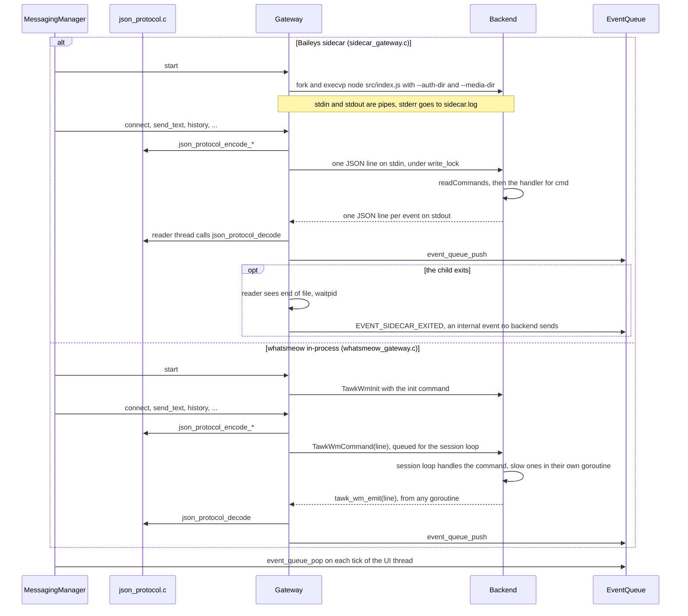

# Backend Protocol

tawk talks to its WhatsApp backend with JSON objects, one per line. The Node.js sidecar reads commands on stdin and writes events on stdout (diagnostics go to stderr, which tawk sends to `~/.local/state/tawk/sidecar.log`). The in-process whatsmeow bridge receives the same command objects through `TawkWmCommand` and returns events through the C callback `tawk_wm_emit`.

Backends report facts and never apply policy: they do not reconnect, retry or decide on notifications. Both backends implement every command and event below, except `picture_changed` (which the sidecar sends only after you change your own picture) `post_status` with its `status_posted` answer, which only whatsmeow handles, and `like_status`, which only the sidecar handles; `json_protocol.c` is the only encoder and decoder on the C side.



In both cases the C side sees the same lines. The difference is the transport: pipes to a child process that the messaging manager restarts when it exits, or direct calls into a Go archive linked into the binary, whose callback `tawk_wm_emit` may run on any goroutine and therefore only decodes the line and pushes it onto the thread-safe queue. When the queue is full the push waits, which slows the backend down instead of dropping events.

## Commands (tawk to backend)

| `cmd` | Fields | Effect |
|---|---|---|
| `init` | `auth_dir`, `media_dir`, `log_dir`, `debug` | whatsmeow only: open the login store (the sidecar takes these as arguments) |
| `connect` | | Open the WhatsApp connection; emits `auth_required` and `qr` when not linked |
| `reconnect` | | Drop the current connection, even one that still looks open, and connect again; sent when the machine's network changes and when the user retries |
| `qr` | | Drop the connection and start again with a fresh QR code |
| `pair` | `phone` (digits) | Request an 8-character pairing code for this number |
| `send` | `jid`, `text`, `id`, `reply_to`?, `mentions`?, `link_preview`?, `forwarded`?, `forwarding_score`? | Send text with the given message id. `reply_to` is an object `{ "id", "sender", "text", "status"? }` naming the message being answered, which makes the message a reply; `status` true means it answers a status (`id` is the status, `sender` its author, and the message goes to the author's chat), and backends set the quoted chat to `status@broadcast`. `mentions`? lists the JIDs of the people mentioned (phone-number form); the text holds `@<number>` for each, and backends switch both to the hidden LID in groups that address members that way. `link_preview`? true asks the backend to fetch a preview for the first https link (tawk sends it only when the user turned previews on); on success the backend adds the card to the message and reports it with a `link` event. `forwarded` true marks it "Forwarded", with `forwarding_score` saying how many times it has been forwarded (1 the first time) |
| `edit` | `jid`, `id`, `text` | Replace the text of one of your own messages |
| `delete` | `jid`, `id`, `sender`?, `from_me`, `everyone`, `ts` | Delete message `id` in chat `jid`. With `everyone` true it is revoked for everyone in the chat; otherwise it is deleted for this account only, which your phone and other linked devices apply too. `sender` is the author when it was not you (needed in groups), and `ts` is when the message was sent (delete for me needs it) |
| `delete_chat` | `jid`, `id`?, `from_me`, `ts` | Delete the whole chat `jid` on every device, like WhatsApp's "Delete chat". `id`, `from_me` and `ts` name the chat's newest message, which WhatsApp needs to apply the deletion |
| `profile` | `jid` | Ask for a contact's or group's details; answered by a `profile` event |
| `picture` | `jid`, `full` | Download the profile picture of `jid` into the media folder: the small preview, or the full picture when `full` is true; answered by a `picture` event |
| `block` | `jid`, `block` | Block (`true`) or unblock (`false`) a contact, then publish the new `blocklist`. Groups cannot be blocked |
| `reject_call` | `jid`, `id` | Decline the incoming call `id` from `jid` |
| `react` | `jid`, `id`, `sender`, `from_me`, `emoji` | React to message `id` in chat `jid`. `sender` is the author of that message (needed in groups) and `from_me` says whether it was yours. An empty `emoji` removes your reaction |
| `typing` | `jid`, `state` | Your chat state in `jid`: `composing`, `recording` or `paused` |
| `subscribe` | `jid` | Ask for typing and online updates from a contact (one-to-one chats only) |
| `presence` | `available` | Show you online (`true`) or offline (`false`) to your contacts |
| `history` | `jid`, `id`, `ts`, `from_me`, `count` | Ask the phone for up to `count` messages older than message `id` (sent at `ts`, yours when `from_me`). Backends clamp `count` to 1 to 100. The messages arrive later as `message` events with `live` false |
| `send_voice` | `jid`, `path`, `seconds`, `id` | Send an Ogg/Opus file as a push-to-talk voice note |
| `send_media` | `jid`, `path`, `kind`, `mime`, `file_name`, `text`, `id`, `forwarded`?, `forwarding_score`? | Send a photo, video, audio file or document with an optional caption; `forwarded` marks it as in `send` |
| `forward_media` | `jid`, `ref`, `id`, `forwarded`, `forwarding_score` | Send the media behind a received message's `ref` to another chat, marked "Forwarded", without downloading or uploading it (whatsmeow sets the context on the stored media message; Baileys uses `sendMessage` with `forward`). Answers with `status` like `send` |
| `download` | `id`, `ref`, `max_mb` | Download media for a message; `max_mb` 0 means no limit |
| `read` | `jid`, `receipts`, `messages` (`id`, `sender`), `last` (`id`, `sender`, `from_me`, `ts`) | Mark the chat read. With `receipts` true, send read receipts for the listed unread messages (and any the backend saw arrive). Always send the account-wide read mark anchored at `last`, which clears the chat's unread badge on the phone and other linked devices (`BuildMarkChatAsRead` in whatsmeow, `chatModify({ markRead })` in Baileys). tawk takes the ids from its database, so messages from before a restart or from history sync are covered |
| `set_name` | `name` | Change the name your contacts see; answered by `profile_updated` |
| `set_about` | `text` | Change your about text; answered by `profile_updated`, then a `profile` event for your own JID |
| `set_picture` | `path` | Make a JPEG or PNG your profile photo (the backend crops it square); answered by `profile_updated`, then `picture_changed` for your own JID |
| `remove_picture` | | Remove your profile photo; answered like `set_picture` |
| `post_status` | `kind`, `text`, `path`, `mime`, `bg`, `font`, `id` | whatsmeow only: post a status to `status@broadcast`. `kind` is `text`, `link`, `image` or `video`; `text` is the words or the caption; `bg` is the background colour of a text or link status as a 32-bit ARGB number and `font` WhatsApp's font number. Answered by `status_posted` |
| `like_status` | `jid`, `id`, `emoji` | Baileys only: like status `id` posted by `jid`, as the heart the phone shows. The sidecar sends a reaction to `status@broadcast` with `statusJidList` holding the author and you, so only the author is told. No answer is sent. whatsmeow has no `like_status` (it cannot address a status reaction to one person), and tawk sends a ❤️ reply with `reply_to.status` instead |
| `logout` | | Unlink this device and delete its login |

`path` values must point inside the media folder. Backends check this again and reject anything else. Message ids in `edit`, `react`, `delete` and `history` must look like WhatsApp message ids, and so must call ids in `reject_call`; `edit` text is limited to 64 KB. Backends ignore commands that do not pass these checks.

## Events (backend to tawk)

| `evt` | Fields | Meaning |
|---|---|---|
| `message` | `id`, `chat`, `sender`, `sender_name`, `text`, `type`, `ts`, `from_me`, `live`, `status`, `ref`?, `seconds`?, `thumb`?, `quote`?, `bg`?, `path`?, `mentions`?, `mentions_me`?, `link`?, `forwarded`? | A message; `live` is false for history. `type` is text, image, video, audio, document, sticker or other. `ref` is an opaque media reference for `download`. `thumb` is the small JPEG preview WhatsApp sends with photos, videos and documents (for a PDF, its first page), base64 encoded. `quote` is an object `{ "id", "sender", "text", "status"? }` when the message is a reply, with `status` true when it answers a status (yours or the sender's). `forwarded` is true when the sender marked it as forwarded. `bg` is the background colour of a text status (32-bit ARGB). `path` is only read on `status@broadcast`: the local file of a status you just posted, used only when it is inside the media folder. `mentions` lists `{ "jid", "user" }` for each person mentioned: `jid` in phone-number form where known, `user` the digits written after `@` in the text (a LID in some groups). `mentions_me` is true when this account is one of them. `link` is `{ "url", "title", "desc" }` for a link card, whose picture is `thumb`. |
| `link` | `id`, `url`, `title`, `desc`, `thumb`? | The preview card made for a message you just sent, so its bubble shows it too |
| `status` | `id`, `status` | sent, delivered, read or failed. Receipts for an edit we sent carry the id of the message it edited (each backend remembers the last 512 edits), so an edited message still turns delivered and read. |
| `receipt` | `id`, `by`, `kind`, `at` | One recipient's receipt for message `id` that you sent: `by` is the recipient's JID, `kind` is `delivered`, `read` or `played`, and `at` is when, in epoch seconds. Edits are resolved to the original id as for `status`. tawk keeps the earliest time of each kind per recipient for Message info |
| `chat` | `jid`, `name`, `unread` (-1 unknown), `ts`, `preview`?, `archived`?, `locked`? | Chat metadata. `archived` and `locked` are booleans; when absent, the stored value is kept. Both backends send `archived`; neither sends `locked` at present |
| `edit` | `id`, `chat`, `text`?, `deleted`? | A message was edited (`text` is the new text) or deleted for everyone (`deleted` true) |
| `removed` | `id`, `chat` | Message `id` was deleted for this account on another device (the phone or another linked device); tawk removes it from the database |
| `reaction` | `id`, `chat`, `sender`, `emoji` | `sender` reacted to message `id`; an empty `emoji` means the reaction was removed |
| `typing` | `chat`, `sender`, `state` | Someone's chat state: `composing`, `recording` or `paused` |
| `presence` | `jid`, `state`, `last_seen` | A contact you subscribed to came online or left: `state` is `online` or `offline`, and `last_seen` is when they were last here in Unix seconds, 0 when they do not share it |
| `alias` | `lid`, `pn` | The hidden id `lid` (…@lid) belongs to the phone number JID `pn` (…@s.whatsapp.net) |
| `chat_removed` | `jid` | The whole chat was deleted on another device |
| `contact` | `jid`, `name`, `push_name` | Contact names |
| `profile` | `jid`, `about`?, `verified_name`?, `business`?, `group`? | A contact's or group's details. `about` is the contact's about text and `verified_name` a business account's verified name. `business` is an object `{ "category", "address", "email" }`, present for business accounts. `group` is an object `{ "subject", "description", "owner", "created", "participants" }` for groups, where `created` is in epoch seconds and `participants` is a list of `{ "jid", "admin" }` |
| `picture` | `jid`, `full`, `path` and `id`, or `none` | A profile picture was downloaded to `path` (the preview, or the full picture when `full` is true); `id` identifies the picture. `none` true means there is no picture, or it is private |
| `picture_changed` | `jid` | The profile picture of `jid` changed; tawk forgets both sizes and fetches them again (whatsmeow only) |
| `blocklist` | `jids` | The full list of blocked JIDs, sent after connecting, after a `block` and whenever the block list changes |
| `call` | `id`, `from`, `state`, `video`, `group`, `ts` | A call: `state` is `offer` (it is ringing), `accepted` (answered on another device) or `ended` (declined, missed or hung up). `video` and `group` are booleans and `ts` is in epoch seconds |
| `auth_required` | | This device is not linked |
| `qr` | `ascii` | A QR code rendered as text |
| `pairing_code` | `code` | The code to type on the phone |
| `connected` | `jid`, `name` | Logged in as this account |
| `logged_out` | | The login was removed |
| `connection` | `reason`, `detail` | `connecting`, `open`, `closed`, `error`, `restart_required`, `qr_timeout`, `replaced`, `banned` or `outdated`, with a readable explanation. whatsmeow gives a dial and handshake 30 seconds before reporting `error`, reports `closed` after 3 unanswered keep-alive pings in a row (and disconnects), and reports `open` again when keep-alives recover before that |
| `media` | `id`, `path` | A download finished |
| `profile_updated` | `field`, `ok`, `detail`?, `name`? | A `set_name`, `set_about`, `set_picture` or `remove_picture` finished. `field` is `name`, `about` or `picture`; `detail` says why it failed; `name` is the saved name |
| `status_posted` | `id`, `ok`, `detail`? | The `post_status` with this `id` went out (`ok` true) or failed, with the reason in `detail` (whatsmeow only) |
| `error` | `detail`, `id`? | Something failed; `id` ties it to a download |

## Deleting messages

The C side builds a `DeleteRequest` from the stored message and `json_protocol_encode_delete` turns it into the `delete` command. tawk only asks for a delete for everyone on your own messages that were sent, are not already deleted and are less than about 60 hours old (`messaging_manager_can_delete_for_everyone`). A message of yours that failed or is still pending never reached WhatsApp, so it is removed locally and no command is sent.

| | whatsmeow | Baileys |
|---|---|---|
| Delete for everyone | `BuildRevoke` sent to the chat with `SendMessage` | `sendMessage(jid, { delete: key })` |
| Delete for me | An app state patch with a `deleteMessageForMe` mutation (`SendAppState`) | `chatModify({ deleteForMe: { deleteMedia: false, key, timestamp } }, jid)` |
| Deleted for me elsewhere | `events.DeleteForMe` becomes `removed` | `messages.delete` becomes one `removed` per key |

A delete for everyone made by the sender, on any device, still arrives as `edit` with `deleted` true, and the message shows as "This message was deleted". A delete for me removes the row, so the message disappears.

## Profiles, pictures and blocking

The profile manager asks for details with `profile` and for pictures with `picture`, a few requests at a time (see [HOW_IT_WORKS.md](HOW_IT_WORKS.md#profiles-and-portraits)). The backends answer as follows:

| | whatsmeow | Baileys |
|---|---|---|
| Contact details | `GetUserInfo` (about text, verified name) and `GetBusinessProfile` | `fetchStatus` and `getBusinessProfile` |
| Group details | `GetGroupInfo` | `groupMetadata` |
| Picture | `GetProfilePictureInfo` with `Preview` for the small one | `profilePictureUrl` with `preview` or `image` |
| Block | `UpdateBlocklist`, then `blocklist` | `updateBlockStatus`, then `fetchBlocklist` |
| Block list | `GetBlocklist` after connecting and on `events.Blocklist` | `fetchBlocklist` after connecting and on `blocklist.update` |
| Picture changed | `events.Picture` becomes `picture_changed` | Not reported, except after your own `set_picture` or `remove_picture`; the preview is fetched again on the next run or once it is a day old |
| Your name | `appstate.BuildSettingPushName` sent with `SendAppState` | `updateProfileName` |
| Your about text | `SetStatusMessage` | `updateProfileStatus` |
| Your picture | Cropped square and scaled to 640×640 JPEG, then `SetGroupPhoto` with no JID (nil removes it) | `updateProfilePicture` or `removeProfilePicture` with your own JID |

The backend downloads a picture itself and reports only the file. The file is named `pic-<hash>-<id>.jpg` (with `-full` before `.jpg` for the full picture), where `<hash>` comes from a SHA-256 of the JID and `<id>` identifies the picture, so a new picture gets a new name and an existing file is reused. Only `https://` addresses are fetched, pictures are limited to 4 MB, and each download is written to a `.part` file first and renamed when complete, so tawk never reads a partly written picture. When WhatsApp has no picture for the JID, or it is private, the backend sends `picture` with `none` true.

Neither library can report a contact to WhatsApp, so tawk does not offer reporting.

## Statuses

Messages on `status@broadcast` are statuses. tawk never shows them as a chat, notifies about them or counts them as unread; the status feed keeps them (yours and your contacts') for `status_keep_days`, the last day as current statuses and the rest as the archive, downloads a photo or video when it is looked at (with no size limit) or, while the archive is on, when it arrives, and deletes the files when the statuses are pruned. whatsmeow also passes on the statuses in history sync (`statusV3Messages`), so ones posted before linking appear too. A status deleted with `edit` (`deleted` true) or `removed` goes away. Looking at a status sends no read receipt. For your own statuses, the `receipt` events of each viewer (read or played) say who saw it and when, and a `reaction` on `status@broadcast` with the status's id is a like; tawk keeps both and lists them in the viewers list. Answers to someone else's status are ordinary messages in your chat with them whose `reply_to` has `status` true; replies to your statuses arrive the same way, with `quote.status` true, and tawk stores the mark (`messages.quoted_status`) so the bubble can show the status it answers.

`post_status` is handled by whatsmeow only: it sends a text or link status as an `ExtendedTextMessage` with white text on the `bg` colour (a link status also names its first address as `MatchedText`, without a preview picture), and a photo or video with the same upload as `send_media`, to `types.StatusBroadcastJID`. whatsmeow sends it to the people your phone's status privacy setting allows. Baileys needs that list from the caller, so the sidecar has no `post_status`; tawk offers to switch to whatsmeow instead. After a status is posted, whatsmeow also sends a `message` event for it on `status@broadcast` (`from_me` true, with `bg`, and for a photo or video its `ref` and local `path`), so it shows among your statuses like one posted from the phone.

## Calls

Both backends report calls as `call` events: whatsmeow from `events.CallOffer`, `CallOfferNotice`, `CallAccept` and `CallTerminate`, and Baileys from its `call` event. `reject_call` declines a call with whatsmeow's `RejectCall` or Baileys' `rejectCall`. tawk cannot answer a call or carry its audio, because neither library implements WhatsApp's call media; it can only show that a call is ringing and decline it.

## Addressing: phone numbers and LIDs

WhatsApp can address the same person by phone number (`27821234567@s.whatsapp.net`) or by a hidden id (`1234567890@lid`). tawk keys chats and contacts by phone number. Backends translate a LID to its phone number whenever they know the mapping, and report every mapping they learn as an `alias` event: from message metadata, from the mappings that arrive with history sync, from the whatsmeow login store after each connect, and from Baileys' `chats.phoneNumberShare`. tawk stores each alias, rewrites the JIDs of later events to the phone number form, and merges any chat, messages, contact and reactions it had stored under the LID into the phone number chat.

## Typing and presence

tawk sends `presence` with `available` true after connecting when "Appear online" is on and you are active, and `false` after two idle minutes, while the screensaver runs, and on exit. WhatsApp only delivers other people's `typing` events to a device that is online, and only for contacts it has been asked about, so tawk sends `subscribe` whenever a one-to-one chat is opened and again after each reconnect. While you type, tawk sends `typing` with `composing` at most every 7 seconds, `recording` while you record a voice note, and `paused` when you stop, send, switch chats or go idle. An incoming `typing` notice is shown for 8 seconds unless it is refreshed.

The same subscription brings the `presence` event: WhatsApp answers a `subscribe` with the contact's state at once, and sends another whenever they come online or leave. A contact who hides their online status sends nothing, and one who hides their last seen leaves `last_seen` at 0. tawk keeps the state while it is connected and shown as online itself, and forgets it otherwise, since WhatsApp stops sending it then.

## Limits enforced by tawk

- Lines over 2 MB are discarded.
- Message text (including edited text) is capped at 64 KB, media references at 16 KB, QR text at 32 KB and quoted text at 512 bytes, with its line breaks turned into spaces.
- `thumb` is accepted only when it decodes to a JPEG of at most 64 KB; anything else is dropped. Backends only send previews under 48 KB.
- Single-line fields (ids, JIDs, names, codes, reasons) have control characters replaced with spaces before they reach the screen or the terminal title; message text keeps only newlines and tabs.
- Unknown events and malformed JSON are ignored.

## Example

```
> {"cmd":"connect"}
< {"evt":"connection","reason":"connecting","detail":"Connecting to WhatsApp"}
< {"evt":"connected","jid":"27821234567@s.whatsapp.net","name":"Logan"}
< {"evt":"connection","reason":"open","detail":"Connected"}
< {"evt":"message","id":"3EB0A1","chat":"27831112222@s.whatsapp.net","sender":"27831112222@s.whatsapp.net","sender_name":"Mom","text":"Did you eat?","type":"text","ts":1790668740,"from_me":false,"live":true,"status":"delivered"}
> {"cmd":"send","jid":"27831112222@s.whatsapp.net","text":"Yes, pizza","id":"3EB0F00DBEEF12345678"}
< {"evt":"status","id":"3EB0F00DBEEF12345678","status":"sent"}
< {"evt":"typing","chat":"27831112222@s.whatsapp.net","sender":"27831112222@s.whatsapp.net","state":"composing"}
< {"evt":"reaction","id":"3EB0F00DBEEF12345678","chat":"27831112222@s.whatsapp.net","sender":"27831112222@s.whatsapp.net","emoji":"😋"}
> {"cmd":"send","jid":"27831112222@s.whatsapp.net","text":"With extra cheese","id":"3EB0C0FFEE1234567890","reply_to":{"id":"3EB0A1","sender":"27831112222@s.whatsapp.net","text":"Did you eat?"}}
> {"cmd":"edit","jid":"27831112222@s.whatsapp.net","id":"3EB0C0FFEE1234567890","text":"With extra cheese, obviously"}
> {"cmd":"delete","jid":"27831112222@s.whatsapp.net","id":"3EB0F00DBEEF12345678","from_me":true,"everyone":true,"ts":1790668800}
< {"evt":"removed","id":"3EB0A1","chat":"27831112222@s.whatsapp.net"}
< {"evt":"alias","lid":"123456789012345@lid","pn":"27831112222@s.whatsapp.net"}
> {"cmd":"picture","jid":"27831112222@s.whatsapp.net","full":false}
< {"evt":"picture","jid":"27831112222@s.whatsapp.net","full":false,"path":"/home/logan/.cache/tawk/media/pic-9f2c4e1a7b3d5c60-1790668000.jpg","id":"1790668000"}
< {"evt":"call","id":"4A1B2C3D4E5F60718293","from":"27831112222@s.whatsapp.net","state":"offer","video":false,"group":false,"ts":1790668900}
> {"cmd":"reject_call","jid":"27831112222@s.whatsapp.net","id":"4A1B2C3D4E5F60718293"}
```
