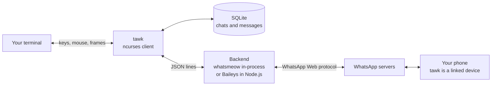

<p align="center">
  <picture>
    <source media="(prefers-color-scheme: dark)" srcset="docs/images/logo-lockup-dark.png">
    
  </picture>
</p>

# tawk

> **Disclaimer.** tawk is an independent project and is not affiliated with, endorsed by or connected to WhatsApp or Meta. It uses unofficial protocol libraries; use it at your own risk and in line with [WhatsApp's terms of service](https://www.whatsapp.com/legal/terms-of-service).

**T**erminal **A**ccess to **W**hatsApp **K**onnector: WhatsApp in your terminal. tawk is a fast, native terminal client written in C with ncurses. It links to your phone the same way WhatsApp Web does, keeps your chats in a local SQLite database, and gives you notifications, voice notes, media, statuses, themes and a screensaver without leaving the terminal.


<table><tr>
<td width="33%"></td>
<td width="33%"></td>
<td width="33%"></td>
</tr><tr><td>Photo viewer</td><td>Emoji picker</td><td>Settings</td></tr><tr>
<td width="33%"></td>
<td width="33%"></td>
<td width="33%"></td>
</tr><tr><td>Statuses</td><td>Camera</td><td>Your profile</td></tr></table>

Screenshots come from a demo account with the chat text blurred, and those of statuses, the camera and your profile are drawn by tawk's own code with made-up data; the [manual](MANUAL.md) has one for every screen.



## Quick Start

```bash
curl -fsSL https://raw.githubusercontent.com/loganventer/tawk/main/install.sh | bash
tawk
```

On first run a wizard links tawk to your phone with a QR code or a pairing code. See [QUICKSTART.md](QUICKSTART.md) for other ways to install and a first-run walkthrough.

Update later with `tawk --update`: it compares the commit this build came from (shown by `tawk --version`) with the newest one on GitHub, says so when you are up to date, and otherwise shows what it will install and asks first. `tawk --reinstall` installs again even when current.

### Installing on macOS

1. Install the Xcode command line tools, which provide the C compiler and `make`:
   ```bash
   xcode-select --install
   ```
2. Install [Homebrew](https://brew.sh) if you do not have it yet.
3. Run the installer. It uses Homebrew for everything tawk needs (ncurses, SQLite, pkg-config, Go, ffmpeg and SoX for voice notes, poppler for PDF pages and pngpaste for pasting pictures) and asks before installing anything:
   ```bash
   curl -fsSL https://raw.githubusercontent.com/loganventer/tawk/main/install.sh | bash
   ```
   To install without `sudo`, put it in your home folder instead and make sure `~/.local/bin` is on your `PATH`:
   ```bash
   curl -fsSL https://raw.githubusercontent.com/loganventer/tawk/main/install.sh | bash -s -- --prefix "$HOME/.local"
   ```
4. Run `tawk --doctor` to check the setup, then `tawk`.

Use [iTerm2](https://iterm2.com) (3.5 or later), [WezTerm](https://wezterm.org) or [Ghostty](https://ghostty.org) rather than the macOS Terminal app. tawk runs in Terminal, but it looks broken there: thin black lines cut through the chat bubbles, and profile badges have jagged edges. tawk draws bubble padding, rounded badge corners and the chat bars with block characters (`▀ ▄ ▌ ▗`). Most terminals draw those characters themselves so they fill the whole cell, but Terminal takes them from the font, whose blocks are shorter than a row, and the gaps show. Changing tawk cannot fix this without changing the look. Terminal also has no Sixel support, so profile pictures show as initials and photos as coloured blocks; iTerm2 and WezTerm show both in full resolution. Photos, videos and files open in their default macOS applications, and voice notes record through CoreAudio with SoX, since ffmpeg's microphone capture clicks on some Macs (allow microphone access for your terminal when macOS asks). Alt shortcuts such as Alt+L work with the Option key; see [Alt shortcuts on a Mac](MANUAL.md#alt-shortcuts-on-a-mac).

### Installing on Windows

tawk runs on Windows through WSL (the Windows Subsystem for Linux), in Windows Terminal.

1. In PowerShell (as administrator), install WSL with Ubuntu, then restart when asked:
   ```powershell
   wsl --install -d Ubuntu
   ```
2. Open **Ubuntu** from Windows Terminal, create your Linux user when prompted, and run the installer there:
   ```bash
   curl -fsSL https://raw.githubusercontent.com/loganventer/tawk/main/install.sh | bash
   ```
3. Run `tawk --doctor`, then `tawk`.

Use **Windows Terminal** 1.22 or later: it draws photos and PDFs as real pixels (Sixel) and shows tawk's status in the tab title. Voice notes use the microphone through WSLg, which comes with current WSL. To open photos, videos and files in Windows applications (the Photos app, your video player), WSL must be allowed to start Windows programs; this is on by default, and `tawk --doctor` tells you when it is off. Without it tawk uses its own viewer and Linux players. For Ctrl+Shift+L (soft lock) in Windows Terminal, see [the manual](MANUAL.md#soft-lock); Alt+L always works.

## Features

- **Two WhatsApp backends behind one contract:** [whatsmeow](https://github.com/tulir/whatsmeow) linked into the binary (default, no runtime dependencies) or [Baileys](https://github.com/WhiskeySockets/Baileys) in a Node.js sidecar. Switch with one config key.
- **Several accounts:** up to eight WhatsApp numbers connected at once in one window and one database (Settings, Account, Accounts…). One chat list with a badge per account, someone who writes to two of your numbers shown as one conversation (`merge_accounts`, or per contact), a sending number per contact (Alt+A, the contact card), and a separate agent access level for each account. See [Several accounts](MANUAL.md#several-accounts).
- **Linking wizard:** scan a QR code, or type your number and enter an 8-character code on the phone.
- **Chats:** a detailed or compact list with adjustable spacing, unread bars and badges, pinned chats in their own foldable group, timed mutes, Archived and Locked folders, per-chat notification tones and themes, drafts kept per chat, a soft lock that blurs a chat's conversation (Ctrl+Shift+L or Alt+L), typing indicators both ways, online and last seen under the name of the open chat, next-unread, read receipts, history sync.
- **Contacts and groups:** profile pictures in the chat list and the title bar (round, in real pixels on Sixel terminals, or an initials badge), the about text or member count under the chat name, and a details panel (click the name, Alt+I or `/info`) with the chat's own settings (which number sends, merging, agents answering, transcripts, TL;DR), business details, the group description and members, blocking, clearing, deleting and exporting a chat in WhatsApp's text format, with or without its media.
- **Your profile:** click your name in the header (right of the connection emoji) or type `/profile` to change your name (up to 25 characters), your about text (up to 139) and your photo: choose a file, take one with the camera, paste a picture, view it full size or remove it.
- **Statuses:** ⭕ in the header, with the number of people whose statuses you have not seen, or `/statuses` opens the status list and a viewer that steps through each person's text, photo and video statuses. Statuses older than a day move to an archive (Tab in the list), kept for 30 days by default (`status_keep_days`), and viewing them sends no read receipt. Answer someone's status with a quick emoji, a reply or a like, and replies to statuses show the status in the chat. The + left of the clock (or `/status`) posts a text status on a background colour of your choice (Ctrl+B), a photo, a video (chosen, pasted, dropped or from the camera) or a link. Posting needs the whatsmeow backend; on Baileys tawk offers to switch and restarts itself.
- **Calls:** an incoming voice call rings in tawk with the caller's picture, and you can decline it or answer on your phone. tawk cannot carry call audio, because neither whatsmeow nor Baileys implements WhatsApp call media.
- **Messages:** solid bubbles aligned by sender, day separators, delivery ticks, replies with quotes, reactions on the side facing the middle, edits within 15 minutes, delete for me or for everyone (Delete key), deleted messages, retry for failed sends, UTF-8 and emoji aware wrapping, and older history loaded as you scroll up (from the phone when the local copy runs out).
- **Search:** full-text search across every chat (Ctrl+K), backed by SQLite FTS5 (and a plain search where SQLite lacks FTS5).
- **Formatting and mentions:** `*bold*`, `_italic_`, `~strike~`, code and quotes shown as WhatsApp shows them; `@` suggests group members, sends real mentions, and being mentioned notifies you even in a muted chat.
- **Forwarding and scheduling:** forward a message to up to five chats, marked as forwarded; `/later 18:00 text` keeps a message on this computer and sends it when it is due, even after a restart (`/scheduled` lists them).
- **Link previews:** cards for links others send; making them for your own links is opt-in, since the site sees your IP address.
- **Your data at rest:** `tawk --encrypt` encrypts the chat database with a passphrase (SQLCipher), and `tawk --backup` and `--restore` make and restore encrypted backups.
- **Agents and automation:** turn on Agent access and [tawk-mcp](https://github.com/loganventer/tawk-mcp) lets an AI assistant such as Claude Code read your chats and draft or send messages; every send or change waits for you in the Agentic tab (F3), deletes need two yeses, and locked chats stay hidden. `tawk send`, `tawk tail`, `tawk unread` and `tawk status-line` do the same for scripts and status bars. See [Automation and MCP](MANUAL.md#automation-and-mcp).
- **Emoji:** the full Unicode emoji set in a searchable picker with group tabs and recent emoji (Ctrl+E), a quick reaction palette, emoticons such as `:)` and `<3` turned into emoji as you type, and `(word` shortcodes that list matching emoji to click.
- **Media:** photos and videos drawn inside the chat, in real pixels on Sixel terminals (Windows Terminal, WezTerm, foot) and with coloured blocks elsewhere; videos show a frame with a play button and PDFs their first page with a document badge. A built-in viewer shows photos full size, turns the pages of PDFs and browses a chat's photos, videos and PDFs; videos play in mpv, vlc or ffplay, documents open in the system default application, and any file can be saved to your Downloads folder. Files tawk does not recognise offer Save or Open instead of guessing. Attach with the file picker (Ctrl+O, remembers the last folder), by dropping a file on the terminal, or paste a picture from the clipboard with Alt+V (converted to PNG when the clipboard holds another format, so it goes out as a photo).
- **Voice notes:** shown with 🔊; play them inline; record with Ctrl+R. Works with PulseAudio, PipeWire, ALSA, CoreAudio and DirectShow.
- **Transcripts:** a voice note that an agent's transcriber has written out shows its words in its own bubble, under the play line, in grey italics. On for every chat or off, and each chat can always or never show them, or be left untranscribed altogether, from its contact card. Kept in the database, so they are there after a restart. See [Voice notes](MANUAL.md#voice-notes).
- **TL;DR mode:** switch it on for a chat and its long messages show as a short summary that unfolds to the original with Enter and folds back. A connected agent's model writes the summaries; you choose which agent (your default agent) in the Agents list, and when several are connected and none is chosen tawk asks you in your own chat on WhatsApp. The last 30 days of such a chat are summarised by themselves. See [TL;DR mode](MANUAL.md#tldr-mode).
- **Notifications:** sound, a blinking chat, and a terminal tab title such as `🟢 tawk · Mom · 💬 3  📷 1`, which animates while someone is typing to you (`✍️ Jan is typing...`). In Windows Terminal the tab also shows a progress ring while reconnecting.
- **Resilience:** exponential backoff with jitter behind a circuit breaker, with a clear overlay while WhatsApp is unavailable. tawk reconnects as soon as the network changes (Wi-Fi to Ethernet or a hotspot, for example), drops a connection whose keep-alives fail, and retries a connect that gets no answer within 45 seconds.
- **Settings panel:** nested menus like the Android app, saved to `~/.config/tawk/config.ini` as you change them.
- **Start-up splash:** an animated logo while tawk connects; any key skips it, and the Startup splash setting under Appearance turns it off.
- **60 themes** as JSON files with live preview; add your own in `~/.config/tawk/themes/`.
- **Screensaver:** runs a command such as `matrix-clock` over tawk after a few idle minutes or on demand (Ctrl+L); any key or click brings tawk back.
- **Photos and videos from your camera:** click ➕ in the input and choose Take a photo, or type `/camera`, for a live viewfinder: Space or Enter takes a photo, V records a video with sound (up to 3 minutes), and you check it before it is attached (Enter uses it, R retakes). The same viewfinder takes a new profile photo or the picture for a status (macOS, Linux).
- **Keyboard and mouse:** slash commands with suggestions (`/help`), Shift+Enter or Alt+Enter for a new line, Option as Alt on a Mac, a right-click menu on messages (reply, react, copy, edit, save, delete), click chats and media, drag chats into and out of the Pinned group, scroll, drag the divider to resize, collapse the chat list with Ctrl+B. The layout reflows when the window is resized.
- **Setup check:** `tawk --doctor` checks the terminal, files, backend, voice note and media tools, the PDF page tools and the screensaver command, and says what to install.

## How It Works

tawk is a single C program organised in [iDesign](ARCHITECTURE.md) layers. The client (the ncurses UI) talks to managers, managers use engines and resource access, and every dependency arrives through a small vtable contract built in `src/main.c`. The WhatsApp protocol comes from a backend that speaks a JSON line protocol ([PROTOCOL.md](PROTOCOL.md)).

See [HOW_IT_WORKS.md](HOW_IT_WORKS.md) for the runtime flow with diagrams.

## Directory Structure

```
tawk/
├── src/, include/        C sources, mirrored by layer
│   ├── core/             domain types (Message, Chat, ContactProfile, Settings, Theme, ...)
│   ├── contracts/        interfaces (IMessageGateway, IChatStore, IProfileStore, IAudioBackend, ...)
│   ├── utilities/        cross-cutting helpers (logging, paths, UTF-8, LRU cache, ...)
│   ├── engines/          business rules (backoff, circuit breaker, notification policy, emoticons, ...)
│   ├── resource_access/  SQLite stores, INI settings, JSON themes, emoji catalog, chat export, WhatsApp gateways
│   ├── infrastructure/   OS integration (audio, camera, media opener, screensaver, terminal title, clipboard, network monitor)
│   ├── managers/         use cases (messaging, profiles, your account, statuses, calls, media, settings, automation)
│   ├── clients/tui/      the ncurses client
│   ├── clients/control/  the control socket client for tawk-mcp and the shell commands
│   ├── clients/cli/      the --doctor setup check, the --update installer and tawk send, tail, unread
│   └── main.c            composition root
├── bridge/whatsmeow/     Go bridge, built as a static C archive
├── sidecar/              Node.js Baileys bridge
├── themes/               JSON colour themes
├── assets/sounds/        notification sound
├── assets/emoji/         Unicode emoji list for the picker
├── vendor/               cJSON and stb_image
├── tests/                tests (make test)
├── docs/                 man page (tawk.1) and screenshots (images/)
├── completions/          bash completion
├── tools/screenshots/    draws the manual's newer screenshots (make screenshots)
├── tools/branding/       draws the logo PNGs in docs/images (make logos)
├── Makefile
└── install.sh
```

## Documentation

| Document | Contents |
|---|---|
| [INTENT.md](INTENT.md) | Purpose, scope and boundaries |
| [QUICKSTART.md](QUICKSTART.md) | Install and first run |
| [AGENT_SETUP.md](AGENT_SETUP.md) | Instructions for an AI agent installing tawk for you, on Windows, Linux and macOS |
| [MANUAL.md](MANUAL.md) | Everyday use and every shortcut |
| [CONFIGURATION.md](CONFIGURATION.md) | Every setting, file locations, themes |
| [HOW_IT_WORKS.md](HOW_IT_WORKS.md) | Runtime flow, login, reconnects, media |
| [ARCHITECTURE.md](ARCHITECTURE.md) | Layers, contracts and design principles |
| [PROTOCOL.md](PROTOCOL.md) | The backend JSON line protocol |
| [CONTROL.md](CONTROL.md) | The control socket protocol, for tawk-mcp and scripts |
| [SECURITY.md](SECURITY.md) | Threat model, controls and reporting |

After installing, `man tawk` covers the command line.

## Building

```bash
make                 # includes whatsmeow when Go is installed
make WHATSMEOW=0     # Node.js backend only
make sidecar         # install the Node.js backend's dependencies
sudo make install    # to /usr/local; use PREFIX=$HOME/.local for a user install
make test            # build and run the tests
make help            # every target and option
tawk --doctor        # check the result
```

Requirements: a C11 compiler, make, pkg-config, ncurses (wide-character), SQLite 3 with FTS5, and Go 1.21 or newer for the in-process backend. At run time ffmpeg and your audio system's tools (for example `pulseaudio-utils`) enable voice notes, `xdg-utils` opens media on Linux, and poppler (`pdftoppm` and `pdfinfo`, in `poppler-utils` on most Linux systems) shows PDF pages inside tawk. Node.js 20 or newer is only needed for the Baileys backend.

## Platforms

Linux and macOS natively; Windows through WSL (recommended) or MSYS2. tawk is tested on Ubuntu under WSL2 with Windows Terminal.

## Logo

The logo files are PNGs with a transparent background, in `docs/images`. `make logos` draws them again.

| File | What it is | Use it on |
|---|---|---|
| `logo-lockup.png` | The app icon with the name beside it | Light pages |
| `logo-lockup-dark.png` | The green symbol with the name in white | Dark pages and terminals |
| `logo-icon.png` | The app icon: the symbol on a dark rounded square | App icons, avatars |
| `logo-symbol.png` | The symbol alone, in green | Anywhere the name is already shown |
| `logo-glyph-black.png`, `logo-glyph-white.png` | The symbol in one colour | Print, stamps, single-colour places |
| `logo-icon-small.png`, `logo-icon-32.png`, `logo-icon-16.png` | The small icon with three plain bars | Favicons and other tiny sizes |
| `logo-symbol-32.png` | The symbol at 32 pixels | Small places on a plain background |

## Disclaimer

tawk is an independent project and is not affiliated with, endorsed by or connected to WhatsApp or Meta. It uses unofficial protocol libraries; use it at your own risk and in line with [WhatsApp's terms of service](https://www.whatsapp.com/legal/terms-of-service).

## Contributing

Issues and pull requests are welcome. Keep to the existing structure: one type per file, contracts for dependencies, composition over inheritance. Run `make` with no warnings before opening a pull request. [CONTRIBUTING.md](CONTRIBUTING.md) has the rules in full.

## Author

tawk is written and maintained by **Logan Venter** ([logan.venter@outlook.com](mailto:logan.venter@outlook.com)). Issues and ideas are welcome on [GitHub](https://github.com/loganventer/tawk/issues).

## License

MIT, see [LICENSE](LICENSE).
