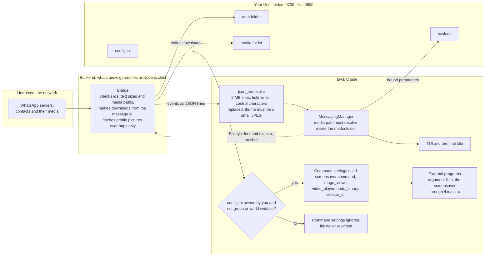

# Security

## Reporting a vulnerability

Please report security issues privately through GitHub's "Report a vulnerability" button on the repository's Security tab rather than in a public issue. Include the version (`tawk --version`), your platform and steps to reproduce. You can expect an acknowledgement within a week.

## What tawk protects

- **Your WhatsApp login.** Anyone with the files in `~/.local/share/tawk/auth/` can act as a linked device on your account.
- **Your messages and media** in `~/.local/share/tawk/tawk.db` and `~/.cache/tawk/media/`, together with your contacts' profile details, profile pictures, their statuses and your block list.
- **Your terminal and system** from anything a contact sends you.
- **Your account from the agents you let in**, when Agent access is on: they see only what you allow and act only with your answer.

## Trust boundaries

Everything that arrives from WhatsApp is untrusted, and so is the backend that relays it: tawk re-checks what the backend reports rather than relying on its checks. The config file is trusted only when nobody else can have changed it.



## Threat model

| Threat | Examples | Controls |
|---|---|---|
| Other local users | Reading your chats or login | umask 077; folders 0700; database, logs, media and config 0600; `O_NOFOLLOW` when creating the database, logs, config and outgoing copies |
| A stolen disk or copied home folder | Reading `tawk.db` offline | `tawk --encrypt` encrypts the database with SQLCipher (AES-256, with the key derived from your passphrase); the passphrase is read from the terminal with echo off, kept only in memory, wiped after use, and never written to a setting, argument, environment variable or log. Copies kept before upgrades are encrypted when the database is, and `--encrypt` offers to remove older unencrypted ones. The login folder, media and logs are not encrypted (see the trade-offs below) |
| A lost or copied backup file | Reading chats or the login from a backup | Backups are always encrypted with `openssl enc -aes-256-cbc -pbkdf2 -iter 600000 -salt`; the passphrase reaches openssl through a pipe (`-pass fd:3`), never its arguments, where other users could see it. The file is created owner only with `O_EXCL` and `O_NOFOLLOW`, never replacing anything. The login goes in only with `--with-login` |
| A crafted backup | A restore writing outside tawk's folders or through a link | Every member is listed before anything is extracted and must be a plain file or folder under the entries a backup holds, with no absolute path and no `..`; tar runs without keeping the archive's owners or permissions, restored files are set to 0600 and folders to 0700, and what the restore replaces is renamed aside instead of deleted |
| Two copies of tawk at once | Two processes writing the same database, or `--encrypt` replacing it under a running tawk | An exclusive lock on `tawk.lock` in the data folder, taken before the database is opened; the system releases it when tawk ends, even after a crash |
| Malicious message content | Escape sequences in names or text that rewrite the screen or the terminal title | Control characters stripped from every single-line field and from the title; ncurses renders any remaining control characters visibly; text length limits |
| Malicious media | A file named to be executed when opened, or a type tawk cannot show | File names are built only from validated message ids plus an extension chosen from a fixed MIME list (unknown types become `.bin`); profile pictures are named `pic-<hash>-<id>.jpg` from a SHA-256 of the JID and the picture id reduced to letters and digits (a hash of the address with Baileys); media opens only when you choose to open it; a document of a type tawk does not recognise opens an offer with Save to Downloads preselected instead of going straight to a viewer |
| Saving files | A document name that tries to escape the downloads folder or replace a file there | `message_file_name` turns slashes, backslashes and control characters into `_` and never starts a name with a dot; `file_copy` creates the copy with `O_EXCL` and `O_NOFOLLOW`, so it never replaces or writes through an existing file or link, and picks `name (1).ext` and so on instead; a partial copy is removed |
| Malicious images | A crafted photo, preview or profile picture aimed at the image decoder | Only JPEG and PNG decoders are compiled in (no file I/O, HDR or animation), images are limited to 4096 pixels a side, embedded previews must decode to a JPEG of at most 64 KB, downloaded photos over 16 MB are not previewed, and profile pictures are fetched only from `https://` addresses, limited to 4 MB and written to a `.part` file that is renamed when complete |
| Path traversal | A backend or config pointing tawk at files outside its folders | Message media, status media and profile picture paths are resolved with `realpath` and must lie inside the media folder, checked in C (and for message media again in each backend); an exported chat's name has slashes, backslashes, colons and control characters turned into `_` and never starts with a dot |
| Command injection | A config value or pasted text becoming a shell command | No `system()`, `popen()` or `wordexp()`; external tools (including `pdftoppm`, `pdfinfo` and `ffmpeg`, which get the path of a downloaded file or of a pasted picture to convert) run with argument lists; config paths only expand a leading `~`; switching backend restarts tawk with `execv` on its own binary and the same arguments without `--backend`, never through a shell |
| Tampered config | Someone else editing `config.ini` to change what tawk runs | Command settings are ignored, and the file is never rewritten, unless it is owned by you and not group or world writable |
| SQL injection | Hostile names or text in queries | Every statement uses bound parameters; search input is turned into quoted FTS5 prefix terms, so it can never use FTS operators |
| Clipboard misuse | Text copied from a message carrying escape sequences | Copy text sends the message base64 encoded inside a single OSC 52 sequence, capped at 64 KB, and only when you choose Copy text; tawk reads the clipboard only for a picture, when you ask to paste one |
| Resource exhaustion | Huge messages, floods during history sync, huge groups | Bounded lines and fields, a bounded event queue with back-pressure, file size limits for sending and auto-download, a pruned media cache (profile pictures included); profile requests go out at most two per pass of the event loop from a queue of 64, and a group's member list (256 KB) and the block list are capped in size |
| Supply chain | Vulnerable or tampered dependencies | Exact versions pinned with lock files (`package-lock.json`, `go.sum`); Baileys pinned at a version with the fix for GHSA-qvv5-jq5g-4cgg; npm installs with `npm ci`; vendored stb_image recorded with its source commit (`vendor/stb/SOURCE_COMMIT`) |
| Another user reaching the control socket | Reading your chats or sending as you through Agent access | Off by default; the socket is 0600 in a 0700 folder under `$XDG_RUNTIME_DIR`, and tawk checks the peer's user id (`SO_PEERCRED`, `getpeereid`) and drops anyone else; lines over 1 MiB close the connection |
| Prompt injection | A message someone sends you telling an agent to forward your chats, send something or delete a chat | Agents see message text as data (tawk-mcp fences it and says so); every send or change from a program acting for a model waits for your answer in the Agentic tab, where you see the exact text and can edit or decline it; deletes and blocks need a yes in the agent's app and Shift+A then Y in tawk, and the token between the two is never shown to the model; allowances for a session never cover destructive requests; a rate limit; a request nobody answers is declined |
| An agent widening its own permissions | Turning its access up, adding chats, or setting a command to run | The Automation settings, settings that run a program, folders, the backend and the log level cannot be changed over the socket; only you can unlock a soft-locked chat |
| An agent sending without you (access admin) | A steered agent answering its own sends | Off unless you set access to admin and hand the agent the admin token file (0600, new each start, removed when access changes or tawk quits); only its own requests, only sends and small things, only in chats you switched on for it in their own list (none by default), only so many an hour; never chat or profile changes, settings, deletes or blocks; each one is logged as approved by the agent and shown on screen; pausing the agent stops it |
| An agent reading private chats | Locked chats, or chats you did not mean to share | Locked and soft-locked chats are never listed, read, searched or passed on, even by JID; the `chats` setting narrows the rest; reads never mark anything read or send receipts |
| A transcript that is false or hostile | An agent handing over words the sender never said, or text meant to rewrite the screen | A transcript is kept beside its message and shown in grey italics under a voice note's play line, the only place such text appears, never as the sender's typed words; it is plain text with control characters replaced, at most 16 KB, and no formatting is applied; the program that handed it over is recorded with it and each one is in the automation log; only a voice note in a chat the client may read takes one |
| Transcribing a chat you want left alone | A transcriber writing out a private chat's voice notes | **Transcribe voice notes** on the contact card switches a chat off: tawk tells a transcriber so (`"transcribe":false`) and refuses a transcript for it (`transcripts_off`), and a locked or soft-locked chat is never transcribed. An agent cannot change the switch |
| A summary that misleads | An agent, or a message that steers it, handing over a summary that says something the message does not | A summary is shown under a `▸ TL;DR` line and never replaces the message: the original is kept and one key away, and copy, reply, forward and search use it; a summary is one plain paragraph of at most 2000 bytes with control characters replaced; the program that handed it over is recorded and each one is in the automation log; it is dropped when its message is edited or deleted |
| Message text reaching a model unasked (TL;DR) | The messages of a chat going to an agent's model without your asking each time | Off for every chat until you switch it on on that chat's contact card; an agent cannot switch it; only chats the agent may already read, never a locked or soft-locked one; its text messages, yours and the other person's, and only those at least `tldr_from_chars` long when you set that above 0; sent to one agent, the one you chose |
| Someone choosing the agent for you | A message containing a number, made to look like your answer to tawk's question | The answer counts only in your own "message yourself" chat, sent from your own number, while a question is out, and only as a bare number from the list; it can only choose among agents already connected to this tawk under your user; anything else in that chat, and any number from anyone else, is ignored |
| Someone posing as you to an agent (the owner's chat) | A message made to look like an instruction from you | Off until you name the owner's chat on its contact card; the setting is under Automation, which cannot be changed over the socket. Only the "message yourself" chat of one of your own connected numbers can be named, so nobody else's number can write there. Within it, a message tawk did not send is yours; tawk keeps the ids of what it sent there (`sent_ids`), so an agent's answer or a request's card is never read back as an instruction, after a restart too. Forwarded and quoted messages, voice notes, files and captions in that chat are passed on as data. Your words in any other chat, a group included, are never an instruction |
| An agent answering by itself in the owner's chat | A steered agent using that chat to send without you | Only into the owner's chat, which reaches nobody but you; only a plain message; a limit per hour of its own (`owner_replies_per_hour`); each answer logged in the Agentic tab. It needs no admin token and widens nothing else: a send to any other chat is asked about as before |
| Approving from WhatsApp | A request allowed by a stray or replayed answer | An answer counts only when it quotes that request's card or is a thumb on it, in the owner's chat, from your number, while the request still waits, and once. Deletes, blocks, settings, profile changes, a first message to someone new and anything in a chat agents may not see are never put to you there. Words that are not a plain yes or no replace the text and are read back on a new card; nothing is sent until that card is answered. `owner_approvals = off` stops cards altogether |
| A model reading what it has no need for | A one-time code or a card number in a message, carried off or used | With `mask_codes` on (the default), a client with origin `mcp` is given `[code]` for a 4 to 8 digit number in a message that speaks of a code, PIN, password or verification, and `[card number]` for 13 to 19 digits that pass the card check, in message text, quoted text, link cards and chat previews. It is a filter on patterns, not a guarantee: a code written in words, or in a message that does not say what it is, passes. A chat you would rather a model never read is hidden with the rule below |
| An agent in a chat you want kept from it | Reading, or writing in, one particular chat | The chat's own rule on its contact card (Agents here): *hidden from agents* makes it unlisted, unreadable and unnameable for every client, exactly like a chat that does not exist; *read only* refuses every write there without asking; *always ask me* puts every send to you, and neither "for this session" nor self-approval covers it. The rule is kept on this computer, set only in tawk, and can only tighten what the account allows |
| Memory safety | Overflows in C code | Bounded copies throughout; built with `-fstack-protector-strong`, `_FORTIFY_SOURCE=2`, PIE and full RELRO; zero compiler warnings with `-Wall -Wextra -Wformat=2 -Wshadow` |

## Deliberate trade-offs

- **The screensaver command runs through `/bin/sh -c`.** This is what makes `matrix-clock --seconds` or a pipeline work. It only happens when the config file is yours and private, the same trust you give your shell's rc file.
- **The owner's chat trusts every device linked to your number.** tawk tells your messages from its own by what it sent, and does not check which device a message came from. Anyone holding your unlocked phone, or at another device linked to that number, can instruct a connected agent and answer its requests, within the limits above. That is the reach WhatsApp already gives them over your account. Remove a device you do not trust from Linked devices, and leave the owner's chat unnamed if this matters to you.
- **What you write in the owner's chat goes to the agent's model.** Like anything an agent reads, it leaves your computer for the service that runs the model.
- **A request's card repeats its words in your own chat.** The text an agent wants to send is copied into your "message yourself" chat so that you can judge it from the phone, and stays in that chat's history on WhatsApp.
- **A system notification hands a line of a message to another program.** With `system_notifications` on, the chat's name and, with previews on, the start of the message go to your terminal as an escape sequence or to `terminal-notifier`, `osascript` or `notify-send` as arguments, and from there to the system's notification centre, where other programs and a locked screen may show them. Control characters are removed first, the program is one of those fixed names found on `PATH`, and it is run with an argument list, never a shell. Turn **Show preview** off to keep the words out of banners.
- **Opening media hands a file to your default application.** tawk never opens anything by itself; it is always your click or Enter. Treat attachments from strangers as you would in any messenger.
- **The installer can be piped from the network.** `curl | bash` trusts GitHub and TLS. If you prefer, download `install.sh`, read it, then run it, or build with `make` directly.
- **Typing and online status are shared by default.** Contacts see when you are typing or recording and when tawk is in use. Turn off "Share typing" and "Appear online" in Settings, Chats to stop this; you will then not see others typing either.
- **Deleted messages are removed locally.** When a sender deletes a message for everyone, tawk clears its text from the local database. When you delete a message for me, here or on another device, its row is removed. In both cases media already downloaded stays in the media cache until it is pruned or you delete it.
- **PDFs are rendered by poppler.** When a downloaded PDF is shown, tawk runs `pdftoppm` and `pdfinfo` on it in the background, so a crafted PDF reaches poppler's parser. Documents are not downloaded automatically, only when you open or save one, and the tools run without a shell with the file as a separate argument. Keep poppler updated, or leave it uninstalled to keep PDFs to their preview.
- **Clearing a chat is local.** Clear chat removes the chat's messages and reactions from the database on this computer only. Your phone keeps its copy, and downloaded files stay in the media cache until it is pruned or you delete it.
- **Exports leave tawk's folders.** Export chat writes the conversation, and with media copies of its files, as ordinary files in your downloads folder. They are created owner only, but tawk never deletes them; treat them like any other copy of your chats.
- **The camera is on only while its viewfinder is open.** ffmpeg reads the camera from opening the viewfinder until you take the photo, finish the video or close it, and the microphone only while a video records. What you take is saved in the media folder's `outgoing` folder like any file you send; one you retake or cancel is deleted.
- **Calls are only declined, never answered.** tawk shows a ringing call and can decline it, but neither backend library implements WhatsApp's call media, so tawk never sends or receives call audio.
- **Link previews for your links fetch the page.** Off by default. When turned on (`link_previews`), the backend fetches the first https link in a message you send, and its picture, to make the card: the site sees your IP address and that the link was shared. Fetches take at most 5 seconds and 1 MB (2 MB for the picture), follow at most three https redirects, and refuse loopback, private, link-local and other non-public addresses, so a link cannot make tawk reach your own network. Previews in messages you receive come from WhatsApp and fetch nothing.
- **Statuses are kept after WhatsApp drops them.** Your own and your contacts' statuses are stored in the database and their photos and videos in the media folder, and stay in the Status archive for `status_keep_days` (30 by default) before they are removed with their files. Set it to 1 to keep them only for the day WhatsApp shows them. While the archive is on, photos and videos are fetched when a status arrives (within the auto-download rules); otherwise only when you view one. Viewing a status sends no read receipt, so the poster is not told you have seen it; answering one (an emoji, a reply or a like) does tell them, as it does on the phone.
- **The words of voice notes are kept.** A transcript an agent's transcriber hands over is stored in the database, so what was said in a voice note can be read and found there without playing it. It is removed with its message (deleted here, deleted for everyone, or cleared with its chat) and is covered by `tawk --encrypt` and backups like the rest of the database. Switching transcribing off for a chat stops new ones and leaves the ones it has; delete the messages to remove those. tawk refuses a transcript for a chat that is switched off, but cannot undo what a transcriber already heard: tawk-mcp checks before it reads the audio.
- **TL;DR sends message text to your agent's model by itself.** In a chat you switched TL;DR on for, each message, yours and the other person's (every one, unless you set a length under which they are left alone), is handed to your default agent without you asking for that message. That is what the mode is for, and it is why it is per chat and off until you choose it. The summaries are kept in the database like transcripts.
- **tawk sends one message by itself, to you.** When several agents are connected and none is chosen, tawk sends its question, and later one line confirming your choice, to your own "message yourself" chat. No agent writes or sends these, they go to nobody else, and tawk sends nothing else unasked. Any device linked to your number can answer the question, as it can do anything else on your account.
- **A soft lock only hides the screen.** It keeps a conversation from being read over your shoulder, but anyone at the keyboard can show the chat again, and the messages stay in the database as before. Use the screensaver or lock your computer to keep people out, and `tawk --encrypt` to protect the database itself.
- **Only the database is encrypted.** `tawk --encrypt` covers `tawk.db`: chats, messages, contacts, profiles and statuses. The WhatsApp login in `auth/` stays unencrypted, because the whatsmeow library keeps it in a SQLite that cannot encrypt, and so do downloaded media, settings and logs; all of them keep owner-only permissions. Full-disk or home-folder encryption protects those as well. Anyone who copies the login folder can act as a linked device until you remove tawk from Linked devices on your phone.
- **A backup with the login is a key to your account.** `--with-login` puts the login in the backup, so whoever has the file and its passphrase can act as a linked device. Leave it out unless you need a restored tawk to be linked at once; without it you link again with a QR code.
- **A lost passphrase cannot be recovered.** tawk stores nothing that could reset it. The way back is to delete the database and let history sync from the phone refill it.
- **Removing unencrypted copies is best effort.** When the database is encrypted, the old unencrypted file is overwritten with zeros before it is deleted, and so are the unencrypted copies `--encrypt` offers to remove. On SSDs and copy-on-write filesystems (Btrfs, APFS, ZFS) the old blocks may still exist on the disk afterwards.
- **What an agent reads leaves your computer.** With Agent access on, chat text that an agent reads goes to whatever service runs its model, under that service's terms. Leave it off, narrow it with the `chats` setting, or keep it at `read` if that matters to you. tawk logs every read and write in the Agentic tab's Log.
- **Each account is opened to agents separately.** An account you add starts closed: agents are not told it exists, and naming it reads the same as naming an account that does not exist. Only the first account follows the Automation access setting, so adding a number never widens what an agent can reach. A chat an agent may answer by itself in is switched on for one account, and stays off for the same person on another. All accounts share one database and one passphrase; an agent's reach is limited by the control client, and anyone who can read the database file can read every account in it.
- **A second number carries the same risk as the first.** WhatsApp can restrict or ban any number linked to an unofficial client, and tawk gives a second account no protection the first lacks.
- **Your shell is trusted as you.** A client says whether it acts for a model or is your own command, and only a model's writes are always asked about. Any program running as your user could claim to be your shell, but such a program could also read tawk's files directly, so the socket adds no new exposure; turn on "Ask for shell commands too" (`confirm_cli`) to be asked about every write.
- **Protocol libraries are unofficial.** tawk depends on whatsmeow and Baileys, which reverse-engineer WhatsApp Web. Keep tawk updated to pick up their fixes.

## Logging

Logs record events and failures, never message text, pairing codes, QR data, keys or passphrases. `tawk --doctor` prints paths, settings such as the screensaver command, and tool names; it never prints message content or login data. Debug logs from the whatsmeow bridge go to a private file (`~/.local/state/tawk/whatsmeow.log`), never to the terminal. Settings, Advanced, Clear logs empties every `*.log` file in the log folder without following links.

## Removing everything

```bash
./install.sh --uninstall
rm -rf ~/.config/tawk ~/.local/share/tawk ~/.cache/tawk ~/.local/state/tawk
```

Also remove "tawk" (or "Chrome") from Linked devices on your phone if you did not log out first.
