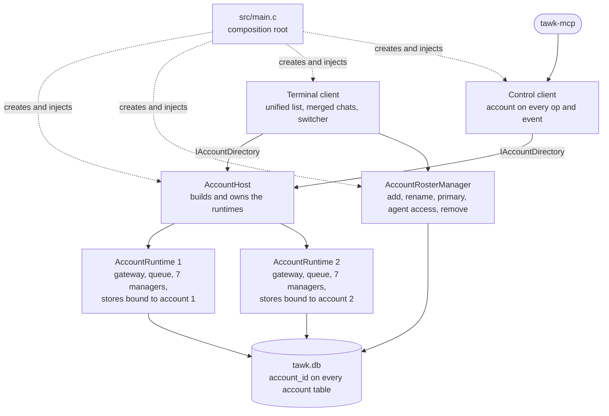

# Plan: several WhatsApp accounts in one tawk

Status: in progress, steps 1 to 5 done (see [Progress](#progress)). Branch: `feature/multi-account` in `tawk` and in `tawk-mcp`, both cut from `main`.

## Table of Contents

- [Why](#why)
- [What was decided](#what-was-decided)
- [Progress](#progress)
- [What it looks like when done](#what-it-looks-like-when-done)
- [The shape of the change](#the-shape-of-the-change)
- [Work, in order](#work-in-order)
  - [1. The account and the database](#1-the-account-and-the-database)
  - [2. Several sessions in the backend](#2-several-sessions-in-the-backend)
  - [3. One runtime per account](#3-one-runtime-per-account)
  - [4. The terminal client](#4-the-terminal-client)
  - [5. Merged chats and a contact's own settings](#5-merged-chats-and-a-contacts-own-settings)
  - [6. The control socket and the shell commands](#6-the-control-socket-and-the-shell-commands)
  - [7. tawk-mcp](#7-tawk-mcp)
  - [8. Encryption, backup, doctor and logs](#8-encryption-backup-doctor-and-logs)
  - [9. Documentation](#9-documentation)
- [How the rules are kept](#how-the-rules-are-kept)
- [Risks](#risks)
- [How it is checked](#how-it-is-checked)
- [Not in this change](#not-in-this-change)

## Why

tawk holds one WhatsApp account. A person with two numbers (a personal one and one an AI assistant works on) has to log out and link again to change number, or run a second tawk beside the first with its own folders. Neither gives one place to read and answer everything, and an agent connected through tawk-mcp cannot tell the numbers apart.

The aim is one tawk, in one window, connected to every account at the same time, with agents allowed onto each account separately.

## What was decided

These were chosen by the owner before planning and are not open in this plan.

| Question | Decision |
|---|---|
| How accounts live in tawk | All accounts connected at once in one process and one window |
| Database | One `tawk.db`; every table that holds account data gains an account column, with a migration of the rows already there |
| tawk-mcp | One server. Every tool that reaches tawk takes an optional `account`; `list_accounts` shows them; channel events say which account a message came from |
| tawk-mcp memory | One shared file. Voices and people are shared; what was learned is tagged with the account it was learned on |
| The same contact on two numbers | A setting keeps that contact as one merged chat or as separate chats, with a default for all chats and a choice per chat |
| Which number sends | A primary account you choose, and a sending account you can set for any one contact. The input shows the sending account and one key changes it for that message |
| A contact's own settings | Set from the contact card: the sending account, merging, and whether agents may answer that chat by themselves |
| Agents | Each account has its own access level: off, read, send, manage or admin. A new account is off, so agents neither see nor reach it until it is switched on. The self-approval chats are per account |
| Chat list | Every account's chats together, each row with an account badge. The header filters to one account |
| Delivery | One pass on the feature branch, reviewed at the end |
| Branches | `feature/multi-account` from `main`, no `develop` |

## Progress

| Step | State |
|---|---|
| 1. The account and the database | Done: migration 17, every store bound to an account, the account and per-contact stores, the label rules, the roster manager, and the tests |
| 2. Several sessions in the backend | Done: the Go bridge keeps its sessions by handle and marks every event with one; the C gateway routes them. Two sessions were run side by side in one tawk, each with its own login store and log, without a linked number |
| 3. One runtime per account | Done: `composition/account_runtime` and `account_host`, the account directory the clients are given, and every account started and served each frame. The clients still show the primary account only |
| 4. The terminal client | Done: every account's chats in one list with account badges, the header's account filter, bringing an account into view, Settings, Account, Accounts (add, rename, primary, agent access, log out, remove), adding an account opening its own linking wizard, and the unread total and tab title over all accounts. Not done: the blink marking the right account's row when a contact is on two and not merged |
| 5. Merged chats and a contact's own settings | Done: the merged conversation with each message marked by its account, the input saying which account sends, Alt+A for the next account and Alt+Shift+A to keep it for the contact, the contact card's three settings, and the list of contacts with a sending number of their own. The planned "send as" menu on the label was left out in favour of the two keys |
| 6. The control socket and the shell commands | Not started |
| 7. tawk-mcp | Not started |
| 8. Encryption, backup, doctor and logs | Not started |
| 9. Documentation | Not started |

Added to the plan after it was first written, at the owner's request: a sending account for each contact, a contact's settings on the contact card (including agents answering by themselves), and the access levels spelled out per account.

## What it looks like when done

- **Settings, Accounts** lists the accounts with their label, number, connection state and agent access. From there: add an account (a label, then the linking wizard for that account only), rename, make primary, set agent access, log out, remove.
- The **header** shows an account filter: `All`, or one account. Each chat row carries a short badge in the account's colour. The terminal title and the unread tally count every account.
- A contact who writes to two of your numbers shows as **one chat** when merging is on. Their messages appear in time order, each marked with the number it arrived on. The input says `as <label>` and Alt+A changes the sending number for that message; clicking the label opens "send this message as" and "always send to this person from".
- The **contact card** has a section for that chat: send from, merge across my numbers, and a switch per account for agents answering by themselves.
- A background account that loses its connection shows in the header and in Settings, Accounts. It does not take over the screen.
- `tawk send --account work "Mom" "on my way"`, and `tawk unread` and `tawk tail` name the account.
- An agent calls `list_accounts`, passes `account` to a tool, and receives `account` on every channel event. It sees only the accounts switched on for agents.
- An existing install opens as before: its chats, login and settings become account 1, labelled `main`, and nothing else changes until a second account is added.

## The shape of the change

Nothing in tawk knows about accounts today: no table, store, manager, event, notification or control frame carries one, and the in-process backend holds a single global session. Three ideas keep the change contained.

**1. Stores are bound to an account when they are made.** `sqlite_message_store_create(db, account_id)` returns a store whose every query carries that account. The store contracts (`IMessageStore`, `IChatStore` and the rest) do not change, so the managers that use them do not change either. Each account gets its own caching decorators, so no cache key needs an account.

**2. An account runtime.** The seven managers that hold one gateway or one account's stores (messaging, account, profile, status, status feed, scheduling, call) are built once per account, together with that account's gateway, event queue, composite observer and network monitor. Identity stays implicit in which runtime drained an event, so `Event` needs no account field.

**3. The clients put accounts together.** Managers never call each other, so everything that spans accounts (the unified chat list, merged conversations, totals, the title) is assembled in the terminal client and the control client, from rules that live in engines.

## Work, in order

The order is the order of dependency. tawk builds with no warnings and passes its tests after each numbered step, and each is its own commit.

### 1. The account and the database

Done. What follows is what was built.

**Core**
- `core/account_id.h`: the `AccountId` type, `ACCOUNT_ID_NONE` (0) and `ACCOUNT_ID_FIRST` (1).
- `core/account.h`: `Account { id, label, jid, name, colour, is_primary, agent_access, created_at }`, with `ACCOUNT_MAX` (8). The id is given once, never changes and is never used again; the label is the person's and can be renamed.
- `core/account_agent_access.h`: the access levels, in [Agent access for each account](#6-the-control-socket-and-the-shell-commands).
- `core/chat_prefs.h` and `core/chat_merge_choice.h`: what you chose for one contact.

**Migration 17**, in `src/resource_access/sqlite_database.c`. SQLite cannot change a primary key, so each table is set aside (`CREATE TABLE x_v16 AS SELECT ...`), dropped, made again and filled from the copy. No table is renamed, which keeps the migration clear of SQLite builds without FTS5. The whole version runs in one transaction; it is long enough to be written as several entries with the same version number, which `migrate` now runs together.

| Table | New key | Notes |
|---|---|---|
| `accounts` | `id` | New. One row is inserted for what is already there: id 1, label `main`, primary, agent access `follow` |
| `messages` | `(account_id, id)` | `rowid` is copied as it is, because the search index is tied to it |
| `chats` | `(account_id, jid)` | |
| `contacts` | `(account_id, jid)` | |
| `profiles` | `(account_id, jid)` | The block list is per account |
| `jid_aliases` | `(account_id, alias)` | |
| `reactions` | `(account_id, message_id, sender_jid)` | |
| `message_receipts` | `(account_id, message_id, jid)` | |
| `statuses` | `(account_id, id)` | |
| `scheduled_messages` | `id`, plus `account_id` | Ids are made locally and stay unique |
| `automation_log` | `id`, plus `account_id` | Added with `ALTER TABLE` |
| `chat_prefs` | `jid` | New. What you chose for a person or group: the sending account and the merge choice. It has no account column because it spans them |

Existing rows get `account_id = 1`. The same message reaches two accounts in one group with the same id and chat, which is why the id alone can no longer be the key.

- The base schema now runs only on a new file, so it cannot bring back an old index on a database that has been reshaped.
- The search triggers go with the old `messages` table; `ensure_search_index` sees the insert trigger missing and rebuilds the index, as it already did for a database saved without one.
- `keep_copy_before_upgrade` writes `tawk.db.pre-v17` first, with the same key when the database is encrypted.

**Stores.** `resource_access/sqlite_account_scope.c` holds the database and the one account a store works for. A store's statements write `{acct}` where the account goes, and `sqlite_account_scope_prepare` puts the id there before preparing. The id is a number of ours and never text from outside, so it is safe in the statement, and the statement's own parameters keep their positions. Every `sqlite_*_store_create` takes an `AccountId`; the store contracts are unchanged. Whole-table operations became account-wide: `chats.get_all`, `set_blocklist`, `statuses.authors` and `prune`, `scheduled.due`, the `reassign_*` and `merge` calls, and the alias table loaded at create. The automation log stays one log for all accounts; its rows gain the account in step 6.

**New**
- `contracts/i_account_store.h`, `resource_access/sqlite_account_store.c`: list, get, add, rename, set primary, set agent access, who the account linked as, the last chat, the self-approval chats, and remove, which takes the account's rows out of every table in one transaction.
- `contracts/i_chat_prefs_store.h`, `resource_access/sqlite_chat_prefs_store.c`: a contact's sending account and merge choice, the list of contacts with a sending account of their own, putting them back when an account goes, and following a contact to another address.
- `engines/account_label_validator.c`: a label is 1 to 24 characters with no comma or line break, and two labels are the same without regard to case.
- `managers/account_roster_manager.c`: the use cases over both stores and the validator. Exactly one account is primary; removing the primary hands that to the oldest account left; the last account cannot be removed; an id is never used twice.

**Tests**
- `migration_test.c` builds its old databases from literal schemas (it used to make one by dropping columns from a current database, which is no longer an old database). It upgrades a v9 and a v16 database, checks every table lands in account 1 with nothing left set aside, that search answers after the tables were made again, that a new database starts with its first account, and that a failed upgrade changes nothing.
- `account_store_test.c`: labels; the roster (add, rename, primary, access, removal, the most accounts); two accounts' stores over one database not seeing each other's messages, chats, contacts, reactions, receipts, block lists, statuses, scheduled messages and aliases; one message id held once for each account; a contact's choices; and removing an account leaving the other whole.

### 2. Several sessions in the backend

The Go bridge keeps one global session, starting a second silently drives the first, and events are emitted by free functions that know no session.

**Go bridge** (`bridge/whatsmeow`)
- `exports.go`: a registry of sessions by handle. `TawkWmInit(handle, json)`, `TawkWmCommand(handle, json)`, `TawkWmShutdown(handle)`.
- `emit` becomes a method on `Session` and passes its handle to `tawk_wm_emit(handle, line)`. About 86 call sites change, with the free helpers `emitClosed`, `profileUpdated` and `emitAlias`.
- The debug log becomes `whatsmeow-<handle>.log`.

**C gateways**
- `whatsmeow_gateway.c`: each gateway holds its handle and uses it in every call. The single static event queue becomes a small table from handle to queue behind the existing lock, since the callback from Go arrives without a `self`.
- `sidecar_gateway.c` already keeps everything per instance. It only needs its own auth folder and log file per account.

**Paths.** Account 1 keeps `<data_dir>/auth`, so an existing login is not moved. Account N uses `<data_dir>/accounts/<N>/auth`. Media stays in one `media_dir`: files are named by message id and by JID, and the same message downloaded by two accounts is the same file.

**Test.** `connection_recovery_test.c` gains a case with two gateways over the Baileys fake, each receiving only its own events. The whatsmeow side is checked by hand with two real numbers (see [How it is checked](#how-it-is-checked)).

### 3. One runtime per account

- `include/composition/account_runtime.h`, `src/composition/account_runtime.c`: builds one account's gateway, event queue, bound stores with their caches, network monitor, composite observer and the seven managers, in the order `main.c` uses today, and destroys them in reverse.
- `include/contracts/i_account_directory.h`: what the clients may ask: how many runtimes, a runtime's managers by account id, add a runtime for a new account, remove one. `src/composition/account_host.c` implements it and owns the runtimes (at most 8).
- `src/main.c` builds the shared parts as now (settings, themes, audio, notifier, automation, control transport), then the `AccountHost`, then one runtime per row in `accounts`.
- `MAX_OBSERVERS` stays 8: each runtime has its own composite observer.
- The frame loop ticks **every** runtime each frame. A background account whose queue is not drained fills it and blocks its backend thread.
- `core/notification.h` gains `account_id` and `account_label`, filled from the runtime's label, so a sink can say which number it was. `BlinkState` gains `account_id`, so a blink for one account does not light the same contact in another.

`composition/` is new. It is part of the composition root and the only other place that may construct implementations; ARCHITECTURE.md is updated to say so.

### 4. The terminal client

- `TuiAppDeps` loses its single manager pointers and gains `IAccountDirectory`, `AccountRosterManager` and the active filter. It is initialised by name, since the positional initialiser in `main.c` breaks silently when the struct changes shape.
- `clients/tui/unified_chat_list.c`: builds the rows for the list from every runtime's chats, applying the filter and the merge policy. A row is one chat with the accounts it belongs to.
- `clients/tui/account_badge.c`: draws the badge. The chat list, the conversation header and the message view use it.
- `clients/tui/account_filter.c` and the header: the filter chip beside the name. Click or Alt+number chooses `All` or an account.
- `clients/tui/accounts_dialog.c` with `accounts_dialog_request.h`: the list under Settings, Accounts, modelled on `scheduled_list_dialog.c` (rows with actions and an inline text field). Reached by a new `MENU_ACTION_ACCOUNTS`, as `MENU_ACTION_SELF_APPROVAL_CHATS` is. Removing asks through `ConfirmDialog` with a new `CONFIRM_REMOVE_ACCOUNT`.
- `clients/tui/label_dialog.c`: a plain one-line prompt for a label. `profile_text_dialog.c` is tied to profile fields and is left alone.
- **Linking.** `LoginView` is given the account it is linking. It takes over the screen only when no account is linked; otherwise it opens as a dialog, so adding a second account never hides the first.
- **Outages.** The blocking overlay shows only when every account is down. One account down shows in the header and the accounts dialog.
- **Per-account view state.** The last chat is kept per account in `accounts`, with the last filter in the settings. Reply and edit ids, mention picks and the composer draft are reset or keyed by account when the chat in view changes account.
- **Title and tally.** `update_tab` and the header tally sum `messaging_manager_tally` over the runtimes.
- **Scheduled messages** go out through the runtime of the account they were written on.

**Tests.** New `unified_chat_list_test.c` (order, filter, badges). `account_dialogs_test.c` gains the accounts dialog. `chat_list_fold_test.c` and `chat_list_drag_test.c` run against two accounts.

### 5. Merged chats and a contact's own settings

A person's WhatsApp id is the same whichever of your numbers they write to, and a group is the same group, so the same id in two accounts is the same contact. Two things follow: their chats can show as one, and something has to say which of your numbers answers them.

**Which chats merge**
- **Setting**: `[chats] merge_accounts`, on or off, default on, in `settings_schema.c`.
- **Per contact**: follow the setting, always merge, never merge, kept in `chat_prefs.merge`.
- `engines/chat_merge_policy.c`, no I/O: two chats in different accounts are one when they have the same id and the setting with the contact's choice allows it. The contact's own choice wins over the setting.
- `clients/tui/merged_message_window.c` joins the message windows of the accounts in time order. In a group that two of your numbers belong to, each message arrives twice with the same id and is shown once, marked with both accounts.
- Read marks, typing and unread counts in a merged chat act on every account that has it. Mute, pin, archive and lock are set on all of them together, so the row has one state.

**Which number sends**

`engines/reply_account_policy.c`, no I/O, picks the sending account in this order and stops at the first that applies:

| Order | Rule |
|---|---|
| 1 | The account chosen for the message being written |
| 2 | The contact's own sending account (`chat_prefs.send_account`), when that account has the chat and is connected |
| 3 | The primary account, when it has the chat |
| 4 | The account that has the chat's newest message |

A contact whose sending account has been removed is put back on the primary. A contact whose sending account no longer has the chat falls through to the next rule, and the input says so.

**In the conversation**
- The input always shows `as <label>`, in that account's colour, so the number is visible before Enter is pressed.
- **Alt+A** moves to the next account that has the chat, for this message only. The label returns to the rule's answer after the message goes.
- Clicking the label, or **Alt+Shift+A**, opens a short menu (`clients/tui/send_as_menu.c`): "Send this message as", listing the accounts that have the chat, and "Always send to <name> from", which saves the contact's sending account.
- The conversation header carries the badges of the accounts the chat is on. In a merged chat each message carries the badge of the account it arrived on or was sent from.

**On the contact card**

`clients/tui/chat_prefs_section.c` adds a "This chat" section to the profile view, so everything about one contact is set where you look at them:

| Row | Choices |
|---|---|
| Send from | Primary account, or one named account. Only accounts that have the chat are offered |
| Merge across my numbers | Follow the setting, always, never. Shown when the contact is on more than one account |
| Agents may answer by themselves | One switch for each account whose agent access is `admin`. It adds the chat to that account's self-approval list or takes it out. Shown greyed, with the reason, for an account at a lower level |
| Agents may see this chat | Follows the global `chats` list; shown so the card says plainly whether an agent can read this chat at all |

The card's existing mute, tone and theme rows stay where they are. This replaces finding a chat in the list under Settings, Automation, Answering for itself, which stays as the place to see every such chat at once.

**In the settings**
- Settings, Accounts shows which account is primary and opens "Contacts with their own sending number" (`clients/tui/send_account_dialog.c`): every contact with a sending account of its own, each of which can be changed or put back to the primary.
- Settings, Chats holds "Merge the same contact across my numbers".

**Tests.** New `chat_merge_test.c`: the setting and the three per-contact choices; a group seen twice; unread counts across accounts. New `reply_account_test.c`: each rule in the order above, a contact whose sending account no longer has the chat, and an account removed. The store behind both is covered by `account_store_test.c`.

### 6. The control socket and the shell commands

The protocol stays at version 1: fields are added and none change meaning.

- **hello** gains `accounts: [{id, label, jid, name, connected, access}]`, listing only accounts an agent may use, and `multi_account: true`. The single `account` object stays and names the default account.
- **Every operation** accepts `account` (an id or a label). Without it the operation uses the default account: the primary one if agents may use it, else the lowest id they may use. A chat reference is resolved inside that account. `ambiguous` candidates carry the account.
- **`list_accounts`** is a new read operation.
- **Events** (`message`, `read`, `reaction`, `edit`, `delete`, `scheduled_sent`, `chat`) carry `account`. The live cursor is kept per account.
- **Agent access for each account.** `engines/automation_policy.c` takes the account's level in place of the one global setting:

  | Level | An agent may |
  |---|---|
  | `off` | Nothing. The account is not listed and cannot be named. Every new account starts here |
  | `read` | Read that account's chats. Nothing is marked as read |
  | `send` | Also propose messages from that account, each approved by you |
  | `manage` | Also make changes there (edits, reactions, downloads), each approved |
  | `admin` | As `manage`, and an agent holding the admin token may answer its own sends in the chats switched on for that account |
  | `follow` | Whatever `[automation] access` says. Only the first account starts here, so an existing install behaves exactly as it did until a level is chosen for it |

  The level is set per account in Settings, Accounts and shown beside each account. `self_approval_chats` is kept per account; the first account's list is moved there from the settings the first time the new build starts. `chats` (which chats agents may use at all), the rate limits and the disclaimer stay global.
- **Approvals and the log.** `ApprovalRequest`, `AutomationEntry`, `ControlPending`, `ControlSession` subscriptions and `ControlWatch` carry the account. The Agentic tab shows it in the queue, the log and the detail.
- **Shell commands** (`clients/cli/control_command.c`, `control_options.h`): `--account NAME`. `tail` and `unread` print the account; `status-line` sums over accounts.

**Tests.** `control_protocol_test.c` gains: an agent sees only accounts switched on; an operation without `account` lands on the default; the same JID in two accounts is told apart; events are tagged; a self-approval chat allowed in one account is refused in another.

### 7. tawk-mcp

On `feature/multi-account` in `tawk-mcp`, after tawk's control socket is done.

- **Reading the accounts.** `HelloInfo` gains `Accounts` and `MultiAccount`. A `list_accounts` tool on `AppTools` and `IAppManager`.
- **Old tawk.** If the hello has no `multi_account`, a tool call that names any account but the default is refused with a clear message. An old tawk would ignore the field and send from the wrong number, which is the worst failure this change can cause.
- **The `account` argument.** Each of the 38 tools that reach tawk, and the memory tools that resolve a chat, gains an optional `account`, placed before `progress` and `cancellationToken`, described once in `ToolText`.
- **Carrying it.** `IAccountScope` in Core, bound in `TawkMcpComposition`. `ToolResults.RunAsync` opens the scope for the call; an `ITawkControl` decorator, `AccountScopedTawkControl`, adds `account` to each request. No manager interface changes, and the fake control sees the account in the request's arguments. The alternative, an explicit parameter on every manager method, the gate and the control interface, touches every interface and fake for the same result; the scope is one injected service with one implementation.
- **Outside a tool call** there is no scope, so `subscribe` and `approve` name the account themselves. A parked request stores its account (`ParkedRequests`, `WaitingRequest`), `approve` sends it, and `list_pending` shows it.
- **Events.** `TawkEvent` gains `Account`, set in one place in `ControlLineCodec`. `ChannelEventSink` adds `account` to the meta, `EventStreamHub` to each event, `NotificationFormatter` to the header (flattened like a name, since a label is the person's text). `ChannelContextHints` and the resource subscriptions are keyed by account and JID.
- **Resources and prompts.** `tawk://{account}/chat/{jid}` and `tawk://{account}/chats` beside the existing forms, which mean the default account. `catch_up` and `draft_reply` name the account.
- **Instructions.** A paragraph in `TawkServerInstructions`: accounts exist, pass the `account` an event arrived with when answering it, and never move a conversation to another number unasked.
- **Memory, schema step 3.** A nullable `account` on `contact_fact` and `okf_link`; for `okf_concept` the tag goes in `extra` through `ObservationDetails`, so export, import and sync carry it. The matching `SyncTables` columns. Keys stay as they are, so a person known on two numbers is one profile. The tag is the account's JID, which is stable, since the offline commands cannot ask tawk for a label.
- **Tests.** Codec, hello, the account on requests through the decorator, the old-tawk refusal, the channel meta, parked approvals, schema step 3, sync with the new column.

### 8. Encryption, backup, doctor and logs

- **Encryption** is unchanged: one file, one passphrase. `same_contents` already compares row counts table by table and holds after the rebuild.
- **Backup and restore**: the manifest gains the list of accounts and moves to format 2 (format 1 still restores, as account 1). `auth` is copied as a tree, and `accounts/<N>/auth` is added to the copy and to the restore path policy (`engines/archive_path_policy.c`).
- **`tawk --doctor`** lists the accounts with their login folder and state.
- **Logs**: one `tawk.log`; lines from a runtime carry its label.

### 9. Documentation

- `tawk`: MANUAL.md (accounts, the filter, merged chats, per-account agent access, with redrawn pictures by `make screenshots`), CONFIGURATION.md (`merge_accounts`, where each account's login lives, what moved out of `[automation]`), CONTROL.md (the added fields and `list_accounts`), ARCHITECTURE.md (the account runtime, `composition/`, the new contracts and engines), HOW_IT_WORKS.md (start-up with several accounts, a merged chat), SECURITY.md (per-account agent access), README.md.
- `tawk-mcp`: README.md tools table, MANUAL.md (the `account` argument, `list_accounts`, the channel tag, resources), CONFIGURATION.md, ARCHITECTURE.md (the tool counts there are already out of date and are recounted), HOW_IT_WORKS.md, SECURITY.md, AGENT.md.
- Both `AGENT_SETUP.md` files: an agent is told that a second number carries the same ban risk as the first and that linking one is the person's decision.

## How the rules are kept

| Rule | Here |
|---|---|
| iDesign layers | Policy with no I/O in engines (`chat_merge_policy`, `reply_account_policy`, `account_label_validator`, the account part of `automation_policy`). Use cases in `AccountRosterManager`. SQL in `sqlite_account_store` behind `IAccountStore`. Everything that spans accounts is put together in the clients, because managers never call each other |
| Single responsibility, one type per file | Each new type above has its own header and source, named after it |
| Open/closed | The store contracts and the seven managers are not edited to learn about accounts; they are given stores that are already bound to one |
| Liskov substitution | Both gateways still satisfy `IMessageGateway` unchanged; only how one is made differs |
| Interface segregation | `IAccountStore` and `IAccountDirectory` are new and small. No existing contract is widened |
| Dependency inversion | The clients depend on `IAccountDirectory`, not on `AccountHost`. Implementations are made only in `main.c` and `composition/` |
| Composition over inheritance | An account runtime is a composition of the existing parts. tawk-mcp adds the account with a decorator over `ITawkControl` |
| Separation of concerns | Which chats merge and which number replies are decided in engines; the client only draws and asks |

## Risks

| Risk | What is done about it |
|---|---|
| The migration damages a real database | The `.pre-v17` copy is written first; the rebuild is one transaction and rolls back whole; the test runs it over a literal old schema with rows in every table, and over an empty one |
| A message goes out from the wrong number | The input always names the sending account; tawk-mcp refuses a named account on a tawk that does not report `multi_account`; a scheduled message keeps the account it was written on |
| An agent reaches the personal number | New accounts start at `off`; hello and `list_accounts` list only accounts switched on; self-approval is per account; the control tests assert each of these |
| whatsmeow misbehaves with two clients in one process | The bridge sets no library globals and each session has its own store. This is proven with two real numbers before the terminal client work starts; if it fails, the fallback for the second account is the Baileys sidecar, which already runs one process per instance |
| A second linked number raises the chance of a ban | WhatsApp treats linking an unofficial client as a breach of its terms. Two numbers from one machine is two such links. The documentation and both `AGENT_SETUP.md` files say so |
| Size | Most of both codebases is touched. Each step in the order above builds and passes its tests alone, so a fault is found in the step that made it |

## How it is checked

1. `make` with no warnings and `make test` after every step; `dotnet build TawkMcp.slnx -warnaserror` and `dotnet test TawkMcp.slnx` for tawk-mcp.
2. **Upgrade**: copy a real `~/.local/share/tawk` aside, open it with the new build, and confirm every chat, the search, the login and the settings are as before, as account `main`.
3. **Two numbers**: add a second account and link it. Both stay connected, each receives only its own messages, and a network change reconnects both.
4. **Merged chat**: a contact writes to both numbers. One chat with merging on, two with it off, and the per-chat choice overrides the setting. Reply from each number and confirm on the phone which one sent.
5. **A shared group**: each message shows once.
6. **Agents**: with tawk-mcp connected, `list_accounts` shows only the account switched on; a send with `account` goes from that number; a channel event carries `account`; the personal account stays invisible while its access is `off`.
7. **Backup and restore** with two accounts, with and without `--with-login`.
8. **Encrypted database**: upgrade one and confirm it opens and the `.pre-v17` copy is encrypted.

## Not in this change

- A separate passphrase or a separate database per account.
- Different themes, notification sounds or privacy settings per account. They stay global.
- Forwarding or moving a chat from one account to another.
- Linking an account from an agent. Linking needs the phone and stays with the person.
