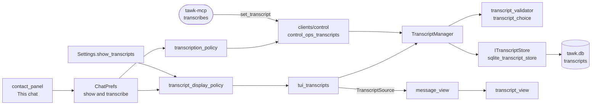

# Plan: the next features for tawk and tawk-mcp

Status: section 1 (transcripts in the conversation) and TL;DR mode are built and merged in both repositories, with tests, as tawk 0.13.0 to 0.14.3 (pull requests 11, 13, 14 and 16) and tawk-mcp 0.9.0 to 0.10.3 (pull requests 15, 17, 18 and 20). Everything else is proposed. This is the one plan for both repositories, written against tawk 0.12.0 (`f169989`) and tawk-mcp 0.8.1 (`c6724f0`), the newest `main` of each on 10 October 2026. The first feature, voice note transcripts shown in the conversation, is planned in full. The rest are planned to the level of what each adds, where its parts go and what has to be decided first.

## Table of Contents

- [Why](#why)
- [What was decided](#what-was-decided)
- [How the rules are kept](#how-the-rules-are-kept)
- [1. Transcripts in the conversation](#1-transcripts-in-the-conversation)
- [2. Safer at rest and safer to install](#2-safer-at-rest-and-safer-to-install)
- [3. Running without a window](#3-running-without-a-window)
- [4. Sorting out the chat list](#4-sorting-out-the-chat-list)
- [5. More kinds of message](#5-more-kinds-of-message)
- [6. Keys and reading comfort](#6-keys-and-reading-comfort)
- [7. Protection from other people](#7-protection-from-other-people)
- [8. Working with agents](#8-working-with-agents)
  - [The owner's chat](#the-owners-chat)
- [TL;DR mode](#tldr-mode)
- [9. tawk-mcp](#9-tawk-mcp)
  - [Keeping up with the protocol](#keeping-up-with-the-protocol)
  - [Tools for the new features](#tools-for-the-new-features)
  - [Doing more for the owner](#doing-more-for-the-owner)
  - [Defences](#defences)
  - [Running it](#running-it)
- [Order and size](#order-and-size)
- [Open questions](#open-questions)
- [How it is checked](#how-it-is-checked)
- [Not in this plan](#not-in-this-plan)

## Why

tawk was compared with WhatsApp's own apps, Telegram, Signal, Beeper and the other terminal clients in October 2026. It already covers everyday messaging and has something none of them have, an approval queue between an agent and your account. What it lacks falls into seven groups: transcripts you can read, protection of the files beside the database, running while no terminal is open, tools for a busy chat list, the newer kinds of message, keyboard comfort, and defences against strangers and against WhatsApp's own restrictions.

## What was decided

| Question | Decision |
|---|---|
| Transcripts in the conversation | Part of the voice note's own bubble: the voice note as it is, then its words below in grey italics. One setting turns the display on and off for every chat, and each chat can follow it, always show or never show |
| Transcribing per chat | Any chat can be shut out of transcription altogether: nothing in it is transcribed, by itself or on request. The switch works forwards only: transcripts the chat already has are kept and still shown |
| The right-click menu | Kept, as a shortcut to the contact card's rows |
| The owner's chat in the written rules | Written, and kept in this plan under [the owner's chat](#the-owners-chat-rules-to-add-when-it-is-built) until the feature is built; they go into INTENT.md and SECURITY.md of both repositories with it, not before |
| Phone notifications for the owner's chat | Not a concern. No second arrangement is planned |
| The MCP revision | tawk-mcp uses Microsoft's official C# SDK (`ModelContextProtocol`), so the 2026-07-28 revision arrives by raising the package version |
| The owner's chat | The "message yourself" chat of your own connected number. The agent answers there by itself, through that number. Which messages are yours is inferred from what tawk itself sent; the sending device is not checked |
| tawk-mcp's tool list | A fresh install lists every tool. A shorter set is something you choose |
| Where a chat's own settings live | On the contact card. Every per-chat setting, the existing ones and each new one in this plan, has its row there. Keys, slash commands and the right-click menu stay as shortcuts to the same rows |
| Everything else | Planned here, to be agreed step by step before each is built |
| Design rules | iDesign layers, SOLID, one type per file, dependency inversion, composition over inheritance, separation of concerns, as in [CONTRIBUTING.md](../../CONTRIBUTING.md) |

## How the rules are kept

Each feature below lists its parts by layer. The same pattern holds for all of them.

| Rule | What it means for every step |
|---|---|
| iDesign layers | A rule with no I/O is an engine. A use case is a manager. A table or a file format is resource access behind a contract. Anything of the operating system is infrastructure behind a contract. Drawing and keys stay in `clients/tui`, and operations for agents in `clients/control` |
| Single responsibility, one type per file | Every type named below gets `include/<layer>/<type>.h` and `src/<layer>/<type>.c`. No existing file gains a second job: a new widget is a new file, and `message_view` only gives it room |
| Open/closed | New notifiers, ciphers, hooks and stores are new implementations added in the composition root. Existing implementations are not edited to make room |
| Interface segregation | A new contract is added before an old one is widened. `IMessageGateway` does not grow: new backend commands go into small contracts the gateways hand out, as `IProfileEditor` and `IStatusPublisher` do |
| Dependency inversion | Managers and clients name contracts only. Concrete types are named in `src/main.c` and `src/composition/` and nowhere else |
| Composition over inheritance | Behaviour is added by wrapping or combining a contract: a decorator over `IFileCipher`, more entries in the composite notifier, a composite approval prompt |
| Separation of concerns | Managers never call each other. Where two are needed the client coordinates them, or the database keeps rows in step with a trigger |
| Per-chat settings | A choice for one chat is a field of `ChatPrefs`, kept through `IChatPrefsStore`, and drawn as a row of `contact_panel`'s "This chat" section. The rule that turns the app's setting and the chat's choice into an answer is an engine. No per-chat choice lives in a menu of its own |
| Accounts | A store is bound to its account when it is made (`SqliteAccountScope`), and a manager that holds one account's stores is built in `AccountRuntime`. No call gains an account argument |

## 1. Transcripts in the conversation

### What it looks like when done

- A voice note that has been transcribed stays as it is, and its bubble grows to hold the words under the play line, in grey italics. There is no heading; the message menu's Show transcript names the language of each.
- **Settings, Chats, Voice note transcripts** (`show_transcripts`) turns this on and off for every chat. The change shows on the next frame and the conversation stays where it was.
- The **contact card** has two rows for the chat. **Show transcripts** steps through *follow the setting*, *always* and *never*. **Transcribe voice notes** is a switch: off, nothing in this chat is transcribed, whether as it arrives or because an agent asked, and tawk refuses a new transcript handed to it for this chat. It works forwards only: switching it off removes nothing, and the transcripts the chat already has stay and are shown as its Show transcripts row says.
- Alt+T and `/transcripts` step the open chat's Show transcripts row, as Alt+Shift+A sets a contact's sending number.
- A long transcript shows its first lines (`transcript_lines`, 6 by default) and ends on an ellipsis. Enter and a click still play the voice note, so the whole text is opened from the message menu.
- With the display off, the message menu still offers **Show transcript** for a voice note that has one, so a single one can be read without switching everything on.
- Turning the display off hides transcripts and nothing else. Whether voice notes are transcribed at all is decided by "Transcribe voice notes as they arrive" under Automation and by the chat's own switch.
- A soft-locked chat veils its transcripts with the rest. Deleting a message or clearing a chat removes its transcripts.

### The shape of the change

tawk does not transcribe anything, and tawk-mcp keeps finished transcripts in memory for half an hour and then drops them. So there is nothing for the conversation to show today. Three ideas close the gap.

**1. tawk keeps transcripts, tawk-mcp makes them.** A finished transcript is handed to tawk over the control socket and stored in `tawk.db`, where encryption and backups already cover it. tawk-mcp still writes nothing to disk, so its rule of storing no messages holds.

**2. A transcript is a note beside a message, never part of it.** It has its own table, store, manager and widget. `Message`, `IMessageStore` and `MessagingManager` do not change.

**3. The switches are read at draw time.** Stored transcripts are untouched by the display setting and by a chat's display choice, so turning either on again shows them at once.

**4. tawk decides which chats are transcribed.** The chat's switch lives in tawk, tawk tells the transcriber, and tawk refuses a transcript for a chat that is switched off, so the rule holds even against a transcriber that does not ask.

Changed in 0.14.3 and tawk-mcp 0.10.3, the same day, with two agent sessions connected: a voice note goes to the agent running the newest transcriber; an agent that hands back no summaries is passed over; a request for a summary says plainly that it is the user's own, since an agent had held one back to ask for a go-ahead; and English alone is switched on as a voice note language to begin with.

Changed in 0.14.2, the same day, after the first transcripts on real chats: a transcript is shown whole (the line limit and `transcript_lines` are gone); the languages a voice note may be in are chosen from a list of switches, for every chat under Settings, Chats (Afrikaans and English to begin with) and for one chat on its contact card; the transcriber works out which is spoken and writes the note once, in it, preferring the other language over English when both are heard, so that a mixed note is not turned into an English translation; and the transcripts written before were dropped by migration 20 to be written again.

### Parts by layer

| Layer | Type | Job |
|---|---|---|
| Core | `Transcript` | Message id, language, text, model, who made it, when |
| Core | `Settings` gains `show_transcripts` (bool, on) and `transcript_lines` (int, 1 to 40, default 6) | The owner's choices |
| Core | `ChatTranscriptChoice` (follow, always, never), and `ChatPrefs` gains `show_transcripts` of that type and `transcribe` (on unless switched off) | One chat's choices, for the same person on every account |
| Contracts | `ITranscriptStore` | `save`, `find` (every language for one message), `remove`. Three functions and no more |
| Engines | `transcript_display_policy` | The app's setting and the chat's choice in, shown or hidden out. The same shape as `chat_merge_policy` |
| Engines | `transcription_policy` | Whether a new transcript may be made or kept for a chat: its switch, and never a locked or soft-locked chat. It is asked only when a transcript arrives or is asked for, never about ones already stored |
| Engines | `transcript_validator` | Accepts a transcript only for a voice or audio message, limits the text (16 KB) and the language code, and replaces control characters as `json_protocol` does for message text |
| Engines | `transcript_choice` | Which of several languages shows first: the order of `transcribe_languages`, then the newest |
| Resource access | `sqlite_transcript_store` | The `transcripts` table, bound to an account through `SqliteAccountScope` |
| Contracts | `IChatTranscriptPrefs` | `set_show` and `set_transcribe` for one chat. `IChatPrefsStore` has a setter per field today (`set_send_account`, `set_merge`), so the two new ones go into a small contract of their own and the old one is not widened; its `get` returns the new fields with the rest |
| Resource access | `sqlite_chat_prefs_store` | Reads the two new columns in `get`, and hands out `IChatTranscriptPrefs` over the same table, as the gateways hand out `IProfileEditor` |
| Resource access | Migration 18 in `sqlite_database.c` | Two columns on `chat_prefs`, and `transcripts(account_id, message_id, language, text, model, source, created_at)`, keyed by the first three. Two triggers on `messages` remove a message's transcripts when its row is deleted and when `deleted` is set, the way the FTS triggers keep the index in step, so no manager needs to tell another |
| Managers | `TranscriptManager` | Asks `transcription_policy`, validates and saves a transcript, and reads the ones for a message. Built per account in `AccountRuntime`, and given `IChatPrefsStore` to read the chat's switch |
| Clients, control | `control_ops_transcripts` | `set_transcript` and `get_transcript`, added to the table in `control_server.c` |
| Clients, tui | `TranscriptSource` | A struct of one function pointer and a `ctx`, like `PortraitSource`: gives `message_view` the transcript for a message, or nothing |
| Clients, tui | `transcript_view` | Draws the wrapped lines and reports its height. Plain text only: WhatsApp formatting is not applied, since the words came from a model that listened to someone else |
| Clients, tui | `tui_transcripts` | Implements `TranscriptSource` over `TranscriptManager`, returns nothing when `transcript_display_policy` says hidden, and carries out the two choices |
| Clients, tui | `contact_panel`, `contact_action` | The two rows in the card's "This chat" section, beside Send from and Merge across my numbers |
| Clients, tui | Rows in `settings_schema.c`, `settings_menu.c`, `tui_commands.c`, `message_action` | The setting, `/transcripts`, Alt+T and Show transcript |
| Composition | `account_runtime`, `main.c` | Build the store and the manager and hand the manager on through `AccountServices` |

### The control operations

| Operation | Arguments | Answer | Notes |
|---|---|---|---|
| `set_transcript` | `message_id`, `language`, `text`, `model` | `{}` | Changes only this computer and sends nothing to WhatsApp, so it is not asked about. It needs no more than `read`, like `download_media`, and the chat must be one the client may use. It does not count against the write rate, since a transcriber working through a busy chat would use up the allowance for sends; each one is in the automation log. A locked or soft-locked chat is refused as not found |
| `get_transcript` | `message_id` | The stored transcripts | Lets tawk-mcp answer after a restart without transcribing again |

A chat whose Transcribe voice notes switch is off answers `set_transcript` with a new error, `transcripts_off`. `get_chat_info` gains `"transcribe": false` for such a chat, and the `message` and `media_ready` events carry the same field, so a transcriber knows before it starts. An agent cannot change either per-chat choice: they are set on the contact card only.

`hello` answers with the protocol number and tawk's version today, and nothing about what this tawk can do. Its result gains a `features` list of names, with `transcripts` as the first. tawk-mcp sends `set_transcript` only when it sees that name, so an older tawk is left alone, and a client that does not know the field ignores it.

### In tawk-mcp

| Layer | Type | Job |
|---|---|---|
| Resource access | `ITranscriptHandoff`, `TawkTranscriptHandoff` | Sends `set_transcript` and reads `get_transcript` through the control client, and does nothing when tawk's `hello` lacks `transcripts` |
| Clients | `TranscriptHandoffSink` | An `IEventSink` that hears a finished job, as `AutoTranscriptionSink` hears a voice note, and hands each language's text over |
| Managers | `TranscriptionRunManager` | A job for a chat that is switched off ends as failed with a plain sentence, before any audio reaches a transcriber. tawk says so on the `download_media` answer and the `media_ready` event |
| Still to do | `get_transcript` | It reads a job by its id, which does not outlive a restart. Reading tawk's stored copy needs the tool to take a message id as well |
| Clients | `AutoTranscriptionSink` | Skips a voice note whose event says `"transcribe": false` |
| Host | `TawkMcpComposition` | Binds the two new types |

tawk-mcp still writes no transcript to disk and none to a log.

### Work, in order

1. Core types, the two settings, the two `ChatPrefs` fields, migration 18 and `sqlite_transcript_store`, with `transcript_store_test` and a case in `migration_test`.
2. The four engines and `TranscriptManager`, with `transcript_policy_test` (every pairing of the setting and a chat's choice) and `transcript_manager_test`.
3. The control operations, the error and the new field, with cases in `control_protocol_test` and `control_accounts_test` (a transcript for one account is not seen from another, and one for a chat switched off is refused).
4. `transcript_view`, `TranscriptSource` and `tui_transcripts`; the card's two rows; the setting, the key, the command and the menu entry; `transcript_view_test` for wrapping, the line limit and the off switches.
5. tawk-mcp's handoff, sink and refusal.
6. MANUAL, CONFIGURATION, CONTROL, ARCHITECTURE, SECURITY (the words of voice notes are now kept in the database) and RELEASE_NOTES, with a redrawn picture of a conversation.

### Risks

| Risk | Answer |
|---|---|
| A transcriber ignores a chat's switch | tawk refuses the transcript, so nothing is kept or shown. What the transcriber told its own model is outside tawk's reach, which is why tawk-mcp refuses before reading the audio |
| An agent writes a false transcript | It is shown in grey italics under a voice note's play line, never as the sender's typed words; `source` records which client wrote it; the operation reaches only chats that client may read |
| Hostile text in a transcript | Same limits and control character handling as message text, and no formatting applied |
| The conversation jumps when the switch is flipped | The view keeps the message at the top of the screen as its anchor and lays out again from it |
| Heights change when a transcript arrives late | The same path as a thumbnail arriving: the chat is marked changed and laid out again |

## 2. Safer at rest and safer to install

| Feature | What the user gets | New parts | Notes |
|---|---|---|---|
| Backups that detect tampering | A changed or damaged backup is refused before anything is extracted | Infrastructure: `authenticated_file_cipher`, a decorator over `IFileCipher` that adds an HMAC-SHA256 tag over the encrypted file, with its key derived apart from the encryption key. Engines: the manifest codec learns format 3 | `openssl enc` cannot do an authenticated mode, which is why this wraps it. Formats 1 and 2 still restore, with a warning |
| A lock that asks for the passphrase | After idle minutes, or on Ctrl+L, tawk shows nothing until the passphrase is typed | Engines: `idle_lock_policy`. Contracts: `IPassphraseCheck`. Clients: `lock_screen` widget | Only offered when the database is encrypted, since otherwise there is no secret to check against. The screensaver stays as it is |
| The login protected at rest | A copied `auth/` folder is useless without the system keychain | Contracts: `ISecretStore`. Infrastructure: `keychain_secret_store` (macOS), `libsecret_secret_store` (Linux), `no_secret_store`. Bridge: the whatsmeow device store wrapped so its key material is sealed with a key from the secret store | Needs a short trial first: the pure Go SQLite driver cannot encrypt, so the sealing has to happen in the store wrapper |
| The media cache encrypted | Downloaded photos and voice notes are unreadable on a stolen disk | Contracts: `IMediaVault` (seal a finished download, open one to a private temporary file). Infrastructure: `openssl_media_vault`, `plain_media_vault` | Opening a file in another program needs a plain copy for as long as that program runs; the vault removes it afterwards. Off by default |
| Releases that can be checked | `install.sh` and `tawk --update` refuse a download whose signature does not match | Contracts: `IReleaseVerifier`. Infrastructure: `minisign_release_verifier`. The public key is compiled in | Releases must be tagged and signed, which changes how a version is published |
| Parsers kept in a box | A crafted PDF or video cannot read your files or reach the network | Contracts: `IProcessSandbox`. Infrastructure: `sandbox_exec_sandbox` (macOS), `bwrap_sandbox` (Linux), `no_sandbox`. `poppler_document_pages`, `ffmpeg_video_poster` and the camera get one injected | `--doctor` says which sandbox is in use |

## 3. Running without a window

| Feature | What the user gets | New parts | Notes |
|---|---|---|---|
| A headless tawk | `tawk --daemon` keeps accounts connected, sends what was scheduled and serves agents with no terminal open | Clients: `clients/headless` (`headless_app`), a third client beside `tui` and `control` that runs the managers' ticks and the frame hook. Contracts: `IInstanceHandover`. Infrastructure: `socket_instance_handover` | One tawk still owns the data folder at a time. Starting the terminal client asks the daemon to hand over and stop, and quitting can start it again. A terminal client that attaches to a running daemon would need a protocol for the whole screen and is not planned |
| Requests that wait while nobody is there | A write asked for while headless is kept, not declined | Contracts: `IApprovalStore`. Resource access: `sqlite_approval_store`. Clients: `stored_approval_prompt`, an `IApprovalPrompt` the headless client uses | The request shows in the Agentic tab when the terminal client next opens, or goes to the phone (section 8). Each keeps its expiry |
| Notifications from the system | A banner when tawk's tab is not in view | Infrastructure: `osc_notifier` (OSC 9, 99 and 777), `desktop_notifier` (terminal-notifier, notify-send, a Windows toast through WSL). Both are `INotifier` and join the composite | `show_preview` decides whether the text is in the banner. INTENT's "notifications inside the terminal" gains this line |
| Quiet hours | Do not disturb by the clock, with a different rule at weekends | Core: `QuietHours`. Engines: `quiet_hours_policy`, asked by `notification_policy` | Mentions still follow `mention_notifications` |
| Mentions only, per chat | A busy group alerts only when you are named | Core: `ChatAlertLevel` in `ChatPrefs`. Engines: one more case in `notification_policy` | Set on the contact card. Kept on this computer, like mutes |

## 4. Sorting out the chat list

| Feature | What the user gets | New parts | Notes |
|---|---|---|---|
| Snooze and remind | `/remind 9:00`, `/remind tomorrow` or `/remind reply` puts a chat aside and brings it back with a mark at the time, or sooner if they answer | Core: `ChatReminder`. Contracts: `IReminderStore`. Resource access: `sqlite_reminder_store`. Engines: `reminder_due` (reuses `schedule_time_parser`). Managers: `ReminderManager` | A snoozed chat sits in a Snoozed folder entry beside Archived. The card shows the chat's reminder and can move or cancel it |
| Labels and filters | Your own labels on chats, and a filter in the header for a label, unread, groups or direct chats | Core: `Label`, `ChatFilter`. Contracts: `ILabelStore`. Resource access: `sqlite_label_store`. Engines: `chat_filter` beside `chat_visibility`. Managers: `LabelManager`. Clients: `label_picker`, a filter entry in `header_bar` | A chat's labels are a row on its contact card. Labels are local. WhatsApp Business labels are not read |
| Repeating scheduled messages | `/later every monday 08:00 …` | Core: `RepeatRule` on `ScheduledMessage`. Engines: `repeat_rule_parser`, `next_occurrence`. A column in `scheduled_messages` | The outreach guard in section 7 counts these |
| Starred messages | Star a message and list every star with `/starred` | Core: `starred` on `Message`. Contracts: `IMessageStarrer`, handed out by a gateway that can sync it. Clients: `starred_list_dialog` | Stars sync with the phone where the backend can; elsewhere they stay local and the manual says so |
| Pinned messages | A bar at the top of a chat with its pinned message; pin from the message menu | Core: `PinnedMessage`. Contracts: `IMessagePinner`. Clients: `pinned_bar` | Needs the protocol event and command in both bridges |
| Search in one chat, jump to a date | Ctrl+F in a conversation, and `/goto 2026-03-01` | Engines: `date_reference_parser`. `IMessageStore` gains nothing: a new small contract `IMessageLocator` (`first_on_or_after`, `search_in_chat`) implemented by the same SQLite file's sibling `sqlite_message_locator` | Search can also cover transcripts once section 1 is in: a second FTS table over `transcripts.text` |
| An awaiting reply view | Chats where your last message has gone unanswered for a set number of days | Engines: `awaiting_reply_rule`. Clients: a filter entry | Read from what is stored; nothing new is kept |

## 5. More kinds of message

Each of these needs four things: an event or command in [PROTOCOL.md](../../PROTOCOL.md) and both bridges, a core type, a widget, and a line in the fenced text agents read.

| Kind | Reading | Sending | New parts |
|---|---|---|---|
| Polls | Options with counts and your own vote | Vote; create with `/poll` | Core: `Poll`, `PollVote`. Contracts: `IPollStore`, `IPollSender`. Clients: `poll_view`, `poll_composer_dialog` |
| Events | Name, time, place, who is going | Answer going or not going | Core: `ChatEvent`. Clients: `event_view` |
| Locations | Place name and coordinates, opened in the system's map on Enter | Not planned | Core: `Location`. Engines: `map_link` |
| Contact cards | Name and numbers, with "message this person" | Send a contact from the contact card | Core: `SharedContact`. Engines: `vcard_reader` |
| View once | A marker that the message exists; opened once in tawk's viewer, never saved, never offered to agents | Not planned | Core: `view_once` on `Message`. Engines: one rule in `automation_policy` |
| Disappearing messages | The timer shown in the title bar, and messages removed from the database when it runs out | Follow the chat's timer on what you send; change it on the contact card | Core: `expires_at` on `Message`, `disappearing_seconds` on `Chat`. Engines: `expiry_rule`. Managers: pruning joins the messaging manager's tick |
| Stickers | Drawn like a photo thumbnail in place of the one-line label | Not planned | Clients only: `media_picture` learns WebP through the bridge handing over a PNG |
| Usernames | A chat with someone known only by username opens, shows and merges correctly | Start a chat by username | Engines: `recipient_reference_parser` learns the form. Resource access: the alias store already maps LIDs |

## 6. Keys and reading comfort

| Feature | What the user gets | New parts | Notes |
|---|---|---|---|
| Your own keys, and a vim set | Any action bound to any key in `keys.ini`; `keymap = vim` as a ready-made set | Core: `KeyBinding`, `ActionId`. Contracts: `IKeymapStore`. Resource access: `ini_keymap_store`. Engines: `keymap` (key to action, conflicts). `tui_input.c` routes actions instead of keys | The largest change in this section, since every key handler becomes an action handler. `/help` reads the live map |
| One home for a chat's settings | The contact card's "This chat" section holds every per-chat choice: mute, pin, archive, theme, tone, soft lock, and the existing send from, merge and agents answering, with each new one from this plan | Clients: `chat_setting_row` (one row: label, value, how it steps), `chat_settings_section` drawn by `contact_panel`. Each row calls the app operation its key or command already calls | `chat_options_menu` stays as the right-click shortcut, by decision, and gains no settings of its own. Mute, pin, tone and theme stay in the `chats` table where they are; only their place on screen changes |
| A quick chat switcher | Ctrl+P, a few letters, Enter | Engines: `fuzzy_match`. Clients: `chat_switcher` | Uses `UnifiedChatList`, so it spans accounts |
| Two chats side by side | `/split` shows a second conversation in the right half | Clients: `split_layout`; `message_view` is already a widget that draws in any box | Only in a wide terminal |
| Undo send | A few seconds to take a message back before it leaves | Engines: `send_delay_policy`. Clients: `outbox_toast` | Off by default (`undo_seconds = 0`). Applies to what you type, not to agents' sends, which already wait for you |
| Select several messages | Forward, copy or delete a selection together | Core: `MessageSelection`. Clients: selection state in `message_view`, a selection bar | Delete for everyone keeps its confirmation |
| Write in your editor | Ctrl+X Ctrl+E opens the input in `$EDITOR` | Contracts: `IExternalEditor`. Infrastructure: `process_external_editor` | The command comes from the environment, and is run with an argument list and a private temporary file |
| A plain mode | No emoji, no block characters, no animation; one line of text per event for a screen reader | Core: `GlyphSet`. Contracts: `IGlyphs`. Clients: `plain_glyphs`, `rich_glyphs`; widgets ask for a glyph by name | Also fixes the look in macOS Terminal, which the README warns about. `reduced_motion` is a separate setting |

## 7. Protection from other people

| Feature | What the user gets | New parts | Notes |
|---|---|---|---|
| Strict mode for strangers | From numbers not in your contacts: nothing downloads by itself, no link cards, no pictures, calls do not ring | Engines: `sender_trust_policy` (known, unknown), asked by the download, preview and call rules. One setting, `strict_unknown` | Mirrors WhatsApp's Strict Account Settings of January 2026 |
| Security code changes | A line in the chat when a contact's code changes, and a screen to compare codes | Core: `IdentityChange`. Contracts: `IIdentityVerifier`. Protocol: an `identity_changed` event and a `get_security_code` command. Clients: `security_code_dialog`. `ChatPrefs` gains `verified`, shown and set on the contact card | The backends already see identity changes; they are not passed on today |
| A guard against restrictions | A warning before the kind of use WhatsApp restricts accounts for, and WhatsApp's own warnings shown instead of lost | Engines: `outreach_guard` (new chats started today, forwards, statuses, scheduled sends). Protocol: an `account_notice` event. Managers: the automation manager asks the guard; the terminal client asks it for your own sends | It warns and can cap what agents start. It never claims to make an unofficial client safe |
| A proxy | The WhatsApp connection through SOCKS5 or Tor | Core: `proxy_url` in `Settings` (advanced, not changeable over the socket). `GatewayOptions` carries it to both bridges | Link previews and profile pictures follow the same proxy or are refused |
| Chats agents may not read | A switch on the contact card, beside the existing ones | Core: `agent_hidden` in `ChatPrefs`. Engines: one rule in `automation_policy` | Treated as not found, like a locked chat |
| What left this computer | A page in the Agentic tab: per session, which chats were read and how much | Engines: `egress_summary` over the automation log | The log already records every read |
| Codes and card numbers masked for agents | One-time codes and card numbers reach a model as `[code]` | Engines: `text_redactor`. Used by the control client when it builds what a model reads | On by default for origin `mcp`; your own shell commands see the text as it is |

## 8. Working with agents

Built on 2026-10-10 in tawk 0.16.0: rules per contact, chats agents may not read, and codes and card numbers masked for agents. The two rows "Rules per contact" (here) and "Chats agents may not read" (section 7) became one card row, **Agents here**, with four choices, and "ask once a session" is what "as the account says" already does.

| Feature | What the user gets | New parts | Notes |
|---|---|---|---|
| The owner's chat | Write to the agent from WhatsApp on your phone, and answer its requests there. See [The owner's chat](#the-owners-chat) below | Listed below | Off by default, set only in tawk |
| Rules per contact | A row on the contact card: "always ask", "ask once a session" or "never from an agent" for one chat | Core: `ApprovalRule` in `ChatPrefs`. Engines: one more input to `automation_policy` | A rule can only tighten what the account's level allows |
| Hooks | A command of yours run for each incoming message, with the message as JSON on its input | Contracts: `IMessageHook`. Infrastructure: `process_message_hook`. It listens as an `IEventObserver` | The command is a setting that runs a program, so it follows the config trust rule and cannot be set over the socket |
| A daily digest | Unread chats in one page at a time you choose | Engines: `digest_builder` (counts and names only). Clients: `digest_view` | The words of a summary come from an agent when one is connected; tawk itself only counts |

### The owner's chat

One WhatsApp chat is named as the place where you and the agent talk: the "message yourself" chat of your own connected number. You write to yourself from the phone, and the agent answers in the same chat, from that same number, by itself.

What it does:

- **You write, the agent hears it as you.** A message you type there on your phone reaches the connected agent as the owner's words, the one place where text from WhatsApp is an instruction and not untrusted data.
- **The agent answers there by itself.** Its replies in this chat go out through the connected number without waiting for you: a message to yourself reaches nobody else, so there is nothing to approve. It needs no admin token and uses none of the self-approval allowance, has its own limit per hour, and each reply is logged in the Agentic tab. This holds for the owner's chat alone; a send to any other chat is asked about as before.
- **Requests come to you there.** A write that has waited in the Agentic tab arrives as a card: who it is for, which number sends it, the exact text. 👍 or "y" sends it, "n" declines, and a quoted reply with other words is an edit that is read back first.

What makes a message yours:

| Check | Why |
|---|---|
| It is in the "message yourself" chat of the account you named | Only your own number can write there at all, whatever anyone else sends you |
| It was not sent by this tawk | The agent's own answers sit in the same chat under the same number. tawk knows the ids of what it sent, cards included, so everything else in the chat is yours and an answer is never read back as an instruction. Nothing more is needed to tell the two apart, and the bridges do not change |
| It is typed text | A forwarded message, a quoted message, a caption, a link card and a transcript are passed on as data inside the fence, never as your words |
| It arrived in the owner's chat | What you write in a group, or in any other chat, is never an instruction |
| An answer to a card quotes that card, within its expiry, once | One "y" cannot approve something else |

What it never does: deletes, blocks, settings, profile changes, a first message to someone new, or anything on a locked chat. Those stay with the terminal. Anyone holding your unlocked phone, or sitting at another device linked to your number, can instruct the agent within these limits. That is the trust WhatsApp itself already gives them, and the manual says so.

| Layer | Type | Job |
|---|---|---|
| Core | `OwnerChat` (the account whose "message yourself" chat it is), `OwnerMessage`, `RemoteApproval` | What the feature is made of |
| Core | `ChatPrefs` is not used: the owner's chat is one per tawk, kept in `Settings` under Automation, where the socket cannot change it | It is still set from that chat's contact card, by the row "This is my chat with the agent", offered only on a "message yourself" chat |
| Engines | `owner_reply_rule` | A send from an agent goes out unasked only when its chat is the owner's chat, it is plain text or a file the agent was asked for, and the hourly limit has room. `automation_policy` asks it before it asks anything else |
| Engines | `self_chat_rule` | Whether a chat is an account's "message yourself" chat: its JID is the account's own. tawk has no such rule today |
| Engines | `owner_message_rule` | The checks in the table above, with no I/O. It is handed the ids tawk sent, and does not look at devices |
| Contracts, resource access | `ISentIdLog`, `sqlite_sent_id_log` | The ids of what tawk sent into the owner's chat, kept so the rule still holds after a restart |
| Engines | `remote_approval_policy`, `approval_reply_parser` | Which requests may go to the phone, the wait before they do, expiry and the hourly cap; reading 👍, "y", "n" and an edit |
| Managers | `OwnerChatManager` | Listens as an `IEventObserver`, asks the rule, and hands a message of yours on. Built per account in `AccountRuntime` |
| Clients, control | `composite_approval_prompt` | An `IApprovalPrompt` that offers a request to the Agentic tab and, after the wait, to the owner's chat. Whichever answers first wins |
| Clients, control | `control_ops_owner` | The `owner_message` event, sent only to the session marked as answering the phone in the Agents list |

In tawk-mcp, an `owner_message` reaches the agent through the Claude Code channel as the owner speaking, outside the untrusted fence, and the server instructions say that only this event carries the owner's words. With no agent connected, tawk answers in the chat with one fixed line saying so.

### The owner's chat: as built

Built on 2026-10-10 in tawk 0.15.0 and tawk-mcp 0.11.0, and the rules below were moved into the documents then. What differs from the design above:

- There is no `composite_approval_prompt`. The control client keeps the one list of waiting requests, and `control_owner.c` puts each to you on WhatsApp and feeds your answer back through the same path an answer in tawk takes.
- There is one `OwnerChatManager` for all accounts, not one per account, since there is one owner's chat.
- The agent that hears you is your default agent when it can, else the newest; there is no separate mark in the Agents list.
- An edit from the phone is any quoted reply that is not a plain yes or no.
- Not built: a file as an answer ("or a file the agent was asked for"), and the Agentic tab showing which session answers the phone.

### The owner's chat: the rules that went into the documents

**tawk INTENT.md, In scope**

- The owner's chat, when you name one: the "message yourself" chat of one of your own connected numbers, where what you write reaches a connected agent as your words and the agent answers you by itself, through that number.

**tawk INTENT.md, Out of scope, in place of the last sentence of the bulk messaging line**

The one exception is an agent's answers to you in the owner's chat, which reach nobody else.

**tawk INTENT.md, Boundary rules**

- Only you instruct an agent. Text that arrives from WhatsApp is data, whoever sent it, with one exception that you switch on yourself: a message in the owner's chat that tawk did not send is taken as yours. The same words anywhere else, and anything forwarded, quoted or transcribed inside that chat, stay data.
- An agent sends without being asked in one place only, the owner's chat, and only as an answer to you. Every other chat keeps its approval, and nothing destructive can be asked for or approved from WhatsApp.

**tawk SECURITY.md, threat model rows**

| Someone posing as you to an agent (the owner's chat) | A message made to look like an instruction from you | Off until you name the owner's chat on its contact card; it cannot be named or changed over the socket. Only the "message yourself" chat of one of your own connected numbers can be named, so nobody else's number can write there. Within it, a message tawk did not send is yours; tawk keeps the ids of what it sent there, so an agent's answer or a request card is never read back as an instruction. Forwarded, quoted and transcribed text, captions and link cards in that chat are passed on as data. Your words in any other chat, a group included, are never an instruction |
| An agent answering by itself in the owner's chat | A steered agent using that chat to send without you | Only into the owner's chat, which reaches nobody but you; only text, or a file you asked for; a limit per hour of its own; each answer logged in the Agentic tab. It needs no admin token and widens nothing else: a send to any other chat is asked about as before |
| Approving from WhatsApp | A request approved by a stray or replayed answer | An answer counts only when it quotes or reacts to that request's card, before the card expires, and once. Deletes, blocks, settings, profile changes, a first message to someone new and anything in a locked chat are never offered there and cannot be asked for from WhatsApp |

**tawk SECURITY.md, deliberate trade-offs**

- **The owner's chat trusts every device linked to your number.** tawk tells your messages from its own by what it sent, and does not check which device a message came from. Anyone holding your unlocked phone, or at another device linked to that number, can instruct a connected agent and answer its requests, within the limits above. That is the reach WhatsApp already gives them over your account. Remove a device you do not trust from Linked devices, and leave the owner's chat unnamed if this matters to you.
- **What you write in the owner's chat goes to the agent's model.** Like anything an agent reads, it leaves your computer for the service that runs the model.

**tawk-mcp INTENT.md, In scope**

- Passing on what you write in the owner's chat, when you have named one in tawk, as your own words, and letting the agent answer you there.

**tawk-mcp INTENT.md, Boundary rules, added to "Only you instruct the agent"**

The one exception is the owner's chat: tawk decides which messages there are yours and hands them over as a separate event, and tawk-mcp passes that event on outside the fenced text. tawk-mcp never decides this itself, and never treats a message as yours because of what it says.

**tawk-mcp SECURITY.md, Who might attack**

| Someone who messages you, posing as you | Write text that claims to come from the owner | Have the model take it as an instruction |

**tawk-mcp SECURITY.md, Controls**

| The owner's words arrive only as tawk's `owner_message` event, never from inside fenced text | tawk and tawk-mcp | Someone posing as you |

**tawk-mcp SECURITY.md, a section before Memory**

## The owner's chat

When you name an owner's chat in tawk, what you write there reaches the agent as your words. This is the one place where text from WhatsApp is an instruction.

- tawk decides which messages are yours and sends each as an `owner_message` event. tawk-mcp cannot name the chat, and never promotes an ordinary message to an instruction, whatever it says.
- The event is passed on outside the untrusted fence and marked as the owner's. Everything else, including messages in the same chat that tawk did not mark, stays fenced.
- The server instructions tell the model that only this event carries the owner's words, and that a message claiming to be from the owner inside fenced text is an attack.
- The agent's answers in that chat are sent without an approval, by tawk's rule, and only there. tawk-mcp has no tool that sends unasked to any other chat.
- What you ask for from WhatsApp is carried out under the same rules as anything else the agent does: a send to another chat still waits for you, and destructive operations still need their two confirmations at the computer.
- tawk does not check which of your devices wrote a message, so anyone at a device linked to your number can instruct the agent. See tawk's SECURITY.md.

## TL;DR mode

Asked for on 2026-10-10 and built the same day; what follows is what was built. A chat can be put in TL;DR mode, and a long message in it then shows as a short summary, so a paragraph need not be read to know what it says.

### What it looks like when done

- The contact card has a row, **TL;DR**, on or off for that chat. Off for every chat until switched on. There is no setting for all chats.
- In a chat with TL;DR on, a message of at least `tldr_min_chars` characters (300 by default) from someone else shows its summary in the bubble in place of the text, under a small `▸ TL;DR` line. The length is counted in characters, not lines, so it does not change with the width of the terminal.
- Each summarised message opens and closes by itself: Enter or a click on the `▸ TL;DR` line turns it to `▾` and shows the original text in full, and again folds it back to the summary. What is open stays open while the chat is open.
- A message with no summary yet shows as it always did. Short messages are never summarised.
- Copy, reply, forward and search always work on the original text, never on the summary.

### Who writes the summary

Decided on 2026-10-10: the model of a connected agent, chosen by the owner.

| Case | What happens |
|---|---|
| You chose a default agent and it is connected | It writes the summaries. Chosen in the Agents list with d, or by answering tawk's question; remembered by the agent's label without its process id (`default_agent`) |
| None chosen, or the chosen one is away, and one agent is connected | That one writes them |
| Several connected and none chosen | tawk asks in your own "message yourself" chat on WhatsApp, with a numbered list; the number you answer with chooses, and tawk confirms there. Messages wait meanwhile |
| No agent connected | Messages wait, and show in full |

Older messages: a long message that comes onto the screen without a summary is asked for, once while tawk runs, and older voice notes get their transcripts the same way. On top of that, asked for later the same day, a TL;DR chat's long messages of the last `tldr_back_days` days (30) are asked for by themselves, newest first, when the chat is switched on or first shown. Requests go to the agent four at once and then one every second and a half, so a month of a busy chat does not flood it. A whole chat's history beyond that was declined.

The asking is a first, small piece of [the owner's chat](#the-owners-chat): tawk sends to your own chat and reads one kind of answer there. It tells its own messages from yours by what they are (a bare number is yours), which is the inference that section relies on.

Changed in 0.14.1, the same day, after the first try on real chats: every message is summarised by default (`tldr_min_chars` 0), a summary shows only when it is shorter than its message, and tawk asks only an agent that says it can do the work (`features` in the client's hello), since a session still running an older tawk-mcp had been handed the requests and ignored them. The question goes to the "message yourself" chat of the account the chat is in.

### Parts by layer

| Layer | Type | Job |
|---|---|---|
| Core | `Summary` (message id, text, model, source, when); `ChatPrefs` gains `tldr` | The summary, and the chat's switch |
| Contracts | `ISummaryStore`; `IChatSummaryPrefs`, handed out by the chat prefs store like `IChatTranscriptPrefs` | Kept apart from transcripts: a different thing with a different life |
| Engines | `summary_validator` (only a text message, a size limit, safe text), `summary_policy` (the chat's switch, the line threshold, never a locked chat) | The rules |
| Resource access | `sqlite_summary_store`, migration 19 | The `summaries` table and the `tldr` column |
| Managers | `SummaryManager`, per account | Keeps what is handed over and answers what to show |
| Clients, control | `control_ops_summaries`; `"tldr":true` on `chat_info` and on the `message` event of a long message in such a chat | So a summariser knows which messages to do |
| Clients, tui | `SummarySource`, `summary_view` (the fold line and the summary rows), the fold state per message in `MessageView`, the contact card row | The dropdown opens and closes one message |
| tawk-mcp | `SummaryWantedEvent`, read from tawk and passed on as a channel event of type `summary_wanted` to one session; `SummaryRequestText` (what the agent is told, outside the fenced message); `ISummaryManager` and the `set_summary` tool; `TranscriptWantedEvent`, which `AutoTranscriptionSink` treats as a voice note that just arrived | Two channel-side events were added because the feature needed them |
| Not built | A summary for your own messages, a summary in the chat list preview, and summarising a whole chat at once | The last was declined |

## 9. tawk-mcp

tawk-mcp is the C# server agents connect to. It has 86 tools, fenced untrusted text, a two-step confirmation through MCP elicitation, and memory for voices, contacts and knowledge. Its layers are the same as tawk's under other names: `Tawk.Mcp.Clients` (tools, prompts, resources, sinks), `Managers`, `Engines`, `ResourceAccess`, `Core`, and `Host` as the composition root, the only place an interface is bound.

### Keeping up with the protocol

The MCP specification of 28 July 2026 changed the ground tawk-mcp stands on. It is pinned to the `ModelContextProtocol` package at 2.2.0.

| Change | Why it matters here | New parts |
|---|---|---|
| The stateless core and the end of server-started requests | The two-step confirmation asks the owner through a server-started elicitation, which the new revision replaces with an "input required" answer the client sends back. The old way keeps working for about a year | Clients: `InputRequiredConfirmation` beside `ElicitationConfirmation`, both behind the existing confirmation interface, chosen by `ProtocolRevisionFilter` from what the client speaks |
| The tasks extension | A send waits for the owner in tawk, and "never hang" has that one exception. As a task, the call returns at once and the client asks again later. Transcription, `download_media` and `export_chat` fit the same shape | Core: `PendingWork`. Managers: `IPendingWorkManager`. Clients: `TaskProgressAdapter`. The existing `ApprovalProgress` feeds it |
| Structured results | Results are text only today. Reads such as `list_chats`, `unread_summary`, `list_scheduled` and `list_accounts` can also carry typed fields, so a client need not parse text | Clients: one result record per tool family (`ChatListResult` and so on). Text written by other people stays in the fenced block and is never copied into a typed field as trusted |
| Resource links | `view_image`, `download_media` and `export_chat` can answer with a link the client fetches, in place of bytes in the result | Clients: `MediaResourceLinks` |
| MCP Apps | A client that can draw one shows a card: the draft with Send, Edit and Decline; a catch-up page; a contact's profile. Other clients get today's text | Clients: `Apps/ApprovalCardApp`, `Apps/CatchUpApp`. Other people's text is escaped before it reaches a card |
| A shorter tool list | 86 tools cost a model its attention before any work starts | Host: `--tools` with named sets (`all`, `core`, `memory`, `manage`). Engines: `ToolSetRule`. The default is `all`, so a fresh install lists every tool and nothing changes until you ask for less |

### Tools for the new features

Each tawk feature above that agents should reach gets a control operation in tawk and a tool here. A tool is one method in a `Tools` class, one manager call and one resource access call, and nothing more.

| tawk feature | Tools | Kind |
|---|---|---|
| Transcripts kept in tawk | No new tool: `get_transcript` answers from tawk after a restart | Read |
| Snooze and remind | `list_reminders`, `set_reminder`, `cancel_reminder` | Write, asked about |
| Labels | `list_labels`, `set_chat_labels` | Manage |
| Repeating schedules | `schedule_message` gains `repeat` | Write, asked about, never covered by an allowance for the session |
| Polls and events | `read_messages` shows them; `vote_poll`, `answer_event` | Write, asked about |
| Starred and pinned messages | `list_starred`, `star_message`, `pin_message` | Manage |
| Quiet hours | Shown by `get_settings` | Read |
| Awaiting reply | `awaiting_replies`, beside `due_follow_ups` | Read |
| Chats agents may not read, masking, view once | Nothing to add: tawk refuses or masks before tawk-mcp sees anything | None |

Each feature adds its name to the `features` list `hello` gains in section 1. tawk-mcp lists a tool only when the tawk it is talking to can carry it out, so the two programs can be updated in either order.

### Doing more for the owner

| Feature | What the owner gets | New parts |
|---|---|---|
| Catch up from where you stopped | `catch_up` covers what arrived since the last time it ran, not a fixed number of messages | Core: `CatchUpMark`. ResourceAccess: a `catch_up_marks` table in the memory file holding a time per chat, never text |
| More prompts | `daily_digest`, `follow_ups`, `triage_inbox`, `summarise_chat`, `translate_message` | Clients: one method each in `TawkPrompts`, or one file each once there are more than a few |
| A reviewed memory | What an agent worked out for itself waits in a list the owner accepts or drops in one go, instead of being written at once | Core: `PendingFact`. Managers: `IMemoryReviewManager`. Tools: `list_pending_memory`; accepting is an elicitation, as deleting is today |
| Memory with a history | Every change to a contact, voice or observation can be seen and taken back, and everything one session wrote can be removed together | ResourceAccess: a `memory_history` table and `IMemoryHistory`. Core: the session id on every fact |
| The owner's chat | The agent hears what you write to it from WhatsApp, and answers there (section 8) | Core: `OwnerMessage`. Clients: `OwnerChannelSink`, an `IEventSink` beside `ChannelEventSink` that delivers the event unfenced and marked as the owner's. `TawkServerInstructions` gains the rule. Needs the stdio channel, as channel events do today |
| Follow-ups shown in tawk | What `due_follow_ups` knows appears in tawk's awaiting reply view | A control operation `set_follow_ups`, handed over like transcripts |

### Defences

The known attack on a WhatsApp MCP server (Invariant Labs, 2025) used a second, hostile MCP server to make the model copy chat history into a message, with the stolen text placed where the approval window did not show it. tawk's approval queue shows the exact text, which is the main defence. These add to it.

| Threat | Defence | New parts |
|---|---|---|
| Chat text carried out in a send | A send whose text repeats long stretches of what the session read from a different chat is marked high risk, so no allowance covers it and tawk says why | Engines: `LeakCheck` over word shingles. Core: `ReadFingerprint`. Held in memory per session as hashes, never as text. tawk's `ApprovalRequest` gains a reason line |
| Text hidden from the eye | Zero-width and direction-changing characters and very long runs of spaces are removed from fenced text, and a draft that contains them is flagged in tawk's queue | Engines: `HiddenTextRule`, used by the fence and by the send path |
| One session reading everything | A budget per session of chats and messages read per hour; past it, reads are refused until the owner allows more in tawk | Engines: `ReadBudget`. The limit is a tawk setting agents cannot change |
| One token for every client | A token per client with its own ceiling (read only for a status bar, for example), each listed and revocable | Core: `ClientToken`. ResourceAccess: `ITokenStore` over the existing token file's folder. Host: `tawk-mcp tokens` |
| A token read from disk | The token kept in the system keychain where there is one | ResourceAccess: `KeychainTokenStore`, `FileTokenStore` |
| Poisoned memory | Covered by the reviewed memory and the history above; stored text keeps being handed over as information, never as instruction | None beyond those |

### Running it

| Feature | What the owner gets | New parts |
|---|---|---|
| A setup check | `tawk-mcp doctor`: the socket, tawk's version and what it can do, the token, the model files, the service | Host: `DoctorCommand`, beside `FetchModelCommand` |
| Versions that agree | tawk-mcp reads what tawk can do from `hello` and says plainly when a tool needs a newer tawk | ResourceAccess: `TawkCapabilities`. Today the only signal is tawk's version number, which is how 0.12.0's `presence` operation is matched to tawk-mcp 0.8.0's `get_online_status` |

## Order and size

| Order | Step | Size | Depends on |
|---|---|---|---|
| 1 | Transcripts in the conversation, with tawk-mcp's handoff | Small | Nothing |
| 2 | Authenticated backups, the passphrase lock | Small | Nothing |
| 3 | System notifications, quiet hours, mentions only | Small | Nothing |
| 4 | Strict mode, chats agents may not read, masking | Small | Nothing |
| 5 | Snooze and remind, labels and filters, awaiting reply | Medium | Nothing |
| 6 | Headless tawk and stored requests | Large | Nothing |
| 7 | The owner's chat: talking to the agent and answering requests from WhatsApp; rules per contact | Medium | Nothing. It is most useful once 6 is in |
| 8 | Outreach guard, security code changes, proxy | Medium | Protocol work in both bridges |
| 9 | Polls, events, locations, contact cards, stickers | Medium each | Protocol work in both bridges |
| 10 | Disappearing messages, view once, pinned and starred messages | Medium | Protocol work in both bridges |
| 11 | Keymap, switcher, split view, plain mode | Large for the keymap, small for the rest | Nothing |
| 12 | Login in the keychain, media vault, signed releases, sandbox | Medium each, after a trial | A trial of the device store wrapper |

tawk-mcp's own steps run beside these and do not wait for them, except where a tool needs its tawk feature.

| Order | Step | Size | Depends on |
|---|---|---|---|
| A | Hidden text rule, leak check, read budget | Small | A reason line on tawk's approval request |
| B | The tool sets, the setup check, capabilities from `hello` | Small | Nothing |
| C | The 2026-07-28 revision: raise the `ModelContextProtocol` package, then input required confirmations, then tasks for approvals | Medium | Nothing |
| D | Structured results and resource links | Medium | C |
| E | Reviewed memory and memory history | Medium | Nothing |
| F | Tokens per client and in the keychain | Small | Nothing |
| G | Catch-up marks and the new prompts | Small | Nothing |
| H | Tools for each tawk feature | Small each | The tawk step that adds the feature |
| I | MCP Apps cards | Medium | C, and a client that draws them |

Each step is its own branch from `main` and its own pull request. tawk builds with `make` free of warnings and `make test` passing; tawk-mcp with `dotnet build TawkMcp.slnx -warnaserror` and `dotnet test TawkMcp.slnx`.

## Open questions

- **Where the display switch lives.** This plan puts `show_transcripts` under Settings, Chats, beside text formatting. It could sit under Automation with the other transcription settings instead, but those cannot be changed by an agent and this one is harmless.
- **Search over transcripts.** Useful, and it means the words of voice notes are indexed. Planned as a later part of step 5 unless wanted with step 1.
- **Exports.** Whether an exported chat carries transcripts under its voice notes. Not in step 1.
- **Scope.** INTENT.md rules out creating and administering groups. That is the commonest reason to pick up the phone, and adding it means changing INTENT first.
- **Stored requests.** Today a request nobody answers is declined. A headless tawk keeps them, which is a change to a security rule and needs its own expiry.
- **Signed releases.** They need a signing key kept somewhere other than the repository.
- **Without the terminal.** The owner's chat is most useful while tawk runs headless (step 6). It also works with the terminal open.
- **The leak check and tawk-mcp's intent.** It keeps hashes of what a session read, in memory only and for that session. INTENT.md says tawk-mcp keeps no copy of chats; a hash is not a copy, but the line should say so.

## How it is checked

1. `make` with no warnings and `make test` after every tawk step; `dotnet build TawkMcp.slnx -warnaserror` and `dotnet test TawkMcp.slnx` after every tawk-mcp step.
2. Step 1: with tawk-mcp connected and automatic transcription on, send a voice note to the account. Its words appear under it. Turn the setting off and they go; set that chat's card to *always* and they are back in that chat alone; set it to *never* with the setting on and they are hidden in that chat alone. Alt+T steps the same row and the view does not move. Switch Transcribe voice notes off on the card and send another voice note: it is not transcribed, an agent asking for it is refused, and nothing new is stored, while the earlier voice notes in that chat keep their transcripts on screen. Restart tawk: the earlier transcript is still there. Delete the message: its row in `transcripts` is gone. Soft-lock the chat: the transcript is veiled. An agent on another account cannot write to it.
3. Upgrade a copy of a real database through migration 18 and compare row counts and the integrity check.
4. Every protocol step is tried on both backends, or the manual says which backend lacks it.
5. Every step that changes what agents can do adds its row to the threat model in [SECURITY.md](../../SECURITY.md), and in tawk-mcp's SECURITY.md where it applies.
6. The owner's chat: write to yourself from the phone and the agent receives it as the owner, and its answer appears in the same chat from your number with nothing waiting in the queue. The answer is not read back as an instruction. The same words forwarded, or in another chat, arrive fenced as data, and an agent's send to any other chat still waits for you. Answer a card with 👍 and the message goes; answer an expired card, or a second time, and nothing happens. Ask from the phone for a delete and it is refused.
7. The leak check: read one chat, ask for a send to another that quotes it at length, and confirm tawk shows the request as high risk with its reason. A short quote, and a reply inside the same chat, are not flagged.
8. An older tawk with a newer tawk-mcp, and the other way round: tools the pair cannot carry out are not listed, and nothing fails.

## Not in this plan

- Carrying call audio or video.
- Running without a phone.
- Bulk or business messaging.
- tawk transcribing by itself. The store and the display take a transcript from whoever hands one over, so this could be added later without changing them.
- Translating or summarising inside tawk with a model of its own.
- tawk-mcp talking to WhatsApp directly, storing messages, or choosing a model. Its INTENT.md rules these out and nothing here changes that.
- Searching chats by meaning. It would need the text of messages kept in an index, which neither program's intent allows today.
- Serving tawk-mcp beyond this computer, and the OAuth work that would need.
